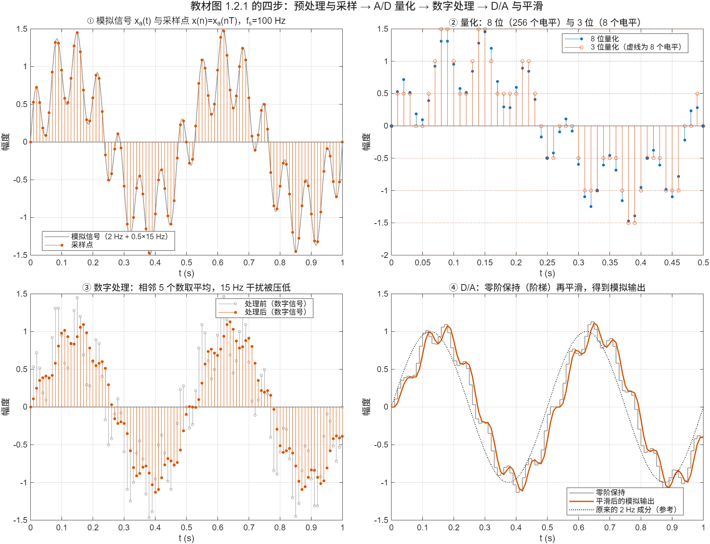

::: {.page-meta}
[教材书内 1—2 页 · PDF 9—10 页]{} [10 分钟]{} [核对 2026-09-18]{}
:::

::: {.keypoints}
[本页要点]{.kp-title}

- 信号 = 携带信息的函数。自变量通常是时间，也可以是空间坐标（图像）或别的量。
- 两个属性各自判断：**时间**连续还是离散，**幅值**连续还是离散。离散时间信号是采样来的；数字信号是时间和幅值都离散（量化过）的。
- 本书用“连续时间信号”代替“模拟信号”，只在与“数字”对比时才说“模拟”。
- 系统 = 能反映信号处理因果关系的设备或运算；按处理的信号类型分为连续时间／离散时间系统，模拟／数字系统。
:::

## [①]{.col-badge} 问题从哪来：把“信息”从载体里分出来 {#sec-1}

::: {.callout-tip}
[观看配套微课：话筒已经采样了，为什么还不算完整的数字化？](../microlectures/1.1-signals-systems/index.html) · 约 5 分 14 秒，含采样与量化动画、参数实验和课堂短片。
:::

“信号是携带信息的函数”这句话看起来平淡，它背后是一次观念上的分离。1948 年 Shannon 在《通信的数学理论》里把“信息”定义成与物理载体无关的量：一段话可以用声压、电压、光强或一串数字来承载，携带的信息是同一个。有了这个分离，才能把“处理信号”理解为“对一个函数做运算”，而不必管它此刻是电压还是气压。教材第 1 页说数字信号处理在 20 世纪 60 年代随计算机与集成电路兴起，前提就是：信号既然是函数，函数就可以变成一串数交给计算机。

课堂落点：**信号的分类不是按“它是什么东西”，而是按“它作为函数的两个属性”。** 这和第 3 章按“连续／离散、周期／非周期”给傅里叶表示分类是同一种思维。

::: {.classroom-media-grid}



:::

::: {.media-note}
外部素材需要联网，核对日期见各卡；课前先核对可访问性，未逐段试看的视频暂作课前资料。
:::

::: {.sources}
- C. E. Shannon, "A mathematical theory of communication," *Bell System Technical Journal* 27(3) (1948) 379–423. [doi:10.1002/j.1538-7305.1948.tb01338.x](https://doi.org/10.1002/j.1538-7305.1948.tb01338.x)
:::

## [②]{.col-badge} 概念与分类 {#sec-2}

### 两个属性，四个格子 {#sec-2-1}

|  | 幅值连续 | 幅值离散（量化过） |
|---|---|---|
| **时间连续** | 连续时间信号（模拟信号）：x_a(t) | 阶梯状的连续时间信号（教材提到“幅值随时间跳跃”，少见） |
| **时间离散** | 离散时间信号（采样信号、序列）：x(n)=x_a(nT) | **数字信号**：x(n) 再取有限个数码之一 |

教材第 2 页的两句话要分开记：离散时间信号“通常由模拟信号采样得到”；数字信号“在时间和幅度上都经过量化”。很多场合把“离散时间”和“数字”混用，离散时间信号的理论同样适用于数字信号，但两者差一步量化，这一步在 [1.2](1.2-dsp-chain.qmd) 和 [1.3](1.3-advantages.qmd) 里都会看到后果。

::: {.callout-note .ask appearance="simple"}
**教师提问：** 手机录音文件、话筒输出的电压、温度计的指针、CD 上的 16 位样本，各属于哪一格？（文件与 CD 样本是数字信号；话筒电压是连续时间信号；指针位置也是连续时间信号。）
:::

### 自变量不一定是时间 {#sec-2-2}

图像是以二维空间坐标为自变量的亮度函数，视频再加上时间。本书只讨论一维信号，但“信号是函数”这个定义对多维同样成立，后续课程会用到。

### 系统 {#sec-2-3}

所有能反映信号处理因果关系的设备或运算都叫系统：一个 RC 电路是系统，“把相邻五个数取平均”也是系统。按处理的信号类型分：连续时间系统处理连续时间信号，离散时间系统处理序列；模拟系统处理模拟信号，数字系统处理数字信号。第 2 章开始研究离散时间系统的性质，第 5 章讲它的结构。

## [③]{.col-badge} 仿真演示：看一次采样，看一次量化 {#sec-3}

::: {.ide-links data-matlab="demo_dsp_chain.m" data-python="python/1.2-dsp-chain.py"}
:::

本页沿用 [1.2](1.2-dsp-chain.qmd) 的演示脚本 [demo_dsp_chain.m](code/demo_dsp_chain.m) [已运行]{.status .ok}，只看前两格。

:::: {.example}
::: {.example-title}
从连续时间信号到数字信号：采样一次，量化一次
:::
::: {.example-body}
**运行前问学生：** 左上图的灰线和蓝点分别属于四格里的哪一格？右上图把幅值只留 8 个电平之后，它又属于哪一格？

{width=100%}

灰线是 x_a(t)，对连续的 t 有定义；蓝点是 x(n)=x_a(nT)，只在 t=nT 处有值，但幅值仍可取任意实数。右上图把幅值“扣”到最近的电平上，才成为数字信号：3 位只有 8 个电平，误差肉眼可见；8 位有 256 个电平，肉眼分不出与采样点的差别。**离散时间信号和数字信号之间隔着一次量化。**
:::
::::

## [④]{.col-badge} 检查与思考 {#sec-4}

::: {.quiz data-type="choice" data-answer="B"}
::: {.q-text}
1. 对连续时间信号按 t=nT 取值，但幅值不做任何处理，得到的是
:::
::: {.q-opts}
[数字信号]{data-opt="A"}
[离散时间信号]{data-opt="B"}
[连续时间信号]{data-opt="C"}
[模拟信号]{data-opt="D"}
:::
::: {.q-explain}
时间离散、幅值连续，是离散时间信号（序列）。再经量化才是数字信号。
:::
:::

::: {.quiz data-type="multi" data-answer="A,D"}
::: {.q-text}
2. 下列哪些是数字信号？
:::
::: {.q-opts}
[手机里的一段录音文件]{data-opt="A"}
[话筒输出端的电压随时间的变化]{data-opt="B"}
[水银温度计的液柱高度随时间的变化]{data-opt="C"}
[CD 上存储的 16 位样本序列]{data-opt="D"}
:::
::: {.q-explain}
A、D 时间和幅值都离散。B、C 是连续时间、连续幅值的信号。
:::
:::

::: {.quiz data-type="choice" data-answer="C"}
::: {.q-text}
3. 一幅静态灰度图像作为信号，它的自变量是
:::
::: {.q-opts}
[时间]{data-opt="A"}
[亮度]{data-opt="B"}
[二维空间坐标]{data-opt="C"}
[像素个数]{data-opt="D"}
:::
::: {.q-explain}
图像是以空间坐标为自变量的亮度函数；亮度是函数值，不是自变量。
:::
:::

**短答题**

4. “离散时间信号的理论同样适用于数字信号”，那么数字信号比离散时间信号多了什么？这一步会带来什么代价？
5. 举一个连续时间系统和一个离散时间系统的例子，说明它们各自处理什么信号。

::: {.callout-tip collapse="true" appearance="simple"}
## 教师参考要点
4. 多了幅值量化。代价是量化误差（不超过半个台阶）和字长限制，见 1.2 的量化图和 1.3 的精度实验。
5. 例如 RC 低通电路处理话筒电压；“相邻五个数取平均”处理采样序列。
:::



::: {.see-also}
[另请参阅]{.sa-title}

::: {.sa-row}
[后继]{.sa-label} [1.2 数字信号处理过程](1.2-dsp-chain.qmd) · 2.1 采样定理 · 2.2.1 序列表示及运算 · [3.1 四种傅里叶变换](../ch3/3.1-fourier-forms.qmd)
:::
:::
