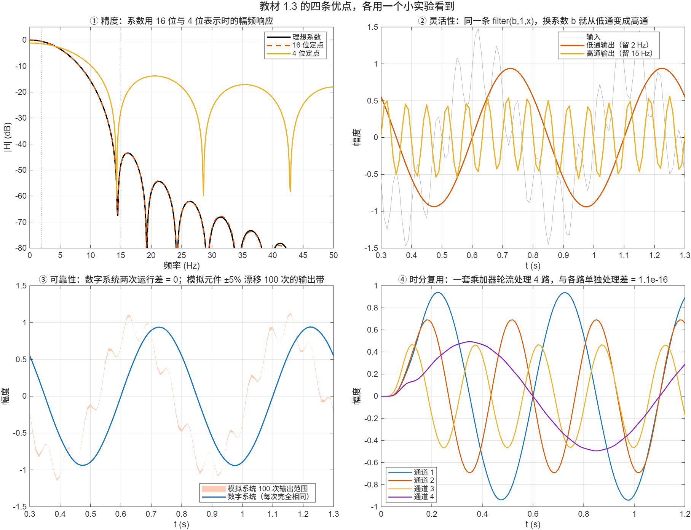

::: {.page-meta}
[教材书内 2—3 页，图 1.3.1 · PDF 10—11 页]{} [12 分钟]{} [核对 2026-09-18]{}
:::

::: {.keypoints}
[本页要点]{.kp-title}

- 教材列了五条：精度高（字长决定）、灵活（改系数即改系统）、可靠（只有两种电平，对噪声和环境不敏感）、易于大规模集成、支持时分复用。
- 演示把前三条和第五条各变成一格图：系数用 4 位还是 16 位；同一条语句换系数从低通变高通；两次运行差精确为 0 而模拟元件漂移出一条带；一套乘加器轮流处理四路。
- “易于大规模集成”不好在课堂上做实验，用一块芯片的故事代替。
:::

::: {.callout-tip}
## 配套微课 · 教师试播
[数字处理的优点，能不能用实验看出来？](../microlectures/1.3-digital-advantages/index.html) · 约5分27秒。用字长、标量增益、二值门限和四路交织入门，附深浅主题、课堂短片与参数实验；可靠性的不同含义在片中分别说明。
:::

## [①]{.col-badge} 问题从哪来：1962 年，24 路电话挤进一根线 {#sec-1}

教材 1.3 的最后一条是时分复用：一套计算设备轮流处理多个通道。这件事在 1962 年就商用了。贝尔系统的 T1 载波把 24 路话音各按 8 kHz 采样、8 位量化，每 125 μs 里把 24 个样本按顺序排成一帧，在一根线上以 1.544 Mb/s 传出去；接收端按同样的顺序拆开。它同时也是“数字比模拟可靠”的第一个大规模证据：中继器只需判断 0 和 1，不像模拟中继那样把噪声一级级累加。

“易于大规模集成”那一条，最直观的证据是 1983 年的 TMS32010：把乘法器、累加器、存储器放进一块芯片，图 1.2.1 里“数字处理”一格从一柜子设备缩成一片。

::: {.classroom-media-grid}



:::

::: {.media-note}
外部素材需要联网，核对日期见各卡；未加载视频时可使用③栏静态图与实验代码。
:::

::: {.sources}
- T1 载波：[Wikipedia: T-carrier](https://en.wikipedia.org/wiki/T-carrier)（二手资料）
- TMS32010：[Wikipedia: TMS320](https://en.wikipedia.org/wiki/TMS320)（二手资料）
:::

## [②]{.col-badge} 五条优点，各对应什么可测的量 {#sec-2}

| 教材的说法 | 可以测的量 | 演示里怎么看 |
|---|---|---|
| 精度高：数字系统仅用 17 位字长就能达到很高精度 | 系数或数据的字长 b；定点表示的最小台阶 2^−(b−1) | 同一个低通滤波器，系数用 16 位与 4 位表示，看幅频响应差多少 |
| 灵活：性能取决于存储的乘法器系数 | 换一组系数 | 同一条 `filter(b,1,x)`，b 换成“1 减低通”就成了高通 |
| 可靠：只有两种电平，对噪声和环境不敏感 | 重复运行的差；模拟元件容差下的输出范围 | 数字：两次运行差 = 0；模拟：RC 元件 ±5% 漂移，100 次输出画出一条带 |
| 易于大规模集成 | 每片芯片的乘加次数 | 不做实验，讲 TMS32010 |
| 时分复用 | 一套设备处理的通道数 | 4 路信号按时刻交织成一路，一套乘加器轮流处理，与各路单独处理比较 |

::: {.callout-note .ask appearance="simple"}
**教师提问：** “数字系统两次运行差为 0”和“差很小”是一回事吗？（不是。数字系统在同样输入、同样字长下逐位相同，差是精确的 0；模拟系统的差取决于元件和温度，永远不为 0。）
:::

教材 1.3 提到的雷达脉冲压缩 35—40 dB 信噪比，是教材陈述，本页演示不复现。

## [③]{.col-badge} 仿真演示：四个小实验 {#sec-3}

::: {.ide-links data-matlab="demo_digital_advantages.m" data-python="python/1.3-digital-advantages.py"}
:::

<div class="video-box">
<p class="media-pending">课堂动画正在整理上线；请先查看下方静态图和实验代码。</p>
</div>

::: {.media-note}
动画由 [make_digital_advantages_video.m](code/make_digital_advantages_video.m) 生成，数据与下方四格图相同；核验记录：[verification-video-advantages.json](code/results/verification-video-advantages.json)。先让学生预测“系数降到几位滤波器就不能用了”和“两次运行会不会完全一样”，再播放；播完看静态四格图读数。“能不能用”需结合要求的阻带衰减判断。点击加载后再按播放键开始。
:::

脚本 [demo_digital_advantages.m](code/demo_digital_advantages.m) [已运行]{.status .ok}，基础 MATLAB。核验记录 [verification-advantages.json](code/results/verification-advantages.json)。

:::: {.example}
::: {.example-title}
精度、灵活、可靠、时分复用
:::
::: {.example-body}
**运行前问学生：** 系数从 16 位减到 4 位，滤波器还能用吗？两次运行同一段程序，输出会完全一样吗？

{width=100%}

| 能数出来的数 | 值 |
|---|---|
| 系数量化误差：16 位 / 4 位 | 1.2×10⁻⁵ / 0.058 |
| 12 Hz 以上最差衰减：理想 / 16 位 / 4 位 | −25.1 dB / −25.2 dB / −13.8 dB |
| 低通对 2 Hz、15 Hz 的增益 | 0.94、0.004 |
| 换成高通后对 2 Hz、15 Hz 的增益 | 0.06、1.00 |
| 数字系统两次运行的最大差 | 0（精确） |
| 模拟 RC 元件 ±5% 漂移，100 次输出带的最大宽度 | 0.046 |
| 时分复用 4 路与各路单独处理的最大差 | 10⁻¹⁶（浮点舍入） |

图①里 16 位曲线与理想曲线重合，4 位曲线阻带抬高 11 dB：字长就是精度。图③里橙色带是模拟系统“正常”的样子，蓝线是数字系统，每次都落在同一条线上。

::: {.panel-tabset}
#### MATLAB [已运行]{.status .ok}

```matlab
fs = 100; n = 0:199; t = n/fs; x = sin(2*pi*2*t) + 0.5*sin(2*pi*15*t);
h = lowpass21(fs);                                  % 21 点低通系数（脚本里用窗函数法生成，第 7 章内容）
qcoef = @(v, bits) round(v*2^(bits-1))/2^(bits-1);   % 定点：bits 位
h16 = qcoef(h, 16); h4 = qcoef(h, 4);               % 精度：字长
hhp = -h; hhp(11) = hhp(11) + 1;                    % 灵活：1 减低通 = 高通
ylp = filter(h, 1, x); yhp = filter(hhp, 1, x);     % 同一条语句
y1 = filter(h, 1, x); y2 = filter(h, 1, x); max(abs(y1 - y2))   % 可靠：0
stream = reshape(ch, 1, []);                        % 时分复用：4 路按时刻交织，一套乘加器轮流处理
```

#### Python [对照]{.status .ref}

```python
import numpy as np
from scipy.signal import lfilter
fs = 100; n = np.arange(200); t = n/fs; x = np.sin(2*np.pi*2*t) + 0.5*np.sin(2*np.pi*15*t)
L, fc = 21, 6; k = np.arange(L); z = 2*np.pi*fc/fs*(k - (L-1)/2)
h = 2*fc/fs*np.where(z == 0, 1.0, np.sin(z)/np.where(z == 0, 1, z))*(0.5 - 0.5*np.cos(2*np.pi*k/(L-1))); h /= h.sum()
qcoef = lambda v, bits: np.round(v*2**(bits-1))/2**(bits-1)
h16, h4 = qcoef(h, 16), qcoef(h, 4)                           # 精度
hhp = -h.copy(); hhp[10] += 1                                 # 灵活：低通变高通
y1, y2 = lfilter(h, [1.0], x), lfilter(h, [1.0], x)
print(np.max(np.abs(y1 - y2)))                                # 可靠：0.0
```
:::
:::
::::

## [④]{.col-badge} 检查与思考 {#sec-4}

::: {.quiz data-type="number" data-answer="0.125" data-tol="0.001"}
::: {.q-text}
1. 系数用 4 位定点表示（满量程 ±1），能表示的最小台阶是多少？
:::
::: {.q-explain}
2^−(4−1) = 0.125。演示里 21 个系数最大只有 0.12 左右，4 位几乎表示不了，阻带衰减从 −25 dB 退到 −14 dB。
:::
:::

::: {.quiz data-type="choice" data-answer="B"}
::: {.q-text}
2. “同一套数字硬件换一组系数就成了另一个滤波器”，这对应教材的哪一条优点？
:::
::: {.q-opts}
[精度高]{data-opt="A"}
[灵活性]{data-opt="B"}
[可靠性]{data-opt="C"}
[时分复用]{data-opt="D"}
:::
::: {.q-explain}
教材原话：数字系统的性能主要取决于存储在系数存储器中的乘法器系数。
:::
:::

::: {.quiz data-type="multi" data-answer="A,C"}
::: {.q-text}
3. 一套处理设备要轮流处理 4 路信号（时分复用），需要满足哪些条件？
:::
::: {.q-opts}
[每一路保留各自的状态（历史样本）]{data-opt="A"}
[4 路信号必须频率相同]{data-opt="B"}
[设备的处理速度至少是 4 路采样率之和]{data-opt="C"}
[4 路必须使用同一个采样时钟以外的时钟]{data-opt="D"}
:::
::: {.q-explain}
演示里每路各有一组状态，乘加器按 ch1、ch2、ch3、ch4 的顺序轮转；一个采样周期内要处理完 4 个样本。
:::
:::

**短答题**

4. 为什么模拟系统的输出会有一条“带”，而数字系统只有一条线？这与“只有两种电平”有什么关系？
5. 教材说数字系统仅用 17 位字长就能达到很高精度。结合演示里 4 位与 16 位的差别，说明“字长”影响的是什么。

::: {.callout-tip collapse="true" appearance="simple"}
## 教师参考要点
4. 模拟元件有容差和温漂，每台机器、每个时刻的参数都略有不同；数字系统只判断 0 和 1，参数是存储的数，不随环境变。
5. 字长决定系数和运算结果能表示的最小台阶，也就是量化误差；位数越多，实际响应越接近设计值。
:::



::: {.see-also}
[另请参阅]{.sa-title}

::: {.sa-row}
[先修]{.sa-label} [1.2 数字信号处理过程](1.2-dsp-chain.qmd)
:::
::: {.sa-row}
[后继]{.sa-label} [1.4 软件工具](1.4-tools.qmd) · 第5章 数字滤波器的结构（字长效应） · 第7章 FIR 设计
:::
:::
