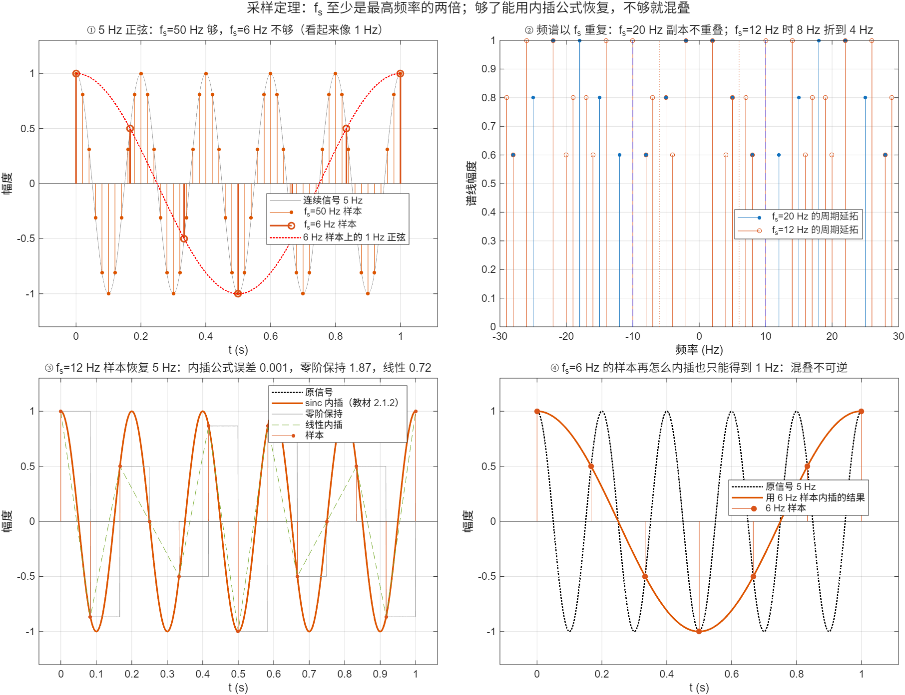

::: {.page-meta}
[教材书内 5—12 页 · PDF 13—20 页]{} [2.1.1 信号的采样，2.1.2 信号的恢复]{} [2 课时]{}
:::

::: {.keypoints}
[本页要点]{.kp-title}

- 理想采样 = 连续信号乘冲激串：x̂(t) = x_a(t)·Σδ(t−nT)。时域乘冲激串，频域就是以 Ω_s=2π/T 为周期的延拓，幅度乘 1/T。
- 采样定理：对事先限定低通带宽的信号，入门采用 Ω_s > 2Ω_max（f_s > 2f_max），避免频谱副本接触；理想采样序列可用于恢复。等号处需另查信号类、带边分量与相位；f_s/2 叫折叠频率。
- 恢复 = 用带宽为折叠频率的理想低通滤掉副本；时域上就是内插公式 x_a(t)=Σx(n)·sin(π(t−nT)/T)/(π(t−nT)/T)。
- 缺乏额外先验时，混叠样本不能唯一确定原信号；采样后插值或平滑不能自动消除这种歧义。
:::

::: {.callout-tip}
## 配套微课 · 2.1-A 采样与混叠
[为什么5Hz会采成“1Hz”？](../microlectures/2.1-sampling/index.html) · 约5分09秒，带章节、参数实验、临界反例与课堂短片。

[2.1-B 为什么连上采样点，还不等于恢复原信号？](../microlectures/2.1-reconstruction/index.html) · 约5分43秒，逐项sinc叠加、三种恢复方法、固定区间误差与混叠反例。下方提供静态图和计算脚本。
:::

## [①]{.col-badge} 问题从哪来：先有内插级数，后有采样定理 {#sec-1}

“有限个样本能不能代表一条曲线”这个问题比信号处理早。1915 年 Whittaker 在研究插值理论时证明：给定等间隔的样本值，用 sin(π(t−nT)/T)/(π(t−nT)/T) 这一族函数做加权和，能得到一条经过所有样本、且不含高于 1/(2T) 频率成分的“最平滑”曲线，他称之为基数函数。这就是教材 2.1.2 的内插公式，比它在通信里的用途早了三十年。

1928 年 Nyquist 在《电报传输理论的若干问题》里从另一头逼近：带宽为 W 的信道每秒最多传 2W 个独立脉冲。1949 年 Shannon 在《噪声中的通信》里把两件事合在一起写成定理：带宽 W 的信号由每秒 2W 个样本完全确定，并给出了内插公式。苏联的 Kotelnikov 1933 年独立得到过同样结论，本站未核对原文，只作提及。

课堂落点：**采样定理不是“采得越密越好”的经验，而是一个等式：样本足够时，样本与原信号是同一份信息。** 图③里 12 Hz 的样本能把 5 Hz 正弦恢复到误差 10⁻³，就是这个等式在起作用。

::: {.classroom-media-grid}





:::

::: {.media-note}
外部素材需要联网，核对日期见各卡；未加载视频时可使用③栏静态图与实验代码。
:::

::: {.sources}
- E. T. Whittaker, "On the functions which are represented by the expansions of the interpolation-theory," *Proc. Royal Society of Edinburgh* 35 (1915) 181–194. [doi:10.1017/S0370164600017806](https://doi.org/10.1017/S0370164600017806)
- H. Nyquist, "Certain topics in telegraph transmission theory," *Trans. AIEE* 47(2) (1928) 617–644. [doi:10.1109/T-AIEE.1928.5055024](https://doi.org/10.1109/T-AIEE.1928.5055024)
- C. E. Shannon, "Communication in the presence of noise," *Proc. IRE* 37(1) (1949) 10–21. [doi:10.1109/JRPROC.1949.232969](https://doi.org/10.1109/JRPROC.1949.232969)
:::

## [②]{.col-badge} 理论与推导 {#sec-2}

### 数学准备 {#sec-2-1}

| 数学知识 | 接入 | 本节用途 |
|---|---|---|
| 冲激函数 δ(t) 的筛选性质 | ∫x(t)δ(t−t₀)dt = x(t₀) | 理想采样只取 t=nT 的值 |
| 周期函数的傅里叶级数 | 冲激串 Σδ(t−nT) = (1/T)Σe^{jkΩ_s t} | 时域乘冲激串 ⇔ 频域周期延拓 |
| 频域乘法 ⇔ 时域卷积 | 理想低通的冲激响应是 sinc | 内插公式 |

### 2.1.1 采样：时域乘冲激串，频域周期延拓 {#sec-2-2}

教材式 (2.1.3)：x̂(t) = x_a(t)·p_δ(t)，p_δ(t)=Σδ(t−nT)。因 δ(t−nT) 只在 t=nT 非零，x̂(t)=Σx_a(nT)δ(t−nT)，只保留了样本值。

把冲激串展成傅里叶级数 p_δ(t)=(1/T)Σ_k e^{jkΩ_s t}，Ω_s=2π/T，代入后逐项取傅里叶变换（频移性质）：

$$
\hat X(j\Omega)=\frac1T\sum_{k=-\infty}^{\infty}X_a\big(j(\Omega-k\Omega_s)\big).
$$

**采样后的频谱是原频谱每隔 Ω_s 复制一份再叠加，幅度乘 1/T。** 副本要不重叠，必须 Ω_s − Ω_max ≥ Ω_max，即 Ω_s ≥ 2Ω_max。这是副本支撑区间不交叠的几何条件；等号处仍要检查带边谱线及相位，不能直接推广为任意单频分量均可恢复。Ω_s/2 称折叠频率：高于它的分量会“折”回来。

::: {.callout-note .ask appearance="simple"}
**教师提问：** 5 Hz 正弦用 6 Hz 采样，折到几 Hz？（副本在 6−5=1 Hz；图①里 6 Hz 的样本点正好落在一条 1 Hz 正弦上。）
:::

::: {.callout-note}
## 临界采样：等号不是无条件保证
5Hz零初相正弦按10Hz采样，样本为 $\sin(\pi n)=0$；同频余弦则为 $\cos(\pi n)=(-1)^n$。因此讨论等号时必须说明信号类、带边分量和相位。本节微课主线采用 $f_s>2B$；完整理想恢复还依赖已知带限条件及理想采样序列，有限显示窗本身不构成普遍恢复保证。
:::

### 2.1.2 恢复：理想低通 ⇔ 内插公式 {#sec-2-3}

不混叠时，|Ω|<Ω_s/2 内 X̂(jΩ)=(1/T)X_a(jΩ)。让 x̂(t) 通过增益 T、带宽 Ω_s/2 的理想低通 H(jΩ)，输出频谱 Y=X̂·H=X_a，时域就回到了 x_a(t)。理想低通的冲激响应是 h(t)=sin(Ω_s t/2)/(Ω_s t/2)=sin(πt/T)/(πt/T)，卷积 x̂(t)*h(t) 逐项展开得教材的内插公式：

$$
x_a(t)=\sum_{n=-\infty}^{\infty}x(n)\,\frac{\sin[\pi(t-nT)/T]}{\pi(t-nT)/T}.
$$

这里采用归一化定义 $\operatorname{sinc}(u)=\sin(\pi u)/(\pi u)$，在 $u=0$ 处取极限1。每个样本贡献一个以它为中心的加权 sinc：未加权基函数在中心为1，在其他采样位置为0，所以求和曲线经过纳入的样本；样本之间的值由各项尾部共同决定。理想公式对所有整数 $n$ 求和，不能把有限段求和直接说成任意带限信号的精确恢复。

零阶保持和线性内插也可经过样本，但一般不是带限恢复。比较方法时应同时说明样本范围、评价区间与误差指标。2.1-B固定5Hz余弦、12Hz采样，在[−0.5,0.5]秒的密集网格上比较保持、线性和有限sinc；增加样本范围不改变评价窗。网格最大差不是连续时间的严格上界，本例误差改善也不保证每增加一项、所有位置都单调改善。

## [③]{.col-badge} 仿真演示 {#sec-3}

::: {.ide-links data-matlab="demo_sampling.m" data-python="python/2.1-sampling.py"}
:::

<div class="video-box">
<p class="media-pending">课堂动画正在整理上线；请先查看下方静态图和实验代码。</p>
</div>

::: {.media-note}
动画由 [make_sampling_video.m](code/make_sampling_video.m) 生成，信号与原演示相同；[动画核验记录](code/results/verification-video-sampling.json)。先让学生预测“采样率降到多少，5 Hz 就变样”，再播放，最后对照静态图读数。12 Hz 恢复用了 121 项 sinc；6 Hz 对照用了 61 项。点击加载后再按播放键开始。
:::

脚本 [demo_sampling.m](code/demo_sampling.m) [已运行]{.status .ok}。核验记录 [verification-sampling.json](code/results/verification-sampling.json)。

:::: {.example}
::: {.example-title}
5 Hz 正弦：采样率够与不够；频谱延拓；内插恢复；混叠不可逆
:::
::: {.example-body}
**运行前问学生：** 6 Hz 采出来的点像几 Hz？含 2、5、8 Hz 的信号用 12 Hz 采，8 Hz 会跑到哪？用 12 Hz 的样本能把 5 Hz 恢复到多准？

{width=100%}

| 能数出来的数 | 值 |
|---|---|
| 5 Hz 以 6 Hz 采样，表观频率 | 1 Hz（样本与 cos(2π·1·t) 逐点重合，差 <10⁻¹²） |
| 2/5/8 Hz 以 12 Hz 采样，折进 0—6 Hz 的新谱线 | 4 Hz（=12−8） |
| 12 Hz 样本恢复 5 Hz 的最大误差：内插公式 / 零阶保持 / 线性内插 | 0.0008 / 1.87 / 0.72 |
| 6 Hz 样本做内插，拟合出的正弦 | 1 Hz，幅度 1.000 |

::: {.panel-tabset}
#### MATLAB [已运行]{.status .ok}

```matlab
f0 = 5; xa = @(t) cos(2*pi*f0*t);
tL = (0:6)/6; xL = xa(tL);                           % 6 Hz 采样
max(abs(xL - cos(2*pi*1*tL)))                        % ~0：与 1 Hz 正弦逐点重合
fsR = 12; T = 1/fsR; nR = -60:60; tR = nR*T; xR = xa(tR);
sincU = @(z) (z == 0) + (z ~= 0).*sin(z + (z == 0))./(z + (z == 0));
tq = 0:1e-3:1; xRec = zeros(size(tq));
for k = 1:numel(nR), xRec = xRec + xR(k)*sincU(pi*(tq - tR(k))/T); end   % 内插公式
max(abs(xRec - xa(tq)))                              % ~8e-4
```

#### Python [对照]{.status .ref}

```python
import numpy as np
f0 = 5; xa = lambda t: np.cos(2*np.pi*f0*t)
tL = np.arange(7)/6; print(np.max(np.abs(xa(tL) - np.cos(2*np.pi*1*tL))))   # ~0
fsR = 12; T = 1/fsR; nR = np.arange(-60, 61); tR = nR*T; xR = xa(tR)
sinc_u = lambda z: np.sinc(z/np.pi)                                          # sin(z)/z
tq = np.arange(0, 1 + 1e-9, 1e-3)
x_rec = sum(xR[k]*sinc_u(np.pi*(tq - tR[k])/T) for k in range(nR.size))
print(np.max(np.abs(x_rec - xa(tq))))                                        # ~8e-4
```
:::
:::
::::

## [④]{.col-badge} 检查与思考 {#sec-4}

::: {.quiz data-type="number" data-answer="1" data-tol="0.01"}
::: {.q-text}
1. 5 Hz 正弦以 6 Hz 采样，样本看起来像几 Hz 的正弦？
:::
::: {.q-explain}
|5−6| = 1 Hz。副本中心在 6 Hz，5 Hz 的镜像落在 1 Hz。
:::
:::

::: {.quiz data-type="number" data-answer="4" data-tol="0.01"}
::: {.q-text}
2. 含 2、5、8 Hz 的信号以 12 Hz 采样，8 Hz 分量折到几 Hz？
:::
::: {.q-explain}
12−8 = 4 Hz；折叠频率 6 Hz，8 Hz 超出 2 Hz 就折回 6−2=4 Hz。要不混叠 f_s 至少 16 Hz。
:::
:::

::: {.quiz data-type="choice" data-answer="C"}
::: {.q-text}
3. 内插公式恢复出的曲线为什么一定经过每个样本点？
:::
::: {.q-opts}
[因为 sinc 函数在 t=0 处为 1]{data-opt="A"}
[因为样本足够密]{data-opt="B"}
[因为每个 sinc 在自己中心为 1、在其他采样点上恰为 0]{data-opt="C"}
[因为用了理想低通]{data-opt="D"}
:::
::: {.q-explain}
sin(π(t−nT)/T)/(π(t−nT)/T) 在 t=nT 为 1，在 t=mT (m≠n) 为 0，所以叠加后在采样点上只剩本样本。
:::
:::

**短答题**

4. 从“时域乘冲激串”推到“频域周期延拓”，用到了哪两条性质？
5. 为什么零阶保持和线性内插也经过所有样本，误差却比内插公式大得多？

::: {.callout-tip collapse="true" appearance="simple"}
## 教师参考要点
4. 冲激串的傅里叶级数展开（周期函数）；时域乘复指数对应频域平移（频移性质）。
5. 它们不是带限的：阶梯和折线含高于折叠频率的成分，等于没有把副本滤干净。
:::



::: {.see-also}
[另请参阅]{.sa-title}

::: {.sa-row}
[先修]{.sa-label} [1.2 数字信号处理过程](../ch1/1.2-dsp-chain.qmd)
:::
::: {.sa-row}
[后继]{.sa-label} [2.3 频域分析](2.3-frequency-domain.qmd) · [3.5 频域采样](../ch3/3.5-frequency-sampling.qmd) · [3.6 混叠、栅栏、泄漏](../ch3/3.6-approximation.qmd)
:::
:::
