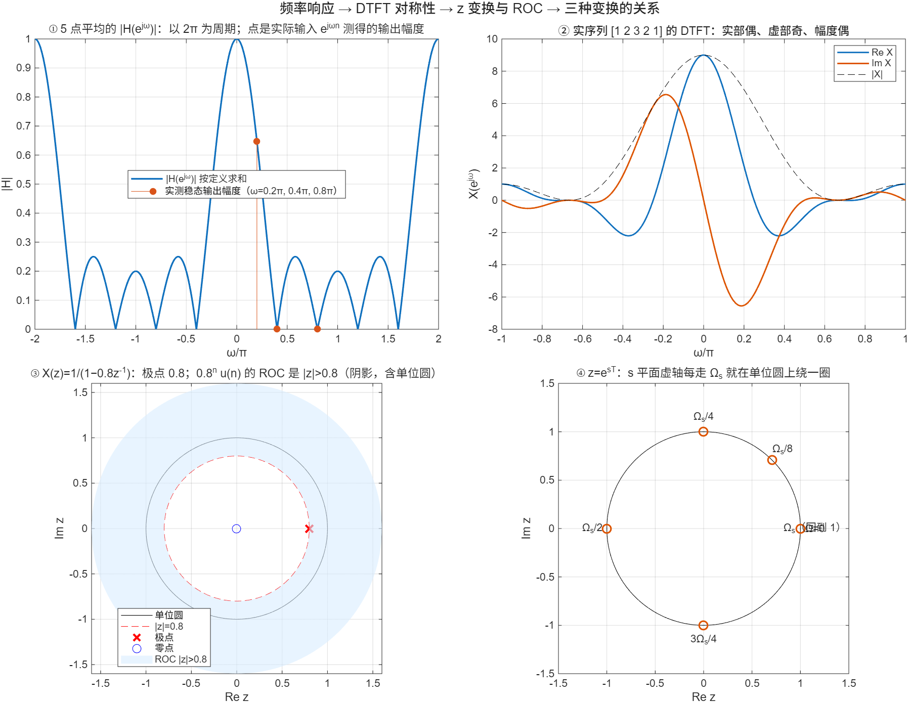

::: {.page-meta}
[教材书内 24—40 页 · PDF 32—48 页]{} [2.3.1 频率响应，2.3.2 DTFT，2.3.3 对称性，2.3.4 z 变换，2.3.5 三种变换的关系]{} [2 课时]{}
:::

::: {.keypoints}
[本页要点]{.kp-title}

- 当相应求和收敛时，双边复指数 e^{jωn} 是线性非时变系统的特征序列：输出仍是 e^{jωn}，乘的常数 H(e^{jω})=Σh(n)e^{−jωn} 就是频率响应。零历史启动时需另算暂态。
- DTFT X(e^{jω})=Σx(n)e^{−jωn} 对连续的 ω 定义，以 2π 为周期；实序列的 DTFT 实部偶、虚部奇、幅度偶；在非零响应处，相位按模 2π 具有奇对称关系，零点相位不定义。
- z 变换 X(z)=Σx(n)z^{−n} 把 e^{jω} 换成任意复数 z；收敛域是 z 平面上的环，**同一个 X(z) 配不同收敛域对应不同序列**。收敛域含单位圆时，单位圆上的 X(z) 就是 DTFT。
- 三种变换的关系：z=e^{sT}，s 平面虚轴每走 Ω_s 就在单位圆上绕一圈，这就是频谱周期延拓在 z 平面上的样子。
:::

::: {.callout-note appearance="simple"}
**微课 2.3-A · 教师试播**：[为什么平均会压低某些频率？](../microlectures/2.3-frequency-response/index.html)（4分48秒）。五点平均、复指数推导、向量抵消与启动/稳态比较；含MATLAB独立实验和三道自测。

**微课 2.3-B · 教师试播**：[同一个z变换式子，为什么可能对应两个序列？](../microlectures/2.3-z-transform/index.html)（约5分35秒）。左右几何级数、收敛域、边界绕动与单位圆；附部分和参数实验。
:::

## [①]{.col-badge} 问题从哪来：一个老工具的新名字 {#sec-1}

把一个序列 x(n) 变成幂级数 Σx(n)z^{−n}，这个想法 18 世纪就有：de Moivre 1730 年前后用“生成函数”处理递推数列，Laplace 把它用于概率。让它成为工程工具的，是 1940 年代采样数据控制系统的需要：雷达、火控用脉冲式传感器，系统里既有连续部分又有每隔 T 秒更新一次的部分，拉普拉斯变换处理起来绕不开 e^{sT}。1952 年 Ragazzini 与 Zadeh 在《采样数据系统的分析》里干脆令 z=e^{sT}，把这一族方法系统化，并给了它现在的名字：z 变换。

课堂落点：**z 变换不是新发明，是把“级数 → 函数”的老办法接到采样系统上；z=e^{sT} 这一步同时解释了为什么离散频谱是周期的。** 演示④画的就是这一步。

::: {.sources}
- J. R. Ragazzini, L. A. Zadeh, "The analysis of sampled-data systems," *Trans. AIEE, Part II* 71 (1952) 225–234. [doi:10.1109/TAI.1952.6371274](https://doi.org/10.1109/TAI.1952.6371274)
- 生成函数：[Wikipedia: Generating function](https://en.wikipedia.org/wiki/Generating_function)（二手资料）
:::

## [②]{.col-badge} 理论与推导 {#sec-2}

### 2.3.1 频率响应：为什么输入 e^{jωn} 输出还是 e^{jωn} {#sec-2-1}

把 x(n)=e^{jωn} 代入卷积：

$$
y(n)=\sum_k h(k)e^{j\omega(n-k)}=e^{j\omega n}\underbrace{\sum_k h(k)e^{-j\omega k}}_{H(e^{j\omega})}.
$$

求和里没有 n，所以输出就是输入乘一个只与 ω 有关的复数。|H| 是幅度增益；H≠0 时 arg H 是相移，零响应处相位不定义。演示①用 5 点平均仿真：ω=0.2π 时稳态输出幅度约 0.647，与公式 |sin(5ω/2)/(5sin(ω/2))| 一致（分母为零处取极限）；ω=0.4π、0.8π 时稳态输出为 0，这两个频率正是 5 点平均的零点。若余弦从 n=0 开始且历史输入为零，前四点属于启动过程，n≥4 才与稳态公式吻合。

::: {.callout-note .ask appearance="simple"}
**教师提问：** 如果输入是 cos(ωn) 而不是 e^{jωn}，输出是什么？（cos 是两个复指数之和，输出 |H|cos(ωn+arg H)，实系统的 H(e^{−jω})=H*(e^{jω}) 保证结果是实的。）
:::

### 2.3.2—2.3.3 DTFT 与对称性 {#sec-2-2}

X(e^{jω})=Σx(n)e^{−jωn}，逆变换 x(n)=(1/2π)∫_{−π}^{π}X(e^{jω})e^{jωn}dω（教材式 (2.3.10)）。它是 2.1 采样信号频谱 X̂(jΩ) 在 ω=ΩT 下的另一种写法，所以天然以 2π 为周期。卷积定理：y=x*h ⇔ Y=X·H，第 3 章的圆周卷积是它的有限长版本。

实序列的对称性从定义一行推出：X(e^{−jω})=Σx(n)e^{jωn}=X*(e^{jω})。于是实部偶、虚部奇、|X| 偶；非零响应处 arg X 的奇对称关系按模 2π 理解，零点不定义相位（教材第 32 页）。演示②用 [1 2 3 2 1] 验证共轭对称性。

### 2.3.4 z 变换与收敛域 {#sec-2-3}

X(z)=Σx(n)z^{−n}，z 是复数。级数只在某个环 R₁<|z|<R₂ 内收敛，这个环叫收敛域（ROC）。关键例子：

| 序列 | X(z) | ROC |
|---|---|---|
| aⁿu(n)（右边序列） | 1/(1−az^{−1}) | \|z\|>\|a\| |
| −aⁿu(−n−1)（左边序列） | 1/(1−az^{−1}) | \|z\|<\|a\| |

**同一个 X(z)，收敛域不同就是不同的序列。** ROC包含单位圆时，单位圆上的z变换可按定义求和得到DTFT。对本例a=0.8，右边ROC为|z|>0.8，包含单位圆；左边ROC为|z|<0.8，不包含单位圆，其单位圆上求和的项甚至不趋于零，因而不存在通常级数意义的DTFT。不能仅凭代数分式在单位圆有有限值，就声称它是左边序列的DTFT。

::: {.callout-note appearance="simple"}
右边几何级数公比为a/z；左边令m=−n后为−Σ(z/a)^m（m从1开始），公比为z/a。两者都要求公比模严格小于1。|z|=0.8整条边界圆都不属于本例两种ROC；即使非极点处部分和有界绕动，也不是收敛。左边正幂级数在z=0值为0，与化简式z/(z−a)的延拓一致，不直接向含z⁻¹的未化简式代零。2.3-B的数值测试避开原点。
:::

### 2.3.5 拉普拉斯、傅里叶、z {#sec-2-4}

采样信号 x̂(t)=Σx(n)δ(t−nT) 的拉普拉斯变换是 Σx(n)e^{−snT}，令 z=e^{sT} 就是 X(z)。s=jΩ 时 z=e^{jΩT}=e^{jω}，落在单位圆上；Ω 每增加 Ω_s=2π/T，z 绕单位圆一圈回到原处，这就是式 (2.3.39)、(2.3.40) 说的频谱周期延拓。左半 s 平面（Re s<0）映到单位圆内：|z|=e^{Re(s)T}<1，稳定性判据由此从“极点在左半平面”变成“极点在单位圆内”（2.4）。

## [③]{.col-badge} 仿真演示 {#sec-3}

::: {.ide-links data-matlab="demo_frequency_domain.m" data-python="python/2.3-frequency-domain.py"}
:::

脚本 [demo_frequency_domain.m](code/demo_frequency_domain.m) [已运行]{.status .ok}。核验记录 [verification-frequency.json](code/results/verification-frequency.json)。

:::: {.example}
::: {.example-title}
频率响应实测、实序列对称性、收敛域、s→z 映射
:::
::: {.example-body}
**运行前问学生：** 5 点平均对 ω=0.4π 的输入输出多大？[1 2 3 2 1] 的 DTFT 虚部是奇函数吗？Ω=Ω_s 映到 z 平面哪一点？

{width=100%}

| 能数出来的数 | 值 |
|---|---|
| 5 点平均在 ω=0.2π、0.4π、0.8π 的实测输出幅度 | 0.647、0、0（与公式一致到 10⁻¹⁰） |
| \|H(e^{jω})\| 与 \|H(e^{j(ω+2π)})\| 的差 | 0 |
| [1 2 3 2 1] 的对称性误差（幅度偶、实偶、虚奇） | 0 |
| 0.8ⁿu(n)：DTFT 直接求和 vs X(z)\|_{z=e^{jω}} | 差 5×10⁻⁴（求和截断到 n=40） |
| −0.8ⁿu(−n−1)：Σ\|x\| 到 n=−40 | 3.8×10⁴，发散 |
| z=e^{jΩT}：Ω=Ω_s/2 → z，Ω=Ω_s → z | −1，1 |

::: {.panel-tabset}
#### MATLAB [已运行]{.status .ok}

```matlab
M = 5; h = ones(1, M)/M; H = @(w) sum(h.' .* exp(-1i*(0:M-1).'*w), 1);
wTest = [0.2 0.4 0.8]*pi; n = 0:59;
for k = 1:3, yk = filter(h, 1, exp(1i*wTest(k)*n)); disp([abs(yk(end)), abs(H(wTest(k)))]); end   % 实测 vs 公式
x = [1 2 3 2 1]; X = @(w) sum(x.' .* exp(-1i*(0:4).'*w), 1); w = linspace(-pi, pi, 801);
max(abs(imag(X(w)) + imag(X(-w))))                  % 0：虚部奇
a = 0.8; nz = 0:40; max(abs(sum((a.^nz).' .* exp(-1i*nz.'*w), 1) - 1./(1 - a*exp(-1i*w))))   % ~5e-4
T = 1/100; Ws = 2*pi/T; exp(1i*[Ws/2 Ws]*T)         % -1, 1
```

#### Python [对照]{.status .ref}

```python
import numpy as np
from scipy.signal import lfilter
M = 5; h = np.ones(M)/M; H = lambda w: np.exp(-1j*np.outer(np.arange(M), np.atleast_1d(w))).T @ h
for wk in np.array([0.2, 0.4, 0.8])*np.pi:
    print(abs(lfilter(h, [1.0], np.exp(1j*wk*np.arange(60)))[-1]), abs(H(wk)[0]))   # 实测 vs 公式
x = np.array([1, 2, 3, 2, 1]); w = np.linspace(-np.pi, np.pi, 801)
X = lambda w: np.exp(-1j*np.outer(np.arange(5), w)).T @ x
print(np.max(np.abs(X(w).imag + X(-w).imag)))        # 0
T = 1/100; Ws = 2*np.pi/T; print(np.exp(1j*np.array([Ws/2, Ws])*T).round(12))   # -1, 1
```
:::
:::
::::

## [④]{.col-badge} 检查与思考 {#sec-4}

::: {.quiz data-type="number" data-answer="0" data-tol="0.001"}
::: {.q-text}
1. 5 点滑动平均对输入 e^{j0.4πn} 的稳态输出幅度是多少？
:::
::: {.q-explain}
|sin(5·0.2π)/(5 sin 0.2π)| = |sin π|/… = 0。0.4π 和 0.8π 都是 5 点平均的零点。
:::
:::

::: {.quiz data-type="choice" data-answer="C"}
::: {.q-text}
2. X(z)=1/(1−0.8z^{−1}) 对应哪个序列？
:::
::: {.q-opts}
[只能是 0.8ⁿu(n)]{data-opt="A"}
[只能是 −0.8ⁿu(−n−1)]{data-opt="B"}
[两者都可能，取决于收敛域]{data-opt="C"}
[两者都不是]{data-opt="D"}
:::
::: {.q-explain}
ROC |z|>0.8 对应右边序列，|z|<0.8 对应左边序列。写 z 变换必须同时写收敛域。
:::
:::

::: {.quiz data-type="choice" data-answer="B"}
::: {.q-text}
3. z=e^{sT} 把 s 平面的虚轴映成
:::
::: {.q-opts}
[z 平面的实轴]{data-opt="A"}
[单位圆，Ω 每增加 2π/T 绕一圈]{data-opt="B"}
[单位圆，只绕一圈]{data-opt="C"}
[z 平面的虚轴]{data-opt="D"}
:::
::: {.q-explain}
|e^{jΩT}|=1，角度 ΩT 每增加 2π 回到原处，对应频谱以 Ω_s 为周期。
:::
:::

**短答题**

4. 由 X(e^{−jω})=X*(e^{jω}) 推出实序列 DTFT 的四条对称性。
5. 为什么只有收敛域包含单位圆的序列才有 DTFT？举一个没有 DTFT 但有 z 变换的序列。

::: {.callout-tip collapse="true" appearance="simple"}
## 教师参考要点
4. 取共轭后实部相等（偶）、虚部反号（奇）；模相等（偶）、辐角反号（奇）。
5. DTFT 就是 z=e^{jω} 处的 z 变换，级数在单位圆上必须收敛；−0.8ⁿu(−n−1) 的 ROC 是 |z|<0.8，不含单位圆。
:::



::: {.see-also}
[另请参阅]{.sa-title}

::: {.sa-row}
[先修]{.sa-label} [2.1 采样定理](2.1-sampling.qmd) · [2.2 时域分析](2.2-time-domain.qmd)
:::
::: {.sa-row}
[后继]{.sa-label} [2.4 系统函数](2.4-system-function.qmd) · [3.1 四种傅里叶变换](../ch3/3.1-fourier-forms.qmd) · [3.7 窗函数](../ch3/3.7-windows.qmd)
:::
:::
