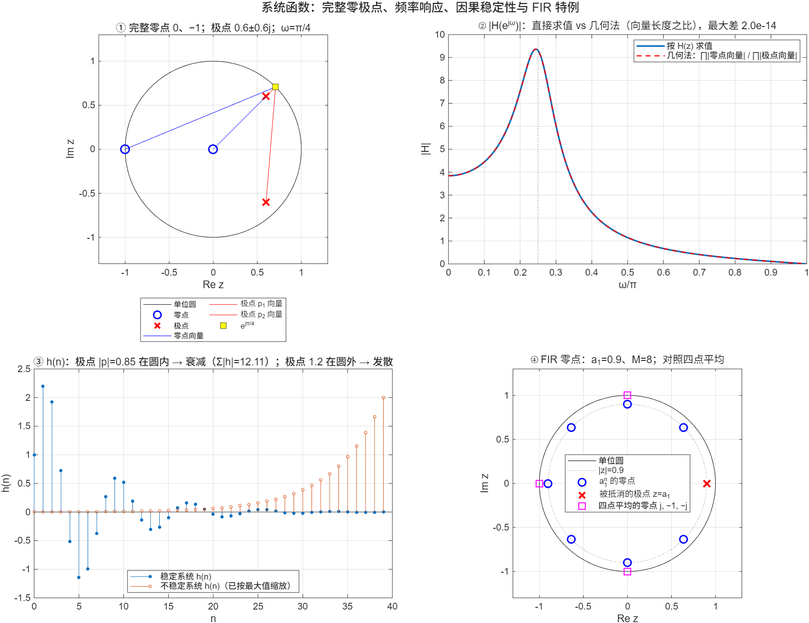

::: {.page-meta}
[教材书内 40—49 页 · PDF 48—57 页]{} [2.4.1 定义，2.4.2 与差分方程的关系，2.4.3 收敛域，2.4.4 几何确定法，2.4.5 IIR 与 FIR]{} [2 课时]{}
:::

::: {.keypoints}
[本页要点]{.kp-title}

- 零状态下，H(z)=Y(z)/X(z)=Z[h(n)]。常系数线性差分方程两边取 z 变换，H(z) 就是两个 z^{−1} 多项式之比，系数直接抄自差分方程。
- 因果有理系统函数的 ROC 是最外层极点之外；稳定要求 ROC 含单位圆，所以**因果有理系统稳定 ⇔ 约分后的全部实际极点严格在单位圆内**。
- 频率响应可以在 z 平面上量出来：|H(e^{jω})| = |K| × ∏|到零点的距离| / ∏|到极点的距离|。ω 转到极点附近出峰，转到零点上出零。
- IIR：H(z) 有分母，h(n) 无限长；FIR：H(z) 只有分子，h(n) 有限长。例 2.10 的横向滤波器 a₁ⁿ（0≤n≤M−1）零点在 |z|=a₁ 上 M 等分，a₁=1 就是 M 点滑动平均。
:::

::: {.callout-tip}
**2.4-A微课：** [脉冲响应趋于零，就一定稳定吗？](../microlectures/2.4-stability/index.html) · 约5分38秒，含中文旁白、五种系统交互比较、MATLAB实验与课堂短片。

**2.4-B微课：** [零极点图，怎样变成频率响应？](../microlectures/2.4-poles-zeros/index.html) · 约6分04秒，完整零极点、向量长度和角度、输入输出验证。
:::

## [①]{.col-badge} 问题从哪来：滑动平均会“制造”周期 {#sec-1}

最古老的数字滤波器是滑动平均：把相邻几个数取平均。经济学家很早就用它平滑物价、产量序列，以为平滑后看到的起伏就是“真实的周期”。1927 年 Slutzky 指出（英译 1937 年发表于《Econometrica》）：对完全随机的序列做滑动平均，也会出现有规律的起伏，周期由平均的点数决定。这就是本节要讲的东西：滑动平均是一个 FIR 系统，它的零点排在单位圆上，等于给了随机输入一个“带通”的形状，看起来像周期。

课堂落点：**一个系统对信号做了什么，看它的零极点就知道；不看零极点，就会把滤波器造出来的形状当成信号本身的性质。** 演示④的四点平均，零点在 ±j 和 −1，通带在低频，这就是 Slutzky 效应的最简版本。

::: {.classroom-media-grid}



:::

::: {.media-note}
外部素材需要联网，核对日期见各卡；课前先核对可访问性，未逐段试看的视频暂作课前资料。
:::

::: {.sources}
- E. Slutzky, "The summation of random causes as the source of cyclic processes," *Econometrica* 5(2) (1937) 105–146（俄文原文 1927 年）。[doi:10.2307/1907241](https://doi.org/10.2307/1907241)
:::

## [②]{.col-badge} 理论与推导 {#sec-2}

### 2.4.1—2.4.2 从差分方程到 H(z) {#sec-2-1}

零初始状态下，差分方程 Σ_{k=0}^{N}a_k y(n−k)=Σ_{r=0}^{M}b_r x(n−r)。两边取 z 变换，用移位性质 Z[y(n−k)]=z^{−k}Y(z)：

$$
H(z)=\frac{Y(z)}{X(z)}=\frac{\sum_{r=0}^{M}b_r z^{-r}}{\sum_{k=0}^{N}a_k z^{-k}}\quad(a_0=1).
$$

演示用 y(n)−1.2y(n−1)+0.72y(n−2)=x(n)+x(n−1)，H(z)=(1+z^{−1})/(1−1.2z^{−1}+0.72z^{−2})：零点 0、−1，极点 0.6±0.6j（|p|=0.85）。核验里把 h(n) 代回差分方程，每一步都成立。

### 2.4.3 收敛域与稳定性 {#sec-2-2}

对于有理系统函数，因果序列的 ROC 是 |z|>R（最外层极点之外）；稳定要 Σ|h|<∞，即 ROC 含单位圆。两者同时成立 ⇔ 所有极点 |p|<1。演示③：|p|=0.85 的系统 h(n) 衰减，n≥200 后的尾部小于 10⁻⁶；把极点换成 1.2，h(n) 每步乘 1.2，发散。

::: {.callout-note .ask appearance="simple"}
**教师提问：** 一个系统 H(z) 的极点在 1.2，它一定不稳定吗？（不一定。若取 ROC |z|<1.2（含单位圆），它稳定但非因果。“因果稳定”才要求极点在圆内。）
:::

**衰减不充分：** 对 $h[n]=u[n]/(n+1)$，虽然 $h[n]$ 趋于零，但输入 $u[n]$ 得到调和部分和。把项按 $1/2$、$1/3+1/4$、$1/5+\cdots+1/8$ 等分组，每组至少 $1/2$，因而无界。LTI系统的BIBO稳定要求 $\sum_{n=-\infty}^{\infty}|h[n]|<\infty$。

**稳定不等于因果：** $h[n]=-1.2^n u[-n-1]$ 的ROC为 $|z|<1.2$，包含单位圆，绝对和为5。它依赖未来输入，是稳定的非因果系统。

### 2.4.4 频率响应的几何确定法 {#sec-2-3}

把 H(z) 写成零极点形式 H(z)=K∏(z−z_r)/∏(z−p_k)，先确认单位圆属于ROC，再令 z=e^{jω}：

$$
|H(e^{j\omega})|=|K|\frac{\prod_r|e^{j\omega}-z_r|}{\prod_k|e^{j\omega}-p_k|},\qquad
\arg H=\arg K+\sum_r\arg(e^{j\omega}-z_r)-\sum_k\arg(e^{j\omega}-p_k).
$$

每个因子是从零点或极点指向单位圆上点 e^{jω} 的向量。ω 从 0 转到 π，点在单位圆上走半圈：靠近极点时极点向量变短，|H| 出峰；碰到零点时零点向量为零，|H| 为零。演示①在 ω=π/4 画出四根向量，演示②把几何法和直接求值叠在一起，差 10⁻¹⁴。峰在 ω=π/4 附近（极点辐角），零在 ω=π（零点 −1）。

**原点零点不可漏：** 本例同乘 $z^2$ 后，$H(z)=z(z+1)/[(z-p_1)(z-p_2)]$，所以零点是0和−1。原点向量在单位圆上的长度为1，但辐角为 $\omega$；只用 `roots([1 1])` 会漏掉这一相位项，完整分子应为 `roots([1 1 0])`。

**峰位与零响应：** 微课的801点频率网格得到峰位约 $0.24375\pi$，不严格等于极点辐角 $0.25\pi$。一般峰位由全部因子共同决定；$\omega=\pi$ 时响应为零、相位未定义。输入 $\cos(\pi n)u[n]$ 在启动时仍有暂态，零点保证的是该频率的稳态抑制。

### 2.4.5 IIR 与 FIR {#sec-2-4}

| | H(z) | h(n) | 极点 | 例 |
|---|---|---|---|---|
| IIR | 有分母（N≥1） | 无限长 | 稳定因果情形：实际极点严格在单位圆内 | 例 2.9：aⁿu(n) |
| FIR | 只有分子 | 长 M | 全在原点 | 例 2.10：横向滤波器 |

例 2.10：h(n)=a₁ⁿ，0≤n≤M−1，H(z)=(1−a₁^M z^{−M})/(1−a₁z^{−1})，分子的零点 z=a₁e^{j2πk/M} 在 |z|=a₁ 的圆上 M 等分，k=0 那个被分母的极点 a₁ 抵消，剩 M−1 个零点，M−1 个极点全在原点。取 a₁=1、M=4 就是四点滑动平均，零点 j、−1、−j：f_s=1000 Hz 时对应 250、500 Hz 的零响应。第 7 章 FIR-01 实验用的正是这个系统。

## [③]{.col-badge} 仿真演示 {#sec-3}

::: {.ide-links data-matlab="demo_system_function.m" data-python="python/2.4-system-function.py"}
:::

脚本 [demo_system_function.m](code/demo_system_function.m) [已运行]{.status .ok}。核验记录 [verification-system.json](code/results/verification-system.json)。

:::: {.example}
::: {.example-title}
零极点向量、几何法、稳定与发散、FIR 的零点
:::
::: {.example-body}
**运行前问学生：** 极点 0.6±0.6j 的系统，|H| 的峰大约在哪个 ω？把极点换成 1.2 会怎样？四点平均的零点在哪？

{width=100%}

| 能数出来的数 | 值 |
|---|---|
| 极点模长 \|p\| | 0.8485（=√0.72） |
| 几何法与直接求值的最大差 | 2.0×10⁻¹⁴ |
| 稳定系统 Σ\|h\|；n≥200 的尾部 | 12.11；6.6×10⁻¹⁴ |
| 不稳定系统 h(39)/h(38) | 1.200 |
| 横向滤波器 0.9ⁿ（M=8）零点模长 | 全部 0.9 |
| 四点平均零点角度／π | −0.5，0.5，1（即 −j，j，−1） |

::: {.panel-tabset}
#### MATLAB [已运行]{.status .ok}

```matlab
b = [1 1]; a = [1 -1.2 0.72]; zeros_ = roots([b 0]); poles_ = roots(a)      % 0、-1；0.6±0.6j
w = linspace(0, pi, 801); z = exp(1i*w);
Hw = polyval(fliplr(b), z.^-1) ./ polyval(fliplr(a), z.^-1);            % 直接求值
geo = @(wq) abs(prod(exp(1i*wq) - zeros_)) / abs(prod(exp(1i*wq) - poles_));   % 几何法
max(abs(arrayfun(geo, w) - abs(Hw)))                                    % ~1e-14
h = filter(b, a, [1 zeros(1, 399)]); sum(abs(h(201:end)))               % 尾部 ~1e-13：稳定
hT = 0.9.^(0:7); abs(roots(hT))                                         % 全为 0.9
angle(roots(ones(1,4)/4))/pi                                            % ±0.5, 1
```

#### Python [对照]{.status .ref}

```python
import numpy as np
from scipy.signal import lfilter
b, a = np.array([1., 1.]), np.array([1., -1.2, 0.72]); zs, ps = np.roots(np.r_[b,0]), np.roots(a)
w = np.linspace(0, np.pi, 801); z = np.exp(1j*w)
Hw = np.polyval(b[::-1], 1/z)/np.polyval(a[::-1], 1/z)
geo = np.array([abs(np.prod(np.exp(1j*wk) - zs))/abs(np.prod(np.exp(1j*wk) - ps)) for wk in w])
print(np.max(np.abs(geo - np.abs(Hw))))                                # ~1e-14
h = lfilter(b, a, np.r_[1., np.zeros(399)]); print(np.sum(np.abs(h[200:])))   # ~1e-13
print(np.abs(np.roots(0.9**np.arange(8))), np.angle(np.roots(np.ones(4)/4))/np.pi)
```
:::
:::
::::

## [④]{.col-badge} 检查与思考 {#sec-4}

::: {.quiz data-type="number" data-answer="0.8485" data-tol="0.002"}
::: {.q-text}
1. H(z)=(1+z^{−1})/(1−1.2z^{−1}+0.72z^{−2}) 的极点模长是多少？
:::
::: {.q-explain}
极点是 z²−1.2z+0.72=0 的根，模长 √0.72=0.8485，在单位圆内，因果系统稳定。
:::
:::

::: {.quiz data-type="choice" data-answer="B"}
::: {.q-text}
2. 用几何法看，|H(e^{jω})| 在什么位置出现峰值？
:::
::: {.q-opts}
[ω 对着零点的方向]{data-opt="A"}
[ω 对着极点的方向（极点向量最短）]{data-opt="B"}
[ω=0 处]{data-opt="C"}
[ω=π 处]{data-opt="D"}
:::
::: {.q-explain}
分母是到极点的距离之积，e^{jω} 转到极点附近时分母最小。本例极点辐角 π/4，峰在 ω≈π/4。
:::
:::

::: {.quiz data-type="multi" data-answer="A,C,D"}
::: {.q-text}
3. 四点滑动平均 y(n)=[x(n)+x(n−1)+x(n−2)+x(n−3)]/4 的零点有
:::
::: {.q-opts}
[j]{data-opt="A"}
[1]{data-opt="B"}
[−1]{data-opt="C"}
[−j]{data-opt="D"}
:::
::: {.q-explain}
H(z)=(1−z^{−4})/(4(1−z^{−1}))，4 次单位根去掉 z=1（被极点抵消）。f_s=1000 Hz 时 ±j 对应 250 Hz，−1 对应 500 Hz。
:::
:::

**短答题**

4. 由差分方程 y(n)−1.2y(n−1)+0.72y(n−2)=x(n)+x(n−1) 写出 H(z)，并说明为什么系数能直接抄。
5. 一个因果系统极点在 1.2，与一个非因果但稳定的系统极点也在 1.2，两者 H(z) 相同吗？区别在哪里？

::: {.callout-tip collapse="true" appearance="simple"}
## 教师参考要点
4. 两边 z 变换，Z[y(n−k)]=z^{−k}Y(z)，整理得 Y(1−1.2z^{−1}+0.72z^{−2})=X(1+z^{−1})；系数就是差分方程的系数。
5. H(z) 相同，收敛域不同：因果取 |z|>1.2（不含单位圆，不稳定），非因果取 |z|<1.2（含单位圆，稳定）。
:::



::: {.see-also}
[另请参阅]{.sa-title}

::: {.sa-row}
[先修]{.sa-label} [2.2 卷积与稳定性](2.2-time-domain.qmd) · [2.3 z 变换](2.3-frequency-domain.qmd)
:::
::: {.sa-row}
[后继]{.sa-label} 第5章 数字滤波器的结构 · 第6章 IIR 设计 · 第7章 FIR 设计（FIR-01 四点平均实验）
:::
:::
