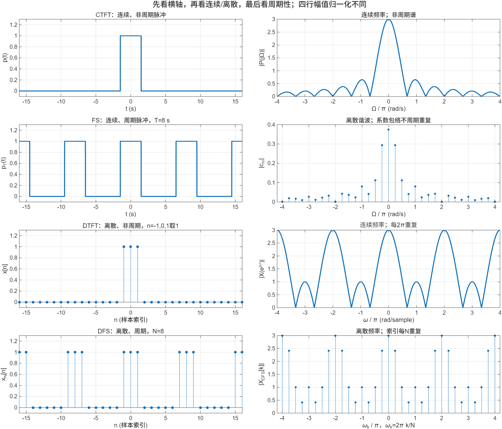
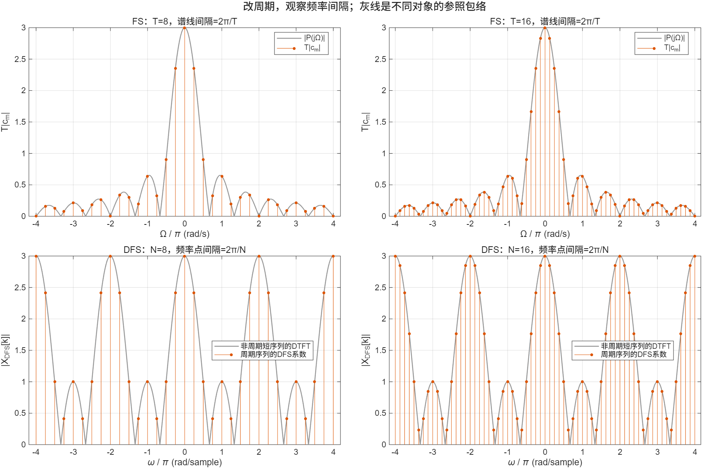
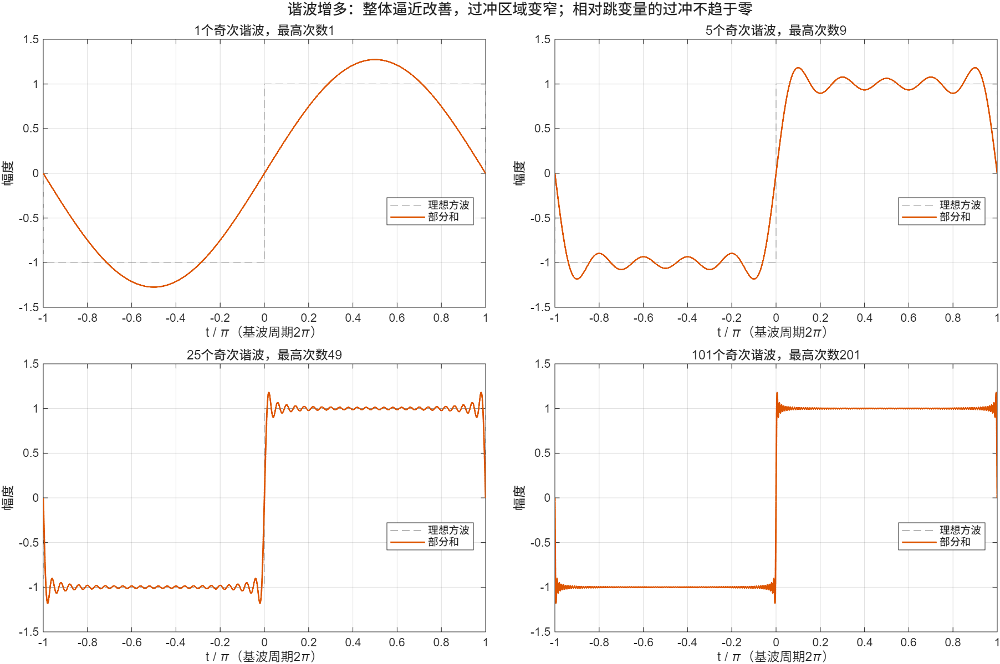

::: {.page-meta}
[教材书内 54—57 页 · PDF 62—65 页]{} [核对 2026-09-18：式 (3.1.1)—(3.1.7)，图 3.1.1—3.1.4]{} [1 课时，展开 2 课时]{}
:::

::: {.keypoints}
[本页要点]{.kp-title}

- 两条关系：**时域周期 ⇔ 频域离散谐波；时域离散 ⇔ 频域周期。** 两条可以同时成立。
- 四种表示按这两条分类：CTFT、FS、DTFT、DFS。第四种时域频域都离散且周期，是计算机唯一能直接算的，引向 3.2。
- 最常见的误解：“序列是离散的，所以它的频谱也是离散的。” 离散和周期是两个独立属性。
:::

| 教材顺序 | 时间信号 | 傅里叶表示 | 频域表示的形态 |
|---|---|---|---|
| 3.1.1 | 连续、非周期 | 连续时间傅里叶变换 CTFT | 连续频率，通常非周期 |
| 3.1.2 | 连续、周期 | 傅里叶级数 FS | 离散谐波，系数通常不随序号周期重复 |
| 3.1.3 | 离散、非周期 | 离散时间傅里叶变换 DTFT | 连续频率，以 2π 为周期 |
| 3.1.4 | 离散、周期 | 离散傅里叶级数 DFS | 离散频率，系数随索引以 N 为周期 |

频率符号随时域变量区分：连续时间用 Ω（rad/s），离散时间用 ω（rad/sample）。周期 tₚ 的连续信号谐波间隔 ΔΩ = 2π/tₚ；周期 N 的序列频率点间隔 Δω = 2π/N。

## [①]{.col-badge} 问题从哪来：三段历史，三个问题 {#sec-1}

::: {.callout-tip}
[观看配套微课：同一个脉冲，为什么需要四种傅里叶表示？](../microlectures/3.1-fourier-forms/index.html) · 约 7 分 44 秒，含关键推导、实算图形、章节定位与课堂短片。
:::

### 为什么要分解：傅里叶与热传导 {#sec-1-1}

一根金属杆，有的地方热、有的地方冷，过一会儿温度怎样变化？初始温度曲线可能很复杂。**假如能把复杂曲线拆成许多简单形状，而每种简单形状怎样变化是已知的，那么把它们的结果再加起来就行。** 傅里叶研究热传导，1807 年提交相关工作，1822 年的《热的解析理论》系统呈现了这一思路。

板书一个现代化的教学示例（不是复现傅里叶原始推导）：

$$
\frac{\partial u}{\partial t}=\alpha\frac{\partial^2u}{\partial x^2},\quad 0<x<L,\qquad u(0,t)=u(L,t)=0,
\qquad
u_r(x,t)=b_r\sin\frac{r\pi x}{L}\,e^{-\alpha(r\pi/L)^2t}.
$$

只需让学生观察：正弦的二阶导数仍是它自身的倍数，r 越大衰减越快。于是问题转为：**任意初始温度能不能用这些正弦叠加？各个权重是多少？** 这就是展开和系数。

### 分解何时有效：Gibbs 与 Michelson 的来信 {#sec-1-2}

Gibbs 在 1898 年《Nature》来信中回应了 Michelson 关于傅里叶级数逼近的讨论，1899 年又发表更正。可提出一个可实验的问题：**用越来越多的正弦项合成有跳变的波形，所有位置的误差都会一起变小吗？** 图 3 让学生自己发现“整体误差减小”和“跳变附近过冲不消失”可以同时成立。

### 如何算得动：Cooley 与 Tukey {#sec-1-3}

Cooley 与 Tukey 1965 年给出适合机器计算的分解方法，展示计算量如何降低。这里用来区分“数学表示”和“计算算法”：**FFT 加快 DFT 的计算，不增加第五种傅里叶表示。** 详细算法属于第 4 章。

::: {.classroom-media-grid}





:::

::: {.media-note}
外部素材需要联网，核对日期见各卡；视频未逐段试看，课堂片段待教师选定。
:::

::: {.sources}
- 傅里叶 1807／1822：[MacTutor 数学史，St Andrews](https://mathshistory.st-andrews.ac.uk/Biographies/Fourier/)；[《热的解析理论》剑桥重印版说明](https://www.cambridge.org/core/books/analytical-theory-of-heat/F6D4802336FABD1116DDA4AA3FE6EFAA)
- Gibbs：[Nature 1898 来信](https://www.nature.com/articles/059200b0)；[Nature 1899 更正](https://www.nature.com/articles/059606a0)
- J. W. Cooley, J. W. Tukey, "An algorithm for the machine calculation of complex Fourier series," *Mathematics of Computation* 19 (1965) 297–301. [doi:10.1090/S0025-5718-1965-0178586-1](https://doi.org/10.1090/S0025-5718-1965-0178586-1)
:::

## [②]{.col-badge} 理论与推导：以投影为主线 {#sec-2}

### 数学准备 {#sec-2-1}

| 数学知识 | 从学生熟悉的内容接入 | 本节用途 |
|---|---|---|
| 欧拉公式 | $e^{j\theta}=\cos\theta+j\sin\theta$ | 用一个复指数统一表达幅度、相位与频率 |
| 内积和正交 | 向量在相互垂直坐标轴上的投影 | 说明为什么乘一个基函数再积分能提取系数 |
| 几何级数、求和与积分 | 有限等比和、黎曼和 | 解释离散正交性，以及离散谐波到连续频率的过渡 |

先提醒：内积中的复共轭使分析式出现负指数，不要只让学生背“正变换负号”。

### 先推 FS：系数是怎样“挑”出来的 {#sec-2-2}

设周期 T、基频 Ω₀ = 2π/T，假设信号具备展开条件：

$$
x_T(t)=\sum_{m=-\infty}^{\infty}c_m e^{jm\Omega_0t}.
$$

关键一步是一个周期上的正交性：

$$
\frac1T\int_{t_0}^{t_0+T}e^{j(m-r)\Omega_0t}\,dt
=\begin{cases}1&m=r,\\0&m\ne r.\end{cases}
$$

两边乘 $e^{-jr\Omega_0t}$，在一个周期积分并除以 T，其他项因正交性消失：

$$
c_r=\frac1T\int_{t_0}^{t_0+T}x_T(t)e^{-jr\Omega_0t}\,dt.
$$

::: {.callout-note .ask appearance="simple"}
**教师提问：** 1/T 为什么出现？它来自基函数在一个周期上的能量为 T。周期信号只需要整数倍基频，所以频率是离散谐波。
:::

### 再说明 CTFT：周期不断增大，谱线怎样变密 {#sec-2-3}

取孤立脉冲 p(t)，每 T 重复一次。一个周期内只含这一份脉冲时，

$$
P(j\Omega)=\int_{-\infty}^{\infty}p(t)e^{-j\Omega t}\,dt,\qquad c_m=\frac1T P(jm\Omega_0).
$$

令 ΔΩ = 2π/T，则 $p_T(t)=\frac1{2\pi}\sum_mP(jm\Delta\Omega)e^{jm\Delta\Omega t}\Delta\Omega$。在适当收敛条件下，T → ∞、ΔΩ → 0，这个和式引向

$$
p(t)=\frac1{2\pi}\int_{-\infty}^{\infty}P(j\Omega)e^{j\Omega t}\,d\Omega.
$$

这是“级数 → 积分”的直观推导，不替代严格收敛证明。周期变长时单条 c_m 因 1/T 缩小，所以图 2 画 T|c_m| 与 |P| 比较。

### 回顾 DTFT：为什么离散时间对应频域周期 {#sec-2-4}

教材式 (3.1.6)：$X(e^{j\omega})=\sum_{n}x[n]e^{-j\omega n}$。最值得学生自己推的一行：

$$
X(e^{j(\omega+2\pi)})=\sum_nx[n]e^{-j\omega n}e^{-j2\pi n}=X(e^{j\omega}),\quad n\in\mathbb Z.
$$

ω 仍可连续取值。逆变换利用 $\frac1{2\pi}\int_{-\pi}^{\pi}e^{j(n-r)\omega}d\omega=\delta[n-r]$ 提取 x[r]，得教材式 (3.1.7)。

::: {.callout-note .ask appearance="simple"}
**教师提问：** 逆变换的积分为什么只取一个 2π 区间？因为频域已经周期重复。证明周期性的哪一步依赖 n 是整数？
:::

### DFS 作为 3.2 的桥梁 {#sec-2-5}

对 N 周期序列，本书采用 $\widetilde X[k]=\sum_{n=0}^{N-1}\widetilde x[n]e^{-j2\pi kn/N}$，逆变换带 1/N。备课所需的离散正交性：

$$
\sum_{k=0}^{N-1}e^{j2\pi k(n-r)/N}
=\begin{cases}N&n\equiv r\pmod N,\\0&\text{其他}.\end{cases}
$$

其他情况就是公比不为 1、N 次方等于 1 的几何级数。详细推导见 [3.2](3.2-dfs.qmd)。

## [③]{.col-badge} 仿真演示：先预测，再运行，再解释 {#sec-3}

::: {.ide-links data-matlab="demo_fourier_forms.m" data-python="python/3.1-fourier-forms.py" data-julia="julia/3.1-fourier-forms.jl"}
:::

<div class="video-box">
<p class="media-pending">课堂动画正在整理上线；请先查看下方静态图和实验代码。</p>
</div>

::: {.media-note}
由 [make_gibbs_video.m](code/make_gibbs_video.m) 生成；[动画核验记录](code/results/verification-video-gibbs.json)。先让学生预测“项数增加，跳变旁的过冲会不会消失”，再播放；播到 25 项时暂停一次。点击加载后再按播放键。
:::

脚本 [demo_fourier_forms.m](code/demo_fourier_forms.m) [已运行]{.status .ok}，基础 MATLAB，点“运行”生成三张图。核验记录 [verification-fourier-forms.json](code/verification-fourier-forms.json)：7 项公式／数值一致性全部通过，最大绝对误差 4.4×10⁻¹⁵。

:::: {.example}
::: {.example-title}
演示 A：同一类脉冲的四种表示
:::
::: {.example-body}
**运行前问学生：** 四行的横轴分别是什么？哪几行的频率轴是连续的？哪几行会重复？

| 对象 | 定义 | 解析依据 | 要看到什么 |
|---|---|---|---|
| 连续、非周期 | p(t)=1，\|t\|<1.5 | P(jΩ)=2sin(1.5Ω)/Ω，Ω=0 取 3 | 连续频率，没有固定谱周期 |
| 连续、周期 | p(t) 每 T=8 s 重复 | c_m=P(jm2π/T)/T | 只在谐波频率上有系数 |
| 离散、非周期 | x[−1]=x[0]=x[1]=1 | X(e^{jω})=1+2cosω | 频率连续，2π 周期；不是只有 3 个频率值 |
| 离散、周期 | 上述脉冲以 N=8 重复 | X̃[k]=1+2cos(2πk/N) | 离散频率，索引每 N 重复 |

{width=100%}

**读图顺序：** 横轴是什么 → 在哪些位置定义 → 是否重复 → 最后才看幅度。三个定量检查：P(0)=3；c₀=3/8；X(π)=−1，幅值为 1 而不是 −1。
:::
::::

:::: {.example}
::: {.example-title}
演示 B：改变周期，观察谱线间隔
:::
::: {.example-body}
**运行前问学生：** T 从 8 变 16，谐波间隔怎么变？直流系数 c₀ 怎么变？

| 改变 | 预测 | 结果解读 |
|---|---|---|
| 脉冲宽度固定，T 从 8 到 16 | 谐波间隔减半 | ΔΩ 从 π/4 变 π/8；c₀ 从 3/8 变 3/16 |
| 离散脉冲固定，N 从 8 到 16 | DFS 频率点间隔减半 | Δω 从 π/4 变 π/8；两种 DFS 系数都落在同一短序列的 DTFT 参照曲线上 |

{width=100%}

第二行是**比较两个不同周期的信号**，不证明“对固定记录补零能提高分辨能力”；那个问题在 [3.5](3.5-frequency-sampling.qmd)。
:::
::::

:::: {.example}
::: {.example-title}
演示 C：Gibbs 现象，把历史问题变成学生的观察
:::
::: {.example-body}
周期 2π、幅度 ±1 的方波，奇次谐波部分和 $S_M(t)=\frac4\pi\sum_{r=0}^{M-1}\frac{\sin((2r+1)t)}{2r+1}$，取 M = 1、5、25、101。

**运行前问学生：** 谐波越多，跳变旁边的凸起会完全消失吗？

{width=100%}

平坦区整体逼近改善；过冲区域变窄；过冲峰值相对跳变量趋近约 8.949%，不趋于 0。本例跳变量为 2，最高值趋近 1.179。本机实测 M=101 时过冲为跳变量的 8.9494%，均方根误差从 0.435 降到 0.044。
:::
::::

### 代码 {#sec-3-1}

::: {.panel-tabset}
#### MATLAB [已运行]{.status .ok}

完整脚本见 [demo_fourier_forms.m](code/demo_fourier_forms.m)。演示 A 的核心：

```matlab
width = 3; T = 8; N = 8;
t = linspace(-16,16,6401); Omega = linspace(-4*pi,4*pi,3201);
w = linspace(-4*pi,4*pi,3201); n = -16:16;
m = -floor(4*pi/(2*pi/T)):floor(4*pi/(2*pi/T)); k = -2*N:2*N;
p = double(abs(t) < width/2);                 % 连续、非周期
P = width*sinc_unscaled(Omega*width/2);       % 解析式取点，不用 fft 冒充 CTFT
c = (width/T)*sinc_unscaled(m*(2*pi/T)*width/2);   % FS 系数
x = double(abs(n) <= 1);  X = 1+2*cos(w);     % DTFT
Xdfs = 1+2*cos(2*pi*k/N);                     % DFS，本书约定：正变换不除 N
function y = sinc_unscaled(z)                 % sin(z)/z，避免与 MATLAB sinc 的 pi 归一化混淆
y = ones(size(z)); nz = (z~=0); y(nz) = sin(z(nz))./z(nz);
end
```

#### Python [对照]{.status .ref}

```python
import numpy as np, matplotlib.pyplot as plt
width, T, N = 3, 8, 8
t = np.linspace(-16, 16, 6401); Om = np.linspace(-4*np.pi, 4*np.pi, 3201)
w = Om.copy(); n = np.arange(-16, 17)
m = np.arange(-int(4*np.pi/(2*np.pi/T)), int(4*np.pi/(2*np.pi/T))+1); k = np.arange(-2*N, 2*N+1)
sinc_u = lambda z: np.sinc(z/np.pi)            # np.sinc 是 sin(pi z)/(pi z)，换算成 sin(z)/z
p = (np.abs(t) < width/2).astype(float)
P = width*sinc_u(Om*width/2)
c = (width/T)*sinc_u(m*(2*np.pi/T)*width/2)
x = (np.abs(n) <= 1).astype(float); X = 1+2*np.cos(w)
Xdfs = 1+2*np.cos(2*np.pi*k/N)
fig, ax = plt.subplots(4, 2, figsize=(12, 10))
ax[0,0].plot(t, p); ax[0,1].plot(Om/np.pi, np.abs(P))
ax[1,0].plot(t, (np.abs(np.mod(t+T/2, T)-T/2) < width/2).astype(float)); ax[1,1].stem(m*(2*np.pi/T)/np.pi, np.abs(c))
ax[2,0].stem(n, x); ax[2,1].plot(w/np.pi, np.abs(X))
ax[3,0].stem(n, np.isin(np.mod(n, N), [0, 1, N-1]).astype(float)); ax[3,1].stem(2*k/N, np.abs(Xdfs))
plt.tight_layout(); plt.show()
```

#### MWORKS Syslab [已运行]{.status .ok}

```julia
# 3.1-fourier-forms.jl：只用 Julia 标准库，Syslab 里直接运行（本机 Julia 1.10.10 通过）
T = 8.0; width = 3.0; c0 = width / T                        # 连续周期脉冲的直流系数 0.375
ck(k) = k == 0 ? c0 : sin(pi * k * width / T) / (pi * k)    # FS 系数
x = Dict(-1 => 1.0, 0 => 1.0, 1 => 1.0)                     # 三点序列
X(w) = sum(v * exp(-im * w * n) for (n, v) in x)            # DTFT：对连续 ω 定义，2π 周期
real.(X.([0.0, pi/2, pi, 2pi]))                             # 3, 1, −1, 3
N = 8; xp = [1.0, 1.0, 0, 0, 0, 0, 0, 1.0]                  # 一个周期：索引 0、1、7 为 1
Xdfs(k) = sum(xp[n+1] * exp(-2im * pi * k * n / N) for n in 0:N-1)
real.(Xdfs.([0, 2, 4]))                                     # 3, 1, −1
```

:::

## [④]{.col-badge} 检查与思考 {#sec-4}

课堂选第 1、3、5 题，其余供课后。

::: {.quiz data-type="choice" data-answer="B"}
::: {.q-text}
1. 概念识别：x[n] 是离散序列。它的 DTFT 在频率轴上是什么样的？
:::
::: {.q-opts}
[只在有限个频率点有定义]{data-opt="A"}
[对连续的 ω 有定义，并以 2π 为周期]{data-opt="B"}
[对连续的 ω 有定义，不周期]{data-opt="C"}
[离散频率，以 N 为周期]{data-opt="D"}
:::
::: {.q-explain}
离散的是时间索引 n；DTFT 的频率变量 ω 连续，频域以 2π 为周期。有限个非零样本也不等于 DTFT 只有有限个频率点。
:::
:::

::: {.quiz data-type="number" data-answer="3" data-tol="0.001"}
::: {.q-text}
2. 手算：x[−1]=x[0]=x[1]=1，其余为 0。X(e^{j0}) 等于多少？
:::
::: {.q-explain}
X=1+2cosω，ω=0 时为 3。同法 X(π/2)=1，X(π)=−1，幅值分别为 3、1、1。最后一项用于区分变换值与幅值。
:::
:::

::: {.quiz data-type="number" data-answer="0.1875" data-tol="0.0005"}
::: {.q-text}
3. 参数预测：宽度 3 的连续周期脉冲，把 T=8 改为 16，直流系数 c₀ 变为多少？
:::
::: {.q-explain}
c₀ = 宽度/T = 3/16 = 0.1875；谱线间隔 ΔΩ 由 π/4 变 π/8。宽度固定而周期增加，占空比降低。
:::
:::

**短答题**（参考要点折叠，投屏出题时不展开）

4. 为什么求 FS 系数时要乘复指数的共轭并在一个周期积分？如果忘记 1/T 会怎样？
5. 有同学说“MATLAB 只画了 3201 个点，所以 DTFT 就是 3201 条谱线”，如何解释？
6. 方波合成中，均方根误差降低但最大过冲仍存在，是否矛盾？什么叫“逼近得更好”？
7. 一个周期的数据在索引 0、1、7 处为 1，其余为 0，N=8。求 DFS 的 k=0、2、4 处的值。为什么不能把向量 [1,1,1,0,0,0,0,0] 直接当作同一个周期信号？

::: {.callout-tip collapse="true" appearance="simple"}
## 教师参考要点
4. 复共轭使不同谐波正交，相同谐波积分为 T；漏 1/T 使系数多乘 T。若学生只说“公式规定”，回到向量投影。
5. 图上的采样点用于显示一个对连续 ω 定义的函数，可以在任意新 ω 处继续求值。数学对象与数值显示不是一回事。
6. 不矛盾：误差度量和收敛方式不同；区域变窄可使整体均方误差下降，跳变附近的峰值仍可保持非零过冲。
7. 三个值为 3、1、−1；索引 7 代表周期下的 −1。另一个向量把三点脉冲右移一格，幅值相同但相位不同。
:::



::: {.see-also}
[另请参阅]{.sa-title}

::: {.sa-row}
[先修]{.sa-label} 2.1 采样定理 · 2.2.3 序列的周期性 · 2.3.2 离散时间傅里叶变换
:::
::: {.sa-row}
[后继]{.sa-label} [3.2 离散傅里叶级数](3.2-dfs.qmd) · [3.3 离散傅里叶变换](3.3-dft.qmd) · 第4章 FFT
:::
::: {.sa-row}
[素材]{.sa-label} 教师讲授稿（完整版）（文件：归档/Ch3/Ch3.1/fourier-forms/教师讲授稿.md） · 45 分钟教学单（文件：归档/Ch3/Ch3.1/3.1-四种傅里叶变换-教学单.md）
:::
:::
