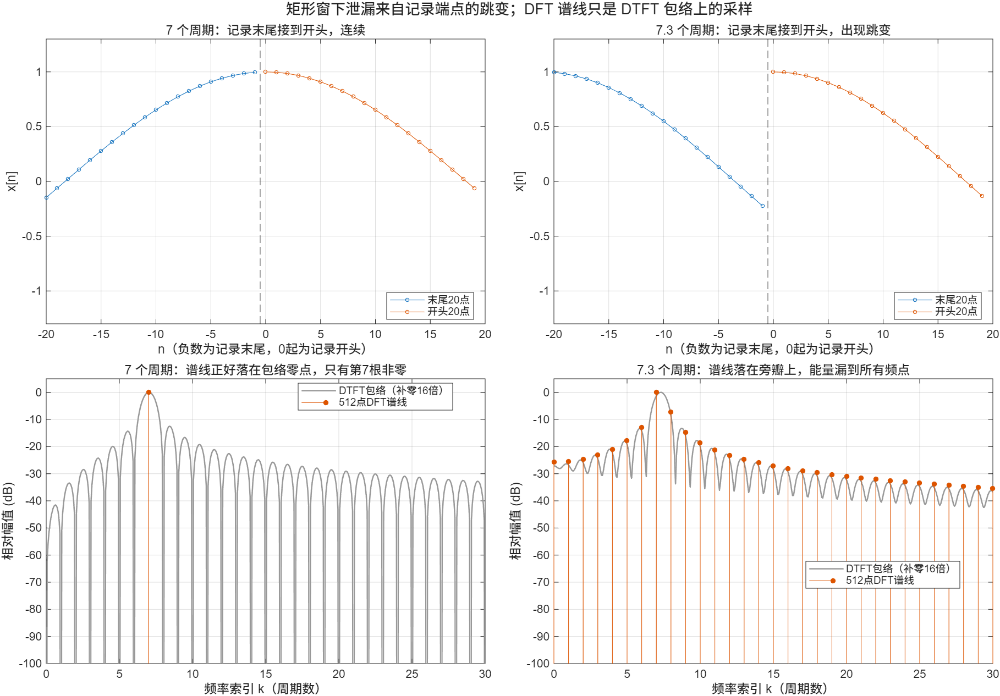
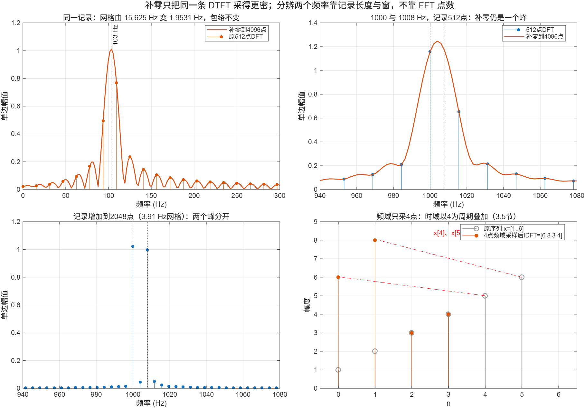

::: {.page-meta}
[教材书内 96—99 页 · PDF 104—107 页]{} [3.6.1 相对数值，3.6.2 三种误差]{} [1 课时]{}
:::

::: {.keypoints}
[本页要点]{.kp-title}

- DFT 的数学性质是确切的，但它作为连续傅里叶变换的近似必然有误差。误差只来自两步：**采样**和**截断**。
- 采样 → 混叠；截断 → 泄漏；只在离散频点上看 → 栅栏效应。三者不能混叫。
- 数值对应：用 DFT 近似 CTFT 要乘 T；近似 FS 系数要除以 N。
:::

## [①]{.col-badge} 问题从哪来：这些词是谁开始用的 {#sec-1}

“用有限个样本估计频谱到底可信到什么程度”是 1950 年代通信与地球物理领域的现实问题。Blackman 与 Tukey 1958 年在《Bell System Technical Journal》发表的长文《从通信工程角度看功率谱的测量》系统讨论了采样引起的**混叠**（aliasing）、有限记录引起的谱峰扩散，以及用“加权”（窗）压低旁瓣的办法；今天常用的 hanning、hamming 两个名字就出自这篇文章。教材本节的三种误差，就是这一传统的教科书化。

课堂只需一句：**这三种误差不是软件缺陷，是对连续信号采样和截断的数学后果，任何平台都一样。**

::: {.classroom-media-grid}



:::

::: {.media-note}
外部素材需要联网，核对日期见各卡；视频未逐段试看，课堂片段待教师选定。
:::

::: {.sources}
- R. B. Blackman, J. W. Tukey, "The measurement of power spectra from the point of view of communications engineering — Part I," *Bell System Technical Journal* 37(1) (1958) 185–282. [doi:10.1002/j.1538-7305.1958.tb03874.x](https://doi.org/10.1002/j.1538-7305.1958.tb03874.x)
:::

## [②]{.col-badge} 理论与推导 {#sec-2}

### 3.6.1 计算的变换与所需变换间相对数值的确定 {#sec-2-1}

设采样间隔 T，采 N 点。x(n)=x_a(nT) 的 DFT 是其 DTFT 在 [0, 2π] 上的 N 点采样，而 DTFT 与 CTFT 的关系里差一个 1/T（黎曼和：积分 ≈ Σx(nT)e^{−jΩnT}·T）。所以：

| 所需变换 | 用 DFT 近似 | 说明 |
|---|---|---|
| 非周期信号的 CTFT | $X_a(j\Omega_k)\approx T\cdot X(k)$ | 式 (3.1.1) 的积分被求和乘 T 代替 |
| 周期信号的 FS 系数 | $c_k\approx \frac{T}{t_p}X(k)=\frac1N X(k)$ | 式 (3.1.3) 是一个周期上的平均，t_p=NT |
| 往返 | 时域再乘 NF=f 得正常电平 | T·NF=1，电平不变 |

教材因此指出：若用 DFT 计算傅里叶级数系数，1/N 放在正变换更方便。多数实际问题只关心各分量的相对电平，绝对电平常可不管。

### 3.6.2 三种误差 {#sec-2-2}

**混叠。** 采样使频谱以 fₛ 为周期重复，高于 fₛ/2 的分量折回低频。例：fₛ=600 Hz 时 cos(2π·400n/600)=cos(2π·200n/600)，两者的样本逐点相同，事后任何处理都分不开。避免的唯一办法是采样前用模拟低通把带宽限制在折叠频率以下。

**栅栏效应。** DFT 只给出 N 个频点上的值，像隔着栅栏看频谱；峰值落在两个频点之间时被低估。补零使栅栏变密（[3.5](3.5-frequency-sampling.qmd)），能看到更接近真实峰值的数，但记录长度不变、DTFT 不变，**分辨两个相近频率的能力不因补零而提高**。要分开两个频率，需要更长的记录或合适的窗。

**泄漏。** 截断相当于乘矩形窗，频域变为与窗谱 $\frac{\sin(N\omega/2)}{\sin(\omega/2)}$ 的卷积。单音的谱不再是一根线，而是一个主瓣加一串旁瓣。记录里恰好含整数个周期时，DFT 频点正好落在旁瓣的零点上，只剩一根谱线；否则能量“漏”到所有频点。

::: {.callout-note .ask appearance="simple"}
**教师提问：** 一段 512 点记录里有 7.3 个周期的余弦，谱图变宽了。这是混叠、栅栏还是泄漏？（泄漏：记录末尾接不回开头，截断造成；与采样率无关。）
:::

## [③]{.col-badge} 仿真演示 {#sec-3}

::: {.ide-links data-matlab="demo_dft.m" data-python="python/3.6-approximation.py"}
:::

脚本 [demo_dft.m](code/demo_dft.m) [已运行]{.status .ok} 演示 2 与 3。核验记录 [verification-dft.json](code/verification-dft.json)：`alias_400_to_200_at_fs600`、`coherent_rectangular_other_bins`、`offgrid_leakage_norm`。

:::: {.example}
::: {.example-title}
泄漏：7 个周期与 7.3 个周期
:::
::: {.example-body}
**运行前问学生：** 两段记录的末尾接回开头，哪一段是连续的？谱线有几根非零？

{width=100%}

7 周期：只有 k=7（和 k=505）非零，其余小于 10⁻¹⁵；谱线正好落在包络零点。7.3 周期：谱线落在旁瓣上，所有频点都有能量。
:::
::::

:::: {.example}
::: {.example-title}
栅栏与补零：两个相差 8 Hz 的单音
:::
::: {.example-body}
**运行前问学生：** fₛ=8000 Hz，记录 512 点（网格 15.6 Hz），1000 Hz 与 1008 Hz 两个单音，补零到 4096 点后能分开吗？

{width=100%}

补零后曲线更平滑，但两个音仍合成一个峰；记录长度增加到 2048 点（网格 3.9 Hz，矩形窗主瓣相应变窄），两个峰分开。

::: {.panel-tabset}
#### MATLAB [已运行]{.status .ok}

```matlab
fs = 8000; M = 512; n = 0:M-1;
pair512 = cos(2*pi*1000*n/fs) + cos(2*pi*1008*n/fs);
plot((0:4095)*fs/4096, 2*abs(fft(pair512,4096))/M);  xlim([940 1080]);   % 一个峰
n2 = 0:2047; pair2048 = cos(2*pi*1000*n2/fs) + cos(2*pi*1008*n2/fs);
figure; stem((0:2047)*fs/2048, 2*abs(fft(pair2048))/2048); xlim([940 1080]);  % 两个峰
% 混叠：两种频率的样本逐点相同
nA = 0:511; max(abs(cos(2*pi*400*nA/600) - cos(2*pi*200*nA/600)))   % ~1e-13
```

#### Python [对照]{.status .ref}

```python
import numpy as np
fs, M = 8000, 512; n = np.arange(M)
pair = np.cos(2*np.pi*1000*n/fs) + np.cos(2*np.pi*1008*n/fs)
A4096 = 2*np.abs(np.fft.fft(pair, 4096))/M
sel = (np.arange(4096)*fs/4096 > 940) & (np.arange(4096)*fs/4096 < 1080)
print("补零后 940-1080 Hz 内的局部极大个数:", int(np.sum((np.diff(np.sign(np.diff(A4096[sel])))<0))))   # 1
n2 = np.arange(2048); pair2 = np.cos(2*np.pi*1000*n2/fs) + np.cos(2*np.pi*1008*n2/fs)
A2048 = 2*np.abs(np.fft.fft(pair2))/2048
f2 = np.arange(2048)*fs/2048; sel2 = (f2 > 990) & (f2 < 1016)
print("2048 点记录在 990-1016 Hz 内幅值>0.5 的频点:", f2[sel2][A2048[sel2] > 0.5])   # 1000 与 1007.8
assert np.allclose(np.cos(2*np.pi*400*n/600), np.cos(2*np.pi*200*n/600))            # 混叠
```
:::
:::
::::

## [④]{.col-badge} 检查与思考 {#sec-4}

::: {.quiz data-type="number" data-answer="200" data-tol="0.5"}
::: {.q-text}
1. 400 Hz 余弦以 600 Hz 采样，会与 0 至 300 Hz 范围内哪个频率的余弦产生相同样本？（Hz）
:::
::: {.q-explain}
600−400=200 Hz。cos(2π400n/600)=cos(2π200n/600)。补零和加窗都不能恢复已混叠的信息。
:::
:::

::: {.quiz data-type="choice" data-answer="B"}
::: {.q-text}
2. “补零 8 倍就使两个相邻频率的可分辨能力提高 8 倍。”这句话
:::
::: {.q-opts}
[正确，网格更密就更能分辨]{data-opt="A"}
[错误，补零只使采样更密，记录长度和窗主瓣都没变]{data-opt="B"}
[只对矩形窗正确]{data-opt="C"}
[只对 Hann 窗正确]{data-opt="D"}
:::
::: {.q-explain}
分辨能力由记录长度与窗决定；补零只减小栅栏效应。
:::
:::

::: {.quiz data-type="choice" data-answer="C"}
::: {.q-text}
3. fₛ=900 Hz 采集 100 Hz 与 400 Hz 两个单音，512 点记录的谱峰看起来变宽了。这是
:::
::: {.q-opts}
[采样率不足引起的混叠]{data-opt="A"}
[栅栏效应]{data-opt="B"}
[有限记录引起的泄漏]{data-opt="C"}
[软件精度问题]{data-opt="D"}
:::
::: {.q-explain}
两个分量都低于 450 Hz，没有混叠；谱峰变宽来自截断。教材配套程序 example3.7.2 的“混叠”段用的正是这组参数，不能据此演示混叠。
:::
:::

**短答题**

4. 矩形窗下 512 点记录的 7 周期和 7.3 周期余弦，DFT 有哪些区别？
5. 给出一套判断 FFT 谱图异常原因的排查步骤，至少区分四种问题。

::: {.callout-tip collapse="true" appearance="simple"}
## 教师参考要点
4. 7 周期只在 k=7 和 505 两个频点有能量；7.3 周期分散到其他频点。矩形窗的连续频谱在两种情况下都有旁瓣，区别是频点是否落在零点上。
5. 查 fₛ 与带外分量（混叠）；查记录时长和相干性（泄漏）；查 N_fft 与补零（栅栏）；查窗主旁瓣和增益；查频率轴、单双边及幅值或功率谱归一化。
:::



::: {.see-also}
[另请参阅]{.sa-title}

::: {.sa-row}
[先修]{.sa-label} 2.1 采样定理 · [3.3.3 DFT 是 CTFT 的近似](3.3-dft.qmd) · [3.5 频域采样](3.5-frequency-sampling.qmd)
:::
::: {.sa-row}
[后继]{.sa-label} [3.7 窗函数和加权](3.7-windows.qmd)
:::
:::
