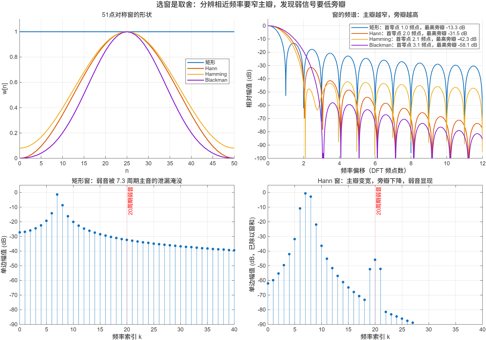

::: {.page-meta}
[教材书内 99—119 页 · PDF 107—127 页]{} [3.7.1 加权，3.7.2 常用的窗函数]{} [1 课时]{}
:::

::: {.keypoints}
[本页要点]{.kp-title}

- 截断就是乘窗；时域相乘，频域是与窗谱的周期卷积。窗谱的主瓣决定分辨能力，旁瓣决定泄漏。
- 所有窗都是在“主瓣窄”和“旁瓣低”之间取舍：矩形窗主瓣最窄、旁瓣最高；Blackman 相反。
- 加窗后幅值要除以窗和 Σw，不是除以 N；补零后分母仍是原窗和。
:::

## [①]{.col-badge} 问题从哪来：从 hanning 到 Harris 的综述 {#sec-1}

Blackman 与 Tukey 1958 年讨论功率谱测量时，把对记录两端逐渐减小权重的做法叫“加权”，并把 0.5−0.5cos 形式的权称为 hanning（取自奥地利气象学家 Julius von Hann，他曾用类似的三点平滑处理气象数据），把 0.54−0.46cos 形式称为 hamming（取自 Richard Hamming）。二十年后，Harris 1978 年在《Proceedings of the IEEE》上发表的综述系统比较了二十余种窗的主瓣宽度、最高旁瓣、旁瓣衰减速率、相干增益等指标，成为此后选窗的标准参考。

给学生的落点：**窗不是“消除”泄漏，是把泄漏从“高而慢衰减的旁瓣”换成“宽一点的主瓣加低旁瓣”。** 选哪个窗取决于你要分辨相近频率，还是要发现弱信号。

::: {.classroom-media-grid}



:::

::: {.media-note}
外部素材需要联网，核对日期见各卡；视频未逐段试看，课堂片段待教师选定。
:::

::: {.sources}
- R. B. Blackman, J. W. Tukey, *Bell System Technical Journal* 37(1) (1958) 185–282. [doi:10.1002/j.1538-7305.1958.tb03874.x](https://doi.org/10.1002/j.1538-7305.1958.tb03874.x)
- F. J. Harris, "On the use of windows for harmonic analysis with the discrete Fourier transform," *Proc. IEEE* 66(1) (1978) 51–83. [doi:10.1109/PROC.1978.10837](https://doi.org/10.1109/PROC.1978.10837)
:::

## [②]{.col-badge} 理论与推导 {#sec-2}

### 3.7.1 加权：时域相乘，频域卷积 {#sec-2-1}

截断后的序列 $x_w(n)=x(n)w(n)$，DTFT 满足

$$
X_w(e^{j\omega})=\frac1{2\pi}\int_{-\pi}^{\pi}X(e^{j\theta})\,W(e^{j(\omega-\theta)})\,d\theta.
$$

单音 $x(n)=\cos\omega_0 n$ 的谱是两根线，卷积后变成两份平移到 ±ω₀ 的窗谱。所以**谱图上看到的“峰”的形状就是窗谱的形状。** 矩形窗（长度 N）的谱

$$
W_R(e^{j\omega})=\sum_{n=0}^{N-1}e^{-j\omega n}=e^{-j\omega(N-1)/2}\frac{\sin(N\omega/2)}{\sin(\omega/2)},
$$

主瓣零点到零点宽 4π/N（以 DFT 频点计为 2 个频点），最高旁瓣约 −13 dB，旁瓣以每倍频程 6 dB 衰减。这是离散序列的正弦之比，不是连续时间矩形脉冲的 sinc。

::: {.callout-note .ask appearance="simple"}
**教师提问：** 记录长度 N 加倍，主瓣宽度怎么变？旁瓣高度怎么变？（主瓣减半；最高旁瓣相对高度不变，仍约 −13 dB。所以加长记录提高分辨力，但不压泄漏；压泄漏要换窗。）
:::

### 3.7.2 常用的窗函数 {#sec-2-2}

对称窗（长度 N，n=0,…,N−1，分母 N−1）：

| 窗 | w(n) | 首零点（频点） | 最高旁瓣 |
|---|---|---|---|
| 矩形 | 1 | 1.0 | −13.3 dB |
| Hann | $0.5-0.5\cos\frac{2\pi n}{N-1}$ | 2.0 | −31.5 dB |
| Hamming | $0.54-0.46\cos\frac{2\pi n}{N-1}$ | 2.1 | −42.3 dB |
| Blackman | $0.42-0.5\cos\frac{2\pi n}{N-1}+0.08\cos\frac{4\pi n}{N-1}$ | 3.1 | −58.1 dB |

表中数值为 N=51 时本机测得（见核验记录），与 Harris 1978 的表一致到小数点后一位。主瓣从 1 到 3 个频点，旁瓣从 −13 到 −58 dB，两列反向变化。

**对称窗与周期窗。** 对称窗 w(n)=w(N−1−n)，用于滤波器设计；配合 DFT 做谱分析常用周期窗（分母 N），首点为 0、末点一般非 0，此时加窗后的序列恰好是一个周期。两者都可用于谱分析，不能说对称窗“错误”。

**幅值校正。** M 个样本乘窗 w 后做 N_fft 点 DFT，实单音的单边幅值取 $2|X(k)|/\sum w$（直流与偶数 N_fft 的 Nyquist 点不乘 2）。矩形窗 Σw=M；补零后分母仍是 Σw，不是 N_fft，否则幅值错误缩小。这是幅值谱的做法，不是功率谱密度。

## [③]{.col-badge} 仿真演示 {#sec-3}

::: {.ide-links data-matlab="demo_dft.m" data-python="python/3.7-windows.py"}
:::

<div class="video-box">
<p class="media-pending">课堂动画正在整理上线；请先查看下方静态图和实验代码。</p>
</div>

::: {.media-note}
由 [make_windows_video.m](code/make_windows_video.m) 生成；[动画核验记录](code/results/verification-video-windows.json)。先让学生预测“加 Hann 窗后主瓣变宽还是变窄、弱音能不能看见”，再播放。对比度沿用原脚本，比较 k=20 与 k=17。点击加载后再按播放键。
:::

脚本 [demo_dft.m](code/demo_dft.m) [已运行]{.status .ok} 演示 4。核验记录 [verification-dft.json](code/verification-dft.json)：`window_first_null_bins`、`window_peak_sidelobe_db`、`hann_coherent_gain_padding_amplitude`、`weak_tone_contrast_db_*`。

:::: {.example}
::: {.example-title}
四种窗的形状与频谱；一个比主音低 46 dB 的弱音
:::
::: {.example-body}
**运行前问学生：** 加 Hann 窗后主瓣变宽还是变窄？一个比 7.3 周期主音低 46 dB、位于 20 周期的弱音，矩形窗能看见吗？

{width=100%}

本机实测：弱音处对比度矩形窗 −2 dB，Hann 窗 +25 dB；Hann 谱已除以窗和，弱音幅值读出 0.00507（真值 0.005，差 1.4%，来自主音残余泄漏）。

::: {.panel-tabset}
#### MATLAB [已运行]{.status .ok}

```matlab
Nw = 51; nw = (0:Nw-1)';
hann  = 0.5-0.5*cos(2*pi*nw/(Nw-1));            % 对称窗，基础 MATLAB 即可
W = abs(fft(hann, 8192)); W = W/W(1);
plot((0:8191)/8192*Nw, 20*log10(W)); xlim([0 12]); ylim([-100 5]);
% 弱音：矩形窗 vs 周期 Hann 窗，幅值除以窗和
M = 512; n = 0:M-1; two = cos(2*pi*7.3*n/M) + 0.005*cos(2*pi*20*n/M);
hannP = 0.5-0.5*cos(2*pi*n/M);
specRect = abs(fft(two))/M*2;  specHann = abs(fft(two.*hannP))/sum(hannP)*2;
[specRect(21), specHann(21)]                    % 频点 20：矩形窗被泄漏淹没，Hann 约 0.005
```

#### Python [对照]{.status .ref}

```python
import numpy as np
from scipy.signal import windows
M = 512; n = np.arange(M)
two = np.cos(2*np.pi*7.3*n/M) + 0.005*np.cos(2*np.pi*20*n/M)
hannP = windows.hann(M, sym=False)                       # 周期 Hann
specRect = np.abs(np.fft.rfft(two))/M*2
specHann = np.abs(np.fft.rfft(two*hannP))/hannP.sum()*2
print(specRect[20], specHann[20])                        # 矩形窗 ~0.02（泄漏），Hann ~0.005
# 相干单音 + Hann + 补零：幅值仍按窗和校正
sig = 2.4*np.cos(2*np.pi*19*n/M)
a = np.abs(np.fft.rfft(sig*hannP, 4096))/hannP.sum()*2
assert abs(a[19*8] - 2.4) < 1e-9
```
:::
:::
::::

## [④]{.col-badge} 检查与思考 {#sec-4}

::: {.quiz data-type="choice" data-answer="B"}
::: {.q-text}
1. 加窗能否同时彻底消除泄漏且保持主瓣宽度不变？
:::
::: {.q-opts}
[能，选 Blackman 窗即可]{data-opt="A"}
[一般不能；降低旁瓣通常主瓣变宽，要按强弱分量和邻近频率权衡]{data-opt="B"}
[能，只要记录足够长]{data-opt="C"}
[能，只要补零足够多]{data-opt="D"}
:::
::: {.q-explain}
主瓣窄与旁瓣低是一对取舍；记录加长只让所有窗的主瓣同比例变窄，不改变旁瓣相对高度；补零不改变窗谱。
:::
:::

::: {.quiz data-type="number" data-answer="512" data-tol="0"}
::: {.q-text}
2. 512 点实记录补零到 4096 点，以矩形窗计算单边幅值谱时，|X(k)| 应除以多少？
:::
::: {.q-explain}
除以 512（窗和）。直流和偶数 N_fft 的 Nyquist 点不乘 2，其余正频率乘 2。这是幅值谱，不是 PSD。
:::
:::

::: {.quiz data-type="number" data-answer="1025" data-tol="0"}
::: {.q-text}
3. 2048 点实序列的 rfft 有几个频点？
:::
::: {.q-explain}
2048/2+1=1025，含 Nyquist 点。若画 FFT 前 1024 项，末索引 1023 按 π 归一化是 1023/1024，不是 1；不能与 linspace(0,1,1024) 配对。
:::
:::

**短答题**

4. hann(51, sym=True) 与 hann(51, sym=False) 有什么区别？512 点记录补零到 4096 点应先乘多长的窗？
5. 记录长度加倍与换成 Hann 窗，各自改变了谱图的什么？

::: {.callout-tip collapse="true" appearance="simple"}
## 教师参考要点
4. 前者对称窗，后者周期窗；先乘 512 点窗，再补零。
5. 加长记录：主瓣变窄，分辨力提高，旁瓣相对高度不变；换 Hann：主瓣加宽一倍，旁瓣从 −13 降到 −31 dB，弱信号可见。
:::



::: {.see-also}
[另请参阅]{.sa-title}

::: {.sa-row}
[先修]{.sa-label} [3.6 泄漏](3.6-approximation.qmd) · 2.3.2 DTFT 的卷积性质
:::
::: {.sa-row}
[后继]{.sa-label} 第7章 窗函数法设计 FIR
:::
:::
