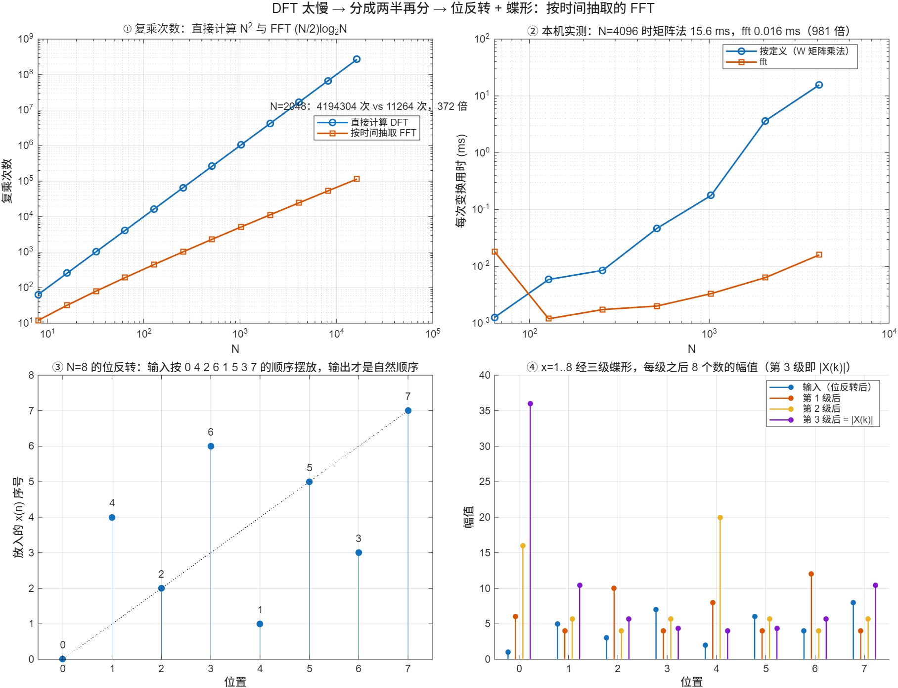

::: {.page-meta}
[教材书内 126—138 页 · PDF 134—146 页]{} [4.2.1 算法原理，4.2.2 运算量比较，4.2.3 特点，4.2.4 变体]{} [2 课时]{}
:::

::: {.keypoints}
[本页要点]{.kp-title}

- 把 x(n) 按 n 的奇偶分成两个 N/2 点序列，X(k)=G(k)+W_N^k H(k)，X(k+N/2)=G(k)−W_N^k H(k)：这一对就是一个**蝶形**，先乘旋转因子再加减。
- 拆到底：v=log₂N 级，每级 N/2 个蝶形；复乘 (N/2)log₂N，复加 N log₂N（式 (4.2.16)、(4.2.17)）。
- 特点：**原位运算**（每个蝶形的输出可以覆盖输入的存储单元）；输入要按**位反转**顺序摆放，输出才是自然顺序；每级的旋转因子指数有规律。
- N=8 的位反转顺序：0 4 2 6 1 5 3 7。
:::

## [①]{.col-badge} 问题从哪来：Danielson 与 Lanczos 的“加倍” {#sec-1}

1942 年，Danielson 和 Lanczos 在 X 射线散射的实用傅里叶分析中写道：把 N 个样本分成奇、偶两组，各算一个 N/2 点的级数，再合并，工作量只有原来的一半多一点；他们把这个技巧反复使用，并报告了手工计算的耗时。这正是本节的“按时间抽取”：拆的依据是输入样本在**时间**上的序号是奇是偶。二十三年后 Cooley 与 Tukey 把同样的分解写成了适合计算机的通用形式；Cooley、Lewis 与 Welch 1967 年的历史注记把 Danielson–Lanczos 列为先驱。

课堂落点：**FFT 的核心只有一句话：奇偶分开，各算一半，合并时只多 N 次乘法。** 剩下的位反转、原位运算都是让这句话在存储器里落地的工程细节。

::: {.classroom-media-grid}





:::

::: {.media-note}
外部素材需要联网，核对日期见各卡；视频未逐段试看，课堂片段待教师选定。
:::

::: {.sources}
- G. C. Danielson, C. Lanczos, "Some improvements in practical Fourier analysis and their application to X-ray scattering from liquids," *J. Franklin Institute* 233(4) (1942) 365–380. [doi:10.1016/S0016-0032(42)90767-1](https://doi.org/10.1016/S0016-0032(42)90767-1)
- J. W. Cooley, P. A. W. Lewis, P. D. Welch, "Historical notes on the fast Fourier transform," *Proc. IEEE* 55(10) (1967) 1675–1677. [doi:10.1109/PROC.1967.5959](https://doi.org/10.1109/PROC.1967.5959)
:::

## [②]{.col-badge} 理论与推导 {#sec-2}

### 4.2.1 拆一次 {#sec-2-1}

N=2^v。把 x(n) 分成偶数项 g(r)=x(2r) 和奇数项 h(r)=x(2r+1)，r=0,…,N/2−1：

$$
X(k)=\sum_{r}x(2r)W_N^{2rk}+\sum_{r}x(2r+1)W_N^{(2r+1)k}
=\underbrace{\sum_r g(r)W_{N/2}^{rk}}_{G(k)}+W_N^k\underbrace{\sum_r h(r)W_{N/2}^{rk}}_{H(k)}.
$$

用到 W_N^{2rk}=W_{N/2}^{rk}（周期性）。G、H 是两个 N/2 点 DFT，只定义在 k=0,…,N/2−1；k 超过 N/2 时用 G(k+N/2)=G(k) 和 W_N^{k+N/2}=−W_N^k（对称性）：

$$
X(k)=G(k)+W_N^kH(k),\qquad X(k+N/2)=G(k)-W_N^kH(k),\qquad k=0,\dots,N/2-1.
$$

这一对式子就是**蝶形**（教材图 4.2.1）：输入 G(k)、H(k)，先算 W_N^k·H(k)（一次复乘），再一加一减（两次复加），输出 X(k) 和 X(k+N/2)。拆一次的代价：两个 N/2 点 DFT 各 (N/2)² 次复乘，加 N/2 个蝶形，共 N²/2+N/2。

### 4.2.1 拆到底 {#sec-2-2}

G(k)、H(k) 各自又是 DFT，再按奇偶拆；拆 v=log₂N 次后全是两点 DFT（两点 DFT 就是一个蝶形，W₂⁰=1）。总共 v 级，每级 N/2 个蝶形：

$$
m_F=\frac N2\log_2N,\qquad a_F=N\log_2N.
$$

演示④用 x=1..8 走三级：输入按位反转顺序摆好，每级之后的 8 个数逐级变化，第三级之后就是 |X(k)|，与 `fft` 逐点一致。

::: {.callout-note .ask appearance="simple"}
**教师提问：** 第一级蝶形的旋转因子是什么？（两点 DFT，W₂⁰=1，不需要乘法。所以实际复乘比 (N/2)log₂N 还少一些，教材 133 页说明了这一点，但为统一比较不计特例。）
:::

### 4.2.3 特点：原位运算与位反转 {#sec-2-3}

**原位运算。** 每个蝶形只用两个输入，产生两个输出，输出可以直接写回输入的位置，全程只要 N 个复数单元。

**位反转。** 拆的时候不断把奇数项挑出去，拆到底时输入的实际顺序是序号二进制位反转后的顺序。N=8：n=1(001) 放到位置 4(100)，n=3(011) 放到 6(110)，得到 0 4 2 6 1 5 3 7（演示③）。这样输出正好是自然顺序。也可以反过来：输入自然顺序、输出位反转（4.2.4 的变体），或者两头都自然但放弃原位（教材图 4.2.7 一类）。

## [③]{.col-badge} 仿真演示 {#sec-3}

::: {.ide-links data-matlab="demo_fft_cost.m" data-python="python/4.1-fft-cost.py"}
:::

<div class="video-box">
<p class="media-pending">课堂动画正在整理上线；请先查看下方静态图和实验代码。</p>
</div>

::: {.media-note}
由 [make_fft_dit_video.m](code/make_fft_dit_video.m) 生成；[动画核验记录](code/results/verification-video-fft-dit.json)。先让学生预测“8 个输入按什么顺序摆放，输出才是自然顺序”，再播放；播到第 2 级时暂停一次问旋转因子。节点仅显示复数幅值，实际蝶形用复数计算。点击加载后再按播放键。
:::

脚本 [demo_fft_cost.m](code/demo_fft_cost.m) [已运行]{.status .ok} 里自写了一个基-2 DIT（函数 `fft_dit`：位反转 + v 级原位蝶形），本页看它的后两格。核验记录 [verification-fft-cost.json](code/results/verification-fft-cost.json)。

:::: {.example}
::: {.example-title}
自己写一个 DIT，与 fft 对照；N=8 逐级看蝶形
:::
::: {.example-body}
**运行前问学生：** x=1..8 做 8 点 DFT，X(0) 是多少？位反转后第一个位置放的是 x(几)？

{width=100%}

| 能数出来的数 | 值 |
|---|---|
| 自写 DIT 与 fft 的最大差（N=1024 随机复序列） | 6.7×10⁻¹⁴ |
| N=8 位反转顺序 | 0 4 2 6 1 5 3 7 |
| x=1..8 的 \|X(k)\| | 36, 10.45, 5.66, 4.33, 4, 4.33, 5.66, 10.45 |

::: {.panel-tabset}
#### MATLAB [已运行]{.status .ok}

```matlab
% 基-2 按时间抽取 FFT：位反转 + v 级原位蝶形（完整代码见 demo_fft_cost.m 末尾的 fft_dit）
x = 1:8; N = 8; v = 3;
order = [0 4 2 6 1 5 3 7] + 1;                    % 位反转顺序
X = x(order);
for s = 1:v
    L = 2^s; half = L/2; W = exp(-2i*pi*(0:half-1)/L);
    for start = 1:L:N
        for k = 0:half-1
            a = X(start+k); b = W(k+1)*X(start+k+half);   % 先乘旋转因子
            X(start+k) = a + b; X(start+k+half) = a - b;  % 再加减，写回原位
        end
    end
end
max(abs(X - fft(x)))                               % ~1e-15
```

#### Python [对照]{.status .ref}

```python
import numpy as np
x = np.arange(1, 9, dtype=complex); N, v = 8, 3
order = [0, 4, 2, 6, 1, 5, 3, 7]; X = x[order].copy()
for s in range(1, v+1):
    L = 2**s; half = L//2; W = np.exp(-2j*np.pi*np.arange(half)/L)
    for start in range(0, N, L):
        for k in range(half):
            a, b = X[start+k], W[k]*X[start+k+half]
            X[start+k], X[start+k+half] = a+b, a-b
print(np.max(np.abs(X - np.fft.fft(x))))           # ~1e-15
```
:::
:::
::::

## [④]{.col-badge} 检查与思考 {#sec-4}

::: {.quiz data-type="number" data-answer="36" data-tol="0"}
::: {.q-text}
1. x=1,2,…,8 的 8 点 DFT，X(0) 等于多少？
:::
::: {.q-explain}
X(0)=Σx(n)=36。第三级蝶形之后第一个位置就是它。
:::
:::

::: {.quiz data-type="choice" data-answer="C"}
::: {.q-text}
2. N=16 的按时间抽取 FFT，位置 1（从 0 数）应放入哪个样本？
:::
::: {.q-opts}
[x(1)]{data-opt="A"}
[x(2)]{data-opt="B"}
[x(8)]{data-opt="C"}
[x(15)]{data-opt="D"}
:::
::: {.q-explain}
位置 1 = 0001，位反转 1000 = 8。
:::
:::

::: {.quiz data-type="number" data-answer="5120" data-tol="0"}
::: {.q-text}
3. N=1024 的基-2 FFT 需要多少次复乘（按 (N/2)log₂N 计）？
:::
::: {.q-explain}
512×10=5120。直接计算要 1 048 576 次。
:::
:::

**短答题**

4. 写出蝶形的两条式子，并说明 X(k+N/2) 里的负号从哪来。
5. 什么叫原位运算？它为什么需要输入按位反转顺序摆放？

::: {.callout-tip collapse="true" appearance="simple"}
## 教师参考要点
4. X(k)=G(k)+W^kH(k)，X(k+N/2)=G(k)−W^kH(k)；负号来自 W_N^{k+N/2}=−W_N^k。
5. 每个蝶形的两个输出写回两个输入的位置，全程 N 个单元；反复按奇偶挑出来的顺序恰是位反转，先摆成这个顺序，逐级蝶形后输出才是自然顺序。
:::



::: {.see-also}
[另请参阅]{.sa-title}

::: {.sa-row}
[先修]{.sa-label} [4.1 DFT 的效率问题](4.1-dft-cost.qmd) · [3.3 DFT 定义](../ch3/3.3-dft.qmd)
:::
::: {.sa-row}
[后继]{.sa-label} [4.3 按频率抽取与 IFFT](4.3-dif-ifft.qmd)
:::
:::
