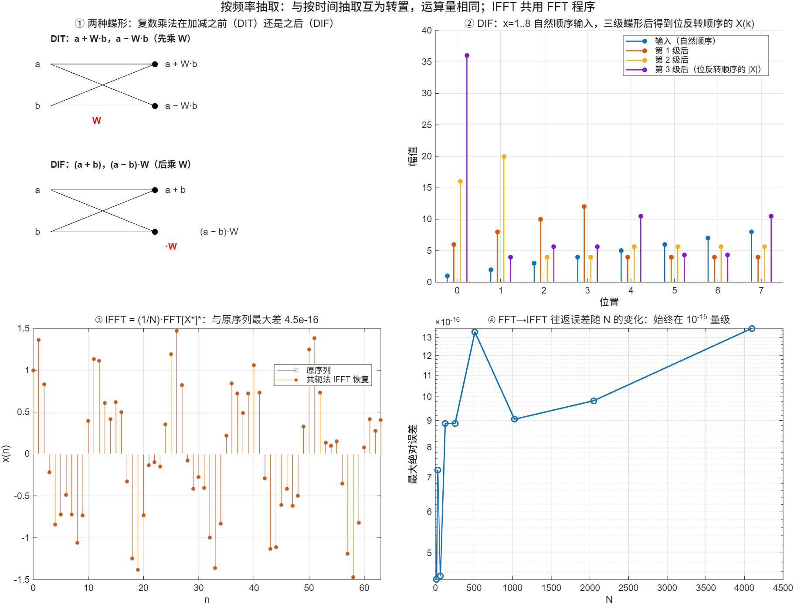

::: {.page-meta}
[教材书内 139—143 页 · PDF 147—151 页]{} [4.3.1 算法原理，4.3.2 与 DIT 的比较，4.3.3 IFFT，4.3.4 变体]{} [1 课时]{}
:::

::: {.keypoints}
[本页要点]{.kp-title}

- 按频率抽取（DIF）：把输入前后两半相加、相减，相减的一半乘 W_N^n，得到 X 的偶数项和奇数项各自的 N/2 点 DFT。蝶形是**先加减、后乘 W**。
- DIF 输入自然顺序、输出位反转，也是原位运算，运算量与 DIT 完全相同；两种流图互为转置。
- IFFT 不必另写程序：x(n)=(1/N)·{DFT[X*(k)]}*（式 (4.3.8)）——先共轭，做 FFT，再共轭，除以 N。
:::

## [①]{.col-badge} 问题从哪来：Gentleman 与 Sande 的另一种拆法 {#sec-1}

Cooley–Tukey 的论文发表一年后，Gentleman 和 Sande 在 1966 年秋季联合计算机会议上发表《快速傅里叶变换：为了乐趣与收益》，讨论了 FFT 的程序实现、舍入误差和各种应用，并给出了另一种分解：不按输入的奇偶拆，而按**输出**的奇偶拆。这种形式后来叫 Sande–Tukey 算法或按频率抽取（DIF）。它和 DIT 的关系是转置：把 DIT 的信号流图反过来，箭头倒向、输入输出互换，就是 DIF。教材第 124 页提到的“桑德—图基等快速算法”就是它。

课堂落点：**同一个 DFT，拆输入还是拆输出是两种对称的选择，运算量一样。** 工程上选哪个看数据顺序：输入已经是自然顺序、输出允许位反转时，DIF 省一次重排。

::: {.sources}
- W. M. Gentleman, G. Sande, "Fast Fourier transforms: for fun and profit," *Proc. AFIPS Fall Joint Computer Conference* (1966) 563–578. [doi:10.1145/1464291.1464352](https://doi.org/10.1145/1464291.1464352)
:::

## [②]{.col-badge} 理论与推导 {#sec-2}

### 4.3.1 拆输出 {#sec-2-1}

把求和拆成前后两半 n 与 n+N/2：

$$
X(k)=\sum_{n=0}^{N/2-1}\Big[x(n)+(-1)^k x(n+\tfrac N2)\Big]W_N^{nk}.
$$

用到 W_N^{(n+N/2)k}=(−1)^k W_N^{nk}。k 为偶（k=2r）时 (−1)^k=1，k 为奇（k=2r+1）时为 −1：

$$
X(2r)=\sum_{n}\big[x(n)+x(n+\tfrac N2)\big]W_{N/2}^{nr},\qquad
X(2r+1)=\sum_{n}\big[x(n)-x(n+\tfrac N2)\big]W_N^{n}\,W_{N/2}^{nr}.
$$

偶数输出是序列 a(n)=x(n)+x(n+N/2) 的 N/2 点 DFT；奇数输出是 b(n)=[x(n)−x(n+N/2)]W_N^n 的 N/2 点 DFT。蝶形：输入 x(n)、x(n+N/2)，输出 a(n) 与 b(n)，**先加减，减法的结果再乘 W_N^n**（教材图 4.3.1）。再对 a、b 各自拆，v 级后得到 X，但顺序是位反转的。

### 4.3.2 与 DIT 比较 {#sec-2-2}

| | DIT | DIF |
|---|---|---|
| 拆的依据 | 输入序号奇偶 | 输出序号奇偶 |
| 蝶形 | 先乘 W 再加减 | 先加减再乘 W |
| 顺序 | 输入位反转，输出自然 | 输入自然，输出位反转 |
| 运算量 | (N/2)log₂N 复乘，N log₂N 复加 | 相同 |
| 原位运算 | 可以 | 可以 |
| 关系 | 互为转置（图 4.2.5 ↔ 图 4.3.4） | |

::: {.callout-note .ask appearance="simple"}
**教师提问：** DIF 第一级的旋转因子是 W_N^n，n=0…N/2−1，最后一级是 W₂⁰=1。DIT 正好相反。为什么？（转置把流图的方向倒过来，第一级和最后一级互换。）
:::

### 4.3.3 IFFT：共用 FFT 程序 {#sec-2-3}

IDFT 与 DFT 只差指数符号和 1/N。对 IDFT 公式两边取共轭：

$$
x(n)=\frac1N\sum_k X(k)W_N^{-kn}
\;\Rightarrow\;
x(n)=\frac1N\Big[\sum_k X^*(k)W_N^{kn}\Big]^*=\frac1N\{\mathrm{DFT}[X^*(k)]\}^*.
$$

三步：X 取共轭 → 调用 FFT → 结果取共轭再除以 N。演示③用 64 点信号验证，与原序列差 4.5×10⁻¹⁶，与内置 `ifft` 同量级。另一种办法是把 FFT 程序里的 W 换成 W^{−1} 并在末尾除 N，教材 4.3.3 也讲了，但要改程序。

## [③]{.col-badge} 仿真演示 {#sec-3}

::: {.ide-links data-matlab="demo_dif_ifft.m" data-python="python/4.3-dif-ifft.py"}
:::

脚本 [demo_dif_ifft.m](code/demo_dif_ifft.m) [已运行]{.status .ok}，自写了 DIF（函数 `fft_dif`）。核验记录 [verification-dif-ifft.json](code/results/verification-dif-ifft.json)。

:::: {.example}
::: {.example-title}
两种蝶形、DIF 逐级结果、共轭法 IFFT、往返误差
:::
::: {.example-body}
**运行前问学生：** DIF 的蝶形里复数乘法在加减之前还是之后？用 FFT 程序算 IFFT，要做哪三步？

{width=100%}

| 能数出来的数 | 值 |
|---|---|
| 自写 DIF 与 fft 的最大差（N=1024） | 5.7×10⁻¹⁴ |
| 共轭法 IFFT 与原序列的最大差 / 内置 ifft | 4.5×10⁻¹⁶ / 4.5×10⁻¹⁶ |
| FFT→IFFT 往返误差，N=16…4096 | 2×10⁻¹⁶ … 10⁻¹⁵ |

::: {.panel-tabset}
#### MATLAB [已运行]{.status .ok}

```matlab
% DIF：自然顺序输入，v 级蝶形（先加减后乘 W），输出位反转（完整代码见 demo_dif_ifft.m 的 fft_dif）
x = 1:8; N = 8; X = x;
for s = 3:-1:1
    L = 2^s; half = L/2; W = exp(-2i*pi*(0:half-1)/L);
    for start = 1:L:N
        for k = 0:half-1
            a = X(start+k); b = X(start+k+half);
            X(start+k) = a + b; X(start+k+half) = (a - b)*W(k+1);   % 后乘旋转因子
        end
    end
end
X([0 4 2 6 1 5 3 7]+1) = X; max(abs(X - fft(x)))   % 输出位反转，整理后 ~1e-15
% IFFT 共用 FFT：x = (1/N)·conj(fft(conj(X)))
xr = randn(1, 64); max(abs(conj(fft(conj(fft(xr))))/64 - xr))   % ~1e-16
```

#### Python [对照]{.status .ref}

```python
import numpy as np
x = np.arange(1, 9, dtype=complex); N = 8; X = x.copy()
for s in (3, 2, 1):
    L = 2**s; half = L//2; W = np.exp(-2j*np.pi*np.arange(half)/L)
    for start in range(0, N, L):
        for k in range(half):
            a, b = X[start+k], X[start+k+half]
            X[start+k], X[start+k+half] = a+b, (a-b)*W[k]
out = np.empty_like(X); out[[0, 4, 2, 6, 1, 5, 3, 7]] = X
print(np.max(np.abs(out - np.fft.fft(x))))                        # ~1e-15
xr = np.random.default_rng(0).normal(size=64)
print(np.max(np.abs(np.conj(np.fft.fft(np.conj(np.fft.fft(xr))))/64 - xr)))   # ~1e-16
```
:::
:::
::::

## [④]{.col-badge} 检查与思考 {#sec-4}

::: {.quiz data-type="choice" data-answer="B"}
::: {.q-text}
1. 按频率抽取 FFT 的蝶形中，复数乘法出现在
:::
::: {.q-opts}
[加减之前]{data-opt="A"}
[加减之后，只乘在相减的那一路]{data-opt="B"}
[加减两路都要乘]{data-opt="C"}
[不需要乘法]{data-opt="D"}
:::
::: {.q-explain}
b(n)=[x(n)−x(n+N/2)]·W_N^n；相加的一路不乘。
:::
:::

::: {.quiz data-type="multi" data-answer="A,C,D"}
::: {.q-text}
2. 用 FFT 程序计算 IFFT，需要哪些步骤？
:::
::: {.q-opts}
[对 X(k) 取共轭]{data-opt="A"}
[对 X(k) 取倒数]{data-opt="B"}
[调用 FFT 后对结果取共轭]{data-opt="C"}
[除以 N]{data-opt="D"}
:::
::: {.q-explain}
x(n)=(1/N){DFT[X*(k)]}*。
:::
:::

::: {.quiz data-type="number" data-answer="11264" data-tol="0"}
::: {.q-text}
3. N=2048 的按频率抽取 FFT 需要多少次复乘？
:::
::: {.q-explain}
与 DIT 相同：(N/2)log₂N = 1024×11 = 11264。
:::
:::

**短答题**

4. 从 X(k)=Σ[x(n)+(−1)^k x(n+N/2)]W_N^{nk} 出发，推出偶数、奇数输出各是哪个序列的 N/2 点 DFT。
5. “DIT 与 DIF 互为转置”是什么意思？转置后哪些东西互换？

::: {.callout-tip collapse="true" appearance="simple"}
## 教师参考要点
4. k=2r：a(n)=x(n)+x(n+N/2) 的 N/2 点 DFT；k=2r+1：b(n)=[x(n)−x(n+N/2)]W_N^n 的 N/2 点 DFT。
5. 信号流图箭头反向、输入输出互换；蝶形里乘法的位置从“前”变“后”，位反转从输入侧变到输出侧。
:::



::: {.see-also}
[另请参阅]{.sa-title}

::: {.sa-row}
[先修]{.sa-label} [4.2 按时间抽取的 FFT](4.2-dit.qmd)
:::
::: {.sa-row}
[后继]{.sa-label} [4.4 实序列 FFT](4.4-real-fft.qmd) · [4.5 FFT 的应用](4.5-applications.qmd)
:::
:::
