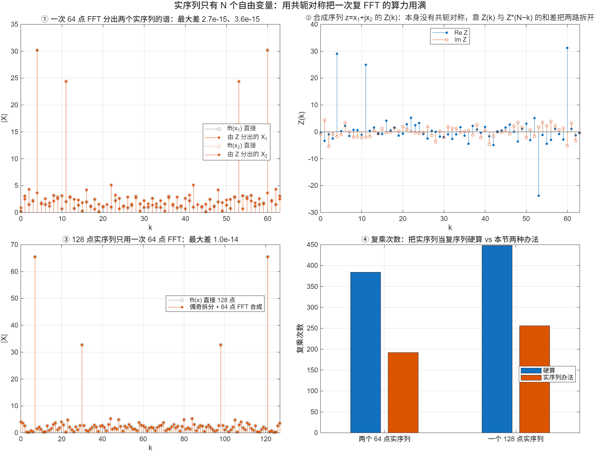

::: {.page-meta}
[教材书内 143—145 页 · PDF 151—153 页]{} [4.4.1 问题的提出，4.4.2 一次 FFT 算两个实序列，4.4.3 N 点 FFT 算 2N 点实序列]{} [1 课时]{}
:::

::: {.keypoints}
[本页要点]{.kp-title}

- 把实序列当复序列做 FFT，存储加倍、虚部的乘法白算。实序列的 DFT 共轭对称 X(N−k)=X*(k)，只有一半独立，这一半算力可以用在别处。
- 办法一：x(n)=x₁(n)+j·x₂(n)，一次 FFT 得 X(k)，再用 X₁(k)=[X(k)+X*(N−k)]/2、X₂(k)=[X(k)−X*(N−k)]/(2j) 拆开。
- 办法二：2N 点实序列，偶样本作实部、奇样本作虚部做 N 点 FFT，拆出 A(k)、B(k) 后用一级蝶形 X(k)=A(k)+W_{2N}^k B(k) 合成。
:::

## [①]{.col-badge} 问题从哪来：实数据的 FFT 该省一半 {#sec-1}

FFT 发表后三年，Bergland 1968 年在《Communications of the ACM》上发表《实值序列的快速傅里叶变换算法》，指出大多数实测数据是实数，直接套复数 FFT 浪费一半存储和运算，并给出了专为实序列改写的算法。教材 4.4 采用的是另一条路：不改 FFT 程序，用共轭对称把两路实数据塞进一次复 FFT，或把一路长实数据折成一半长的复序列。两种思路的收益相同：**实序列的 DFT 只有一半独立，另一半应当用来算别的东西。**

::: {.sources}
- G. D. Bergland, "A fast Fourier transform algorithm for real-valued series," *Communications of the ACM* 11(10) (1968) 703–710. [doi:10.1145/364096.364118](https://doi.org/10.1145/364096.364118)
:::

## [②]{.col-badge} 理论与推导 {#sec-2}

### 数学准备：共轭对称 {#sec-2-1}

实序列 x(n) 的 DFT 满足 X(N−k)=X*(k)（[2.3.3](../ch2/2.3-frequency-domain.qmd)、[3.4.12](../ch3/3.4-properties.qmd)）。反过来，任何 X(k) 都能分成共轭对称部分 X_e(k)=[X(k)+X*(N−k)]/2 与共轭反对称部分 X_o(k)=[X(k)−X*(N−k)]/2；前者是 Re x(n) 的 DFT，后者是 j·Im x(n) 的 DFT。

### 4.4.2 一次 N 点 FFT 算两个 N 点实序列 {#sec-2-2}

令 x(n)=x₁(n)+j x₂(n)，则 X(k)=X₁(k)+jX₂(k)，其中 X₁、X₂ 各自共轭对称。于是

$$
X_1(k)=\frac{X(k)+X^*(N-k)}{2},\qquad X_2(k)=\frac{X(k)-X^*(N-k)}{2j}.
$$

代价：一次 N 点 FFT 加 N 次复加减，而不是两次 FFT。演示①用两个 64 点实序列验证，与分别做 FFT 的差 3×10⁻¹⁵。

### 4.4.3 一个 N 点 FFT 算一个 2N 点实序列 {#sec-2-3}

x(n) 长 2N。取偶样本 a(r)=x(2r)、奇样本 b(r)=x(2r+1)，组成 z(r)=a(r)+j b(r)，做 N 点 FFT 得 Z(k)，按上一小节拆出 A(k)、B(k)。再用[按时间抽取](4.2-dit.qmd)拆一次的蝶形合成：

$$
X(k)=A(k)+W_{2N}^k B(k),\qquad X(k+N)=A(k)-W_{2N}^k B(k),\qquad k=0,\dots,N-1.
$$

代价：一次 N 点 FFT 加 N 次复乘，而不是一次 2N 点 FFT。演示③用 128 点实序列验证，差 10⁻¹⁴。

::: {.callout-note .ask appearance="simple"}
**教师提问：** 办法二的最后一步和 4.2 的第一级蝶形是不是同一件事？（是。4.2 把 N 点拆成奇偶两个 N/2 点；这里把 2N 点拆成奇偶两个 N 点，只是这两个 N 点 DFT 用一次复 FFT 一起算出来。）
:::

## [③]{.col-badge} 仿真演示 {#sec-3}

::: {.ide-links data-matlab="demo_real_fft.m" data-python="python/4.4-real-fft.py"}
:::

脚本 [demo_real_fft.m](code/demo_real_fft.m) [已运行]{.status .ok}。核验记录 [verification-real-fft.json](code/results/verification-real-fft.json)。

:::: {.example}
::: {.example-title}
两路实序列一次算；2N 点实序列用 N 点 FFT
:::
::: {.example-body}
**运行前问学生：** z=x₁+jx₂ 的 Z(k) 还共轭对称吗？128 点实序列用 64 点 FFT 算，省了多少复乘？

{width=100%}

| 能数出来的数 | 值 |
|---|---|
| 两路拆分与直接 FFT 的最大差 | 2.7×10⁻¹⁵、3.6×10⁻¹⁵ |
| 128 点合成与直接 FFT 的最大差 | 1.0×10⁻¹⁴ |
| 两个 64 点实序列：硬算 / 本法 复乘 | 384 / 192 |
| 一个 128 点实序列：硬算 / 本法 复乘 | 448 / 256（192 + 64 次合成乘法） |

::: {.panel-tabset}
#### MATLAB [已运行]{.status .ok}

```matlab
N = 64; n = 0:N-1; x1 = cos(2*pi*4*n/N); x2 = sin(2*pi*11*n/N);
Z = fft(x1 + 1i*x2); Zc = conj(Z(mod(-n, N) + 1));            % Z*(N−k)
X1 = (Z + Zc)/2; X2 = (Z - Zc)/(2i);
[max(abs(X1 - fft(x1))), max(abs(X2 - fft(x2)))]              % ~1e-15
M = 128; m = 0:M-1; x = cos(2*pi*7*m/M);
ZZ = fft(x(1:2:end) + 1i*x(2:2:end)); ZZc = conj(ZZ(mod(-n, N) + 1));
A = (ZZ + ZZc)/2; B = (ZZ - ZZc)/(2i); Wk = exp(-2i*pi*n/M);
max(abs([A + Wk.*B, A - Wk.*B] - fft(x)))                     % ~1e-14
```

#### Python [对照]{.status .ref}

```python
import numpy as np
N = 64; n = np.arange(N); x1 = np.cos(2*np.pi*4*n/N); x2 = np.sin(2*np.pi*11*n/N)
Z = np.fft.fft(x1 + 1j*x2); Zc = np.conj(Z[(-n) % N])
X1, X2 = (Z + Zc)/2, (Z - Zc)/(2j)
print(np.max(np.abs(X1 - np.fft.fft(x1))), np.max(np.abs(X2 - np.fft.fft(x2))))   # ~1e-15
M = 128; m = np.arange(M); x = np.cos(2*np.pi*7*m/M)
ZZ = np.fft.fft(x[0::2] + 1j*x[1::2]); ZZc = np.conj(ZZ[(-n) % N])
A, B = (ZZ + ZZc)/2, (ZZ - ZZc)/(2j); Wk = np.exp(-2j*np.pi*n/M)
print(np.max(np.abs(np.r_[A + Wk*B, A - Wk*B] - np.fft.fft(x))))                # ~1e-14
```
:::
:::
::::

## [④]{.col-badge} 检查与思考 {#sec-4}

::: {.quiz data-type="choice" data-answer="B"}
::: {.q-text}
1. x(n)=x₁(n)+j x₂(n)，x₁、x₂ 为实序列。X₁(k) 等于
:::
::: {.q-opts}
[Re X(k)]{data-opt="A"}
[[X(k)+X*(N−k)]/2]{data-opt="B"}
[[X(k)−X*(N−k)]/2]{data-opt="C"}
[X(k)/2]{data-opt="D"}
:::
::: {.q-explain}
X₁ 是 X 的共轭对称部分；Re X(k) 不对，因为 jX₂(k) 也有实部。
:::
:::

::: {.quiz data-type="number" data-answer="256" data-tol="0"}
::: {.q-text}
2. 用一次 64 点 FFT 算 128 点实序列，复乘次数按 (N/2)log₂N + N 计是多少？
:::
::: {.q-explain}
32×6 + 64 = 256；直接做 128 点 FFT 要 64×7 = 448。
:::
:::

::: {.quiz data-type="choice" data-answer="C"}
::: {.q-text}
3. 为什么把实序列当复序列做 FFT 是浪费？
:::
::: {.q-opts}
[因为 FFT 只能处理复数]{data-opt="A"}
[因为结果会有误差]{data-opt="B"}
[因为实序列的 DFT 共轭对称，一半输出是冗余的，虚部为零的乘法也照做]{data-opt="C"}
[因为实序列不能做 DFT]{data-opt="D"}
:::
::: {.q-explain}
教材 4.4.1：N 点实序列只有 N 个自由变量，N 点复序列有 2N 个。
:::
:::

**短答题**

4. 证明 [X(k)+X*(N−k)]/2 是 Re x(n) 的 DFT。
5. 办法二的合成步骤为什么用的是 W_{2N}^k 而不是 W_N^k？

::: {.callout-tip collapse="true" appearance="simple"}
## 教师参考要点
4. x=x_r+jx_i，X=X_r+jX_i，X_r、X_i 各共轭对称；X*(N−k)=X_r(k)−jX_i(k)，相加除 2 得 X_r。
5. 合成的是 2N 点 DFT，奇样本相对偶样本延迟 1 个样本，对应 2N 点变换的旋转因子 W_{2N}^k。
:::



::: {.see-also}
[另请参阅]{.sa-title}

::: {.sa-row}
[先修]{.sa-label} [4.2 按时间抽取的 FFT](4.2-dit.qmd) · [3.4 对称性](../ch3/3.4-properties.qmd)
:::
::: {.sa-row}
[后继]{.sa-label} [4.5 FFT 的应用](4.5-applications.qmd)
:::
:::
