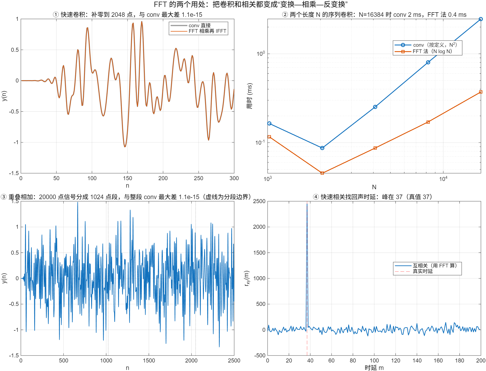

::: {.page-meta}
[教材书内 145—148 页 · PDF 153—156 页]{} [4.5.1 快速卷积，4.5.2 快速相关]{} [1 课时]{}
:::

::: {.keypoints}
[本页要点]{.kp-title}

- 线性卷积 y=x*h 可用圆周卷积代替，条件 N ≥ N₁+N₂−1；取 N=2^v 补零，FFT 相乘再 IFFT。
- 很长的 x 与短的 h：把 x 分段，每段与 h 做快速卷积，相邻段结果的重叠部分相加（重叠相加法）；结果与整段卷积逐点相同。
- 相关是卷积的近亲：r_xy(m)=Σx(n)y(n−m)，频域 R_xy(k)=X(k)Y*(k)，同样补零后用 FFT 算；相关峰的位置就是时延。
:::

## [①]{.col-badge} 问题从哪来：Stockham 1966，高速卷积 {#sec-1}

FFT 论文发表的第二年，Stockham 在春季联合计算机会议上发表《高速卷积与相关》，指出卷积和相关都可以“变换—相乘—反变换”来算，长序列时比直接求和快几个数量级；同一篇文章讨论了圆周卷积与线性卷积的区别（要补零）和长数据的分段处理（后来叫重叠相加、重叠保留）。[3.4](../ch3/3.4-properties.qmd) 的圆周卷积定理、补零长度条件，就是为这一节准备的。

课堂落点：**FFT 最大的用处不是看频谱，而是算卷积。** 滤波器越长、信号越长，收益越大；演示②里两个 16384 点序列卷积，`conv` 2.5 ms，FFT 法 0.37 ms。

::: {.classroom-media-grid}



:::

::: {.media-note}
外部素材需要联网，核对日期见各卡；视频未逐段试看，课堂片段待教师选定。
:::

::: {.sources}
- T. G. Stockham Jr., "High-speed convolution and correlation," *Proc. AFIPS Spring Joint Computer Conference* (1966) 229–233. [doi:10.1145/1464182.1464209](https://doi.org/10.1145/1464182.1464209)
:::

## [②]{.col-badge} 理论与推导 {#sec-2}

### 4.5.1 快速卷积的步骤 {#sec-2-1}

x 长 N₁，h 长 N₂：

1. 取 N ≥ N₁+N₂−1 且 N=2^v，两者都补零到 N。
2. X(k)=FFT[x]，H(k)=FFT[h]。
3. Y(k)=X(k)H(k)。
4. y(n)=IFFT[Y(k)]，取前 N₁+N₂−1 点。

为什么必须补零：DFT 相乘对应的是 N 点圆周卷积，等于线性卷积以 N 为周期叠加后取一周期（[3.4.9](../ch3/3.4-properties.qmd)）；N ≥ N₁+N₂−1 时副本不重叠，圆周卷积就是线性卷积。运算量：直接卷积 N₁N₂ 次实乘；FFT 法三次 N 点 FFT 加 N 次复乘，N 大时远少于 N₁N₂。

### 4.5.1 很长的信号：重叠相加 {#sec-2-2}

x 有几万点、h 只有一百点时，不必等整段数据到齐。把 x 切成 B 点一段：x=Σx_i，每段 x_i*h 长 B+N₂−1，比段长多出 N₂−1 点，与下一段的结果重叠；卷积是线性的，y=Σ(x_i*h)，把重叠部分相加即可。每段用 N ≥ B+N₂−1 的 FFT，H(k) 只算一次。演示③：20000 点信号分成 1024 点段，与整段 `conv` 差 4×10⁻¹⁶。

::: {.callout-note .ask appearance="simple"}
**教师提问：** 段长 B 取大取小各有什么代价？（B 小：段数多、每段都要一次 FFT 和 N₂−1 点的重叠开销；B 大：每段 FFT 长，延迟大。B 取 h 长度的几倍到几十倍常见。）
:::

### 4.5.2 快速相关 {#sec-2-3}

互相关 r_xy(m)=Σ_n x(n)y(n−m) 与卷积只差一个翻转：r_xy(m)=x(m)*y(−m)。频域 R_xy(k)=X(k)Y*(k)。步骤与快速卷积相同，只是第 3 步取共轭相乘，同样要补零到 N ≥ N₁+N₂−1，否则相关也会圆周折叠。相关的用处：y 是 x 的延迟版本时，r_xy 在延迟处出峰。演示④：把随机信号延迟 37 点、衰减到 0.6、加上同量级噪声，相关峰仍准确落在 37。

## [③]{.col-badge} 仿真演示 {#sec-3}

::: {.ide-links data-matlab="demo_fast_convolution.m" data-python="python/4.5-fast-convolution.py"}
:::

脚本 [demo_fast_convolution.m](code/demo_fast_convolution.m) [已运行]{.status .ok}。核验记录 [verification-fast-conv.json](code/results/verification-fast-conv.json)。

:::: {.example}
::: {.example-title}
快速卷积、用时比较、重叠相加、相关找时延
:::
::: {.example-body}
**运行前问学生：** 1000 点与 101 点卷积要补零到多少？分段后重叠部分怎么处理？回声延迟 37 点，相关峰在哪？

{width=100%}

| 能数出来的数 | 值 |
|---|---|
| 1000 点 * 101 点：补零长度 / 与 conv 最大差 | 2048 / 4.4×10⁻¹⁶ |
| 两个 16384 点序列卷积：conv / FFT 法（本机，5 次取最小） | 2.5 ms / 0.37 ms |
| 重叠相加（20000 点，段长 1024）与整段 conv 最大差 | 4.4×10⁻¹⁶ |
| 回声时延：真值 / 相关峰 | 37 / 37 |

MATLAB 的 `conv` 本身已高度优化，小 N 时比 FFT 法快，两条曲线在几千点处交叉；Python 里 `np.convolve` 是直接求和，16384 点时 30 ms 对 1.7 ms。

::: {.panel-tabset}
#### MATLAB [已运行]{.status .ok}

```matlab
x = randn(1, 1000); h = ones(1, 101)/101;                 % 任意 x、h
N = 2^nextpow2(1000 + 101 - 1);                            % 2048
y = real(ifft(fft(x, N) .* fft(h, N))); y = y(1:1100);
max(abs(y - conv(x, h)))                                   % ~1e-16
% 重叠相加
xL = randn(1, 20000); B = 1024; NfB = 2^nextpow2(B + 100); H = fft(h, NfB); yOA = zeros(1, 20100);
for s = 1:B:20000
    seg = xL(s:min(s+B-1, 20000)); ys = real(ifft(fft(seg, NfB) .* H)); ys = ys(1:numel(seg)+100);
    yOA(s:s+numel(ys)-1) = yOA(s:s+numel(ys)-1) + ys;
end
max(abs(yOA - conv(xL, h)))                                % ~1e-16
% 快速相关找时延
s = randn(1, 4096); r = [zeros(1, 37), 0.6*s(1:end-37)] + 0.5*randn(1, 4096);
Nc = 2^nextpow2(2*4096 - 1); rxy = real(ifft(fft(r, Nc) .* conj(fft(s, Nc))));
[~, i] = max(rxy(1:4096)); i - 1                           % 37
```

#### Python [对照]{.status .ref}

```python
import numpy as np
rng = np.random.default_rng(0); x = rng.normal(size=1000); h = np.ones(101)/101
N = 1 << int(np.ceil(np.log2(1100)))                       # 2048
y = np.fft.ifft(np.fft.fft(x, N)*np.fft.fft(h, N)).real[:1100]
print(np.max(np.abs(y - np.convolve(x, h))))               # ~1e-16
s = rng.normal(size=4096); r = np.r_[np.zeros(37), 0.6*s[:-37]] + 0.5*rng.normal(size=4096)
Nc = 1 << 13; rxy = np.fft.ifft(np.fft.fft(r, Nc)*np.conj(np.fft.fft(s, Nc))).real[:4096]
print(int(np.argmax(rxy)))                                 # 37
```
:::
:::
::::

## [④]{.col-badge} 检查与思考 {#sec-4}

::: {.quiz data-type="number" data-answer="2048" data-tol="0"}
::: {.q-text}
1. 1000 点序列与 101 点序列做快速卷积，用基-2 FFT 至少补零到多少点？
:::
::: {.q-explain}
N ≥ 1000+101−1 = 1100，取 2 的幂 2048。
:::
:::

::: {.quiz data-type="choice" data-answer="C"}
::: {.q-text}
2. 快速相关与快速卷积在频域的区别是
:::
::: {.q-opts}
[相关不需要补零]{data-opt="A"}
[相关不需要 IFFT]{data-opt="B"}
[相关是 X(k)·Y*(k)，卷积是 X(k)·Y(k)]{data-opt="C"}
[没有区别]{data-opt="D"}
:::
::: {.q-explain}
r_xy(m)=x(m)*y(−m)，时域翻转对应频域共轭。补零条件相同。
:::
:::

::: {.quiz data-type="number" data-answer="1124" data-tol="0"}
::: {.q-text}
3. 重叠相加法中，段长 1024、h 长 101，每段卷积结果有多少点？
:::
::: {.q-explain}
1024+101−1 = 1124，其中最后 100 点与下一段的开头重叠相加。
:::
:::

**短答题**

4. 不补零直接把两个 1000 点序列的 FFT 相乘再 IFFT，得到的是什么？与线性卷积差在哪里？
5. 回声延迟 37 点、幅度 0.6、噪声与信号同量级，相关峰为什么还能准确落在 37？

::: {.callout-tip collapse="true" appearance="simple"}
## 教师参考要点
4. 1000 点圆周卷积：线性卷积（1999 点）以 1000 为周期叠加后取一周期，前 999 点被尾部折回污染。
5. 相关把 4096 个样本的一致性累加起来，噪声不相关，累加后相对变小；峰高约 0.6×Σs²。
:::



::: {.see-also}
[另请参阅]{.sa-title}

::: {.sa-row}
[先修]{.sa-label} [3.4 圆周卷积与补零长度](../ch3/3.4-properties.qmd) · [4.2 FFT](4.2-dit.qmd)
:::
::: {.sa-row}
[后继]{.sa-label} 第7章 FIR 滤波器的实现（FIR-01 实验用快速卷积核对）
:::
:::
