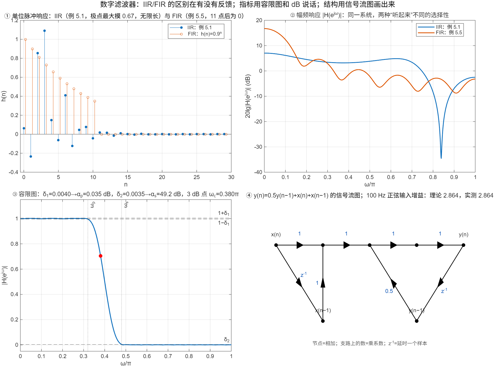

::: {.page-meta}
[教材书内 150—153 页 · PDF 158—161 页]{} [5.1.1 分类与频率响应，5.1.2 技术指标，5.1.3 结构表示]{} [1 课时]{}
:::

::: {.keypoints}
[本页要点]{.kp-title}

- 数字滤波器 = 一个用差分方程实现的线性时不变系统。分母有 z⁻¹ 项（有反馈）是 IIR，h(n) 无限长；只有分子（无反馈）是 FIR，h(n) 有限长（式 (5.1.1)、(5.1.2)）。
- 频率响应 H(e^{jω})=|H|e^{jθ(ω)}：幅频响应管“通哪些、阻哪些”，相频响应管“延迟多少”。
- 技术指标：通带 |ω|≤ωp 内 1−δ₁≤|H|≤1+δ₁，阻带 |ω|≥ωs 内 |H|≤δ₂；换成 dB：αp=−20lg(1−δ₁)，αs=−20lg δ₂；|H|=1/√2 处是 3 dB 截止频率（式 (5.1.3)—(5.1.6)）。
- 结构三要素：加法器、乘法器、单位延时 z⁻¹；用方框图或信号流图画出来，节点代表相加，支路代表乘系数或延时。
:::

## [①]{.col-badge} 问题从哪来：“数字滤波器”这个词是 1960 年代中期才有的 {#sec-1}

模拟滤波器有近百年的理论：电感电容网络、巴特沃思、切比雪夫，指标就是用通带容限、阻带衰减来说的。1965 年 Kaiser 在 Allerton 会议上发表《线性数字滤波器实现中的一些实际考虑》，标题里已经用了“digital filter”，讨论的正是本章的问题：差分方程怎么排成结构、系数取有限字长会怎样。1967 年 Rader 与 Gold 在《Proc. IEEE》发表了长达 23 页的综述《频域中的数字滤波器设计技术》，把 IIR、FIR、频率采样这些概念系统地摆到了一起。本章的容限图（教材图 5.1.2）是从模拟滤波器直接继承下来的：先说清楚“允许差多少”，再谈怎么设计（第 6、7 章）和怎么实现（本章）。

课堂落点：**滤波器要先能说清指标，再谈结构。** 本页的容限图和 dB 换算会在第 6、7 章反复使用。

::: {.classroom-media-grid}





:::

::: {.media-note}
外部素材需要联网；核对日期和未知字段见各卡。
:::

::: {.sources}
- J. F. Kaiser, "Some practical considerations in the realization of linear digital filters," *Proc. 3rd Allerton Conf.* (1965)；重印于 *Papers on Digital Signal Processing*, MIT Press (1969) 54–66. [doi:10.7551/mitpress/5222.003.0006](https://doi.org/10.7551/mitpress/5222.003.0006)
- C. M. Rader, B. Gold, "Digital filter design techniques in the frequency domain," *Proc. IEEE* 55(2) (1967) 149–171. [doi:10.1109/PROC.1967.5434](https://doi.org/10.1109/PROC.1967.5434)
:::

## [②]{.col-badge} 理论与推导 {#sec-2}

### 5.1.1 分类：看分母 {#sec-2-1}

$$
H(z)=\frac{\sum_{r=0}^{M}b_r z^{-r}}{1-\sum_{k=1}^{N}a_k z^{-k}}\quad\text{(IIR，N≥1)},\qquad
H(z)=\sum_{n=0}^{N-1}h(n)z^{-n}\quad\text{(FIR)}.
$$

IIR 的输出用到过去的输出（递归），h(n) 一般无限长；FIR 的输出只用到有限个输入，h(n) 就是分子系数。演示①把教材例 5.1 的 IIR 与例 5.5 的 FIR 放在一起：前者 30 点后仍不为零（10⁻⁵ 量级），后者第 11 点起严格为零。

### 5.1.1 频率响应 {#sec-2-2}

单位圆上 z=e^{jω}：H(e^{jω})=|H(e^{jω})|e^{jθ(ω)}。|H| 是幅频响应，θ 是相频响应。正弦输入 A sin(ω₀n) 的稳态输出是 A|H(e^{jω₀})| sin(ω₀n+θ(ω₀))。演示④用习题 5 的一阶系统验证：fs=1 kHz，100 Hz 正弦，ω₀=0.2π，理论增益 2.864 与实测一致。

### 5.1.2 技术指标 {#sec-2-3}

理想低通在 ωc 处陡降，物理上做不到；实际指标允许通带有起伏、阻带有泄漏、中间有过渡带：

| 区间 | 要求 | dB 表示 |
|---|---|---|
| 通带 \|ω\|≤ωp | 1−δ₁ ≤ \|H\| ≤ 1+δ₁ | αp = −20 lg(1−δ₁) |
| 阻带 \|ω\|≥ωs | \|H\| ≤ δ₂ | αs = −20 lg δ₂ |
| 过渡带 ωp<\|ω\|<ωs | 不作要求 | |

3 dB 截止频率：|H(e^{jωc})|=1/√2≈0.707，αp=3 dB。演示③拿一个 41 点低通量出 δ₁=0.0040（0.035 dB）、δ₂=0.0035（49.2 dB）。

::: {.callout-note .ask appearance="simple"}
**教师提问：** δ₂=0.01 对应多少 dB？δ₁=0.01 呢？（αs=40 dB；αp=−20lg0.99=0.087 dB。阻带说“衰减多少 dB”，通带说“起伏多少 dB”，两个数差三个量级是正常的。）
:::

### 5.1.3 结构表示 {#sec-2-4}

差分方程只用三种运算：加、乘常数、延时一个样本。方框图用方块画它们；信号流图更简洁：**节点**表示信号（进入的支路相加），**支路**上标传输系数（常数或 z⁻¹）。同一个 H(z) 可以画出许多不同的流图，这就是本章后面要比较的“结构”。演示④画了 y(n)=0.5y(n−1)+x(n)+x(n−1) 的流图。

## [③]{.col-badge} 仿真演示 {#sec-3}

::: {.ide-links data-matlab="demo_filter_concepts.m" data-python="python/5.1-filter-concepts.py"}
:::

脚本 [demo_filter_concepts.m](code/demo_filter_concepts.m) [已运行]{.status .ok}。核验记录 [verification-filter-concepts.json](code/results/verification-filter-concepts.json)。

:::: {.example}
::: {.example-title}
IIR 与 FIR 的 h(n)、幅频响应、在容限图上量指标、一阶系统的流图与稳态增益
:::
::: {.example-body}
**运行前问学生：** 例 5.1 的 h(n) 会不会衰减到零？由什么决定？100 Hz 正弦通过 y(n)=0.5y(n−1)+x(n)+x(n−1) 后幅度变成几倍？

{width=100%}

| 能数出来的数 | 值 |
|---|---|
| 例 5.1 极点最大模 / h(29) | 0.670 / 1.5×10⁻⁵ |
| 示例低通：δ₁ → αp | 0.0040 → 0.035 dB |
| 示例低通：δ₂ → αs | 0.0035 → 49.2 dB |
| 示例低通：3 dB 截止频率 | 0.380π |
| 100 Hz 正弦增益（理论 / 实测） | 2.864 / 2.864，相移 −44.3° |

::: {.panel-tabset}
#### MATLAB [已运行]{.status .ok}

```matlab
bI = [1 -3 11 27 18]; aI = [16 12 2 -4 -2];          % 例 5.1 的 IIR
hI = filter(bI, aI, [1 zeros(1, 29)]); max(abs(roots(aI)))   % 极点最大模 0.670 → 稳定
w = linspace(0, pi, 1024); z = exp(-1i*w);
H = polyval(fliplr(bI), z) ./ polyval(fliplr(aI), z);   % H(e^{jω})，不用 freqz
d1 = 0.0040; d2 = 0.0035; [-20*log10(1 - d1), -20*log10(d2)]   % 0.035 dB, 49.2 dB
b5 = [1 1]; a5 = [1 -0.5]; abs(polyval(fliplr(b5), exp(-1i*0.2*pi)) / polyval(fliplr(a5), exp(-1i*0.2*pi)))   % 2.864
```

#### Python [对照]{.status .ref}

```python
import numpy as np
from scipy import signal
bI = np.array([1, -3, 11, 27, 18.]); aI = np.array([16, 12, 2, -4, -2.])
hI = signal.lfilter(bI, aI, signal.unit_impulse(30)); print(np.max(np.abs(np.roots(aI))))   # 0.670
w = np.linspace(0, np.pi, 1024); z = np.exp(-1j*w)
H = np.polyval(bI[::-1], z) / np.polyval(aI[::-1], z)
print(-20*np.log10(1 - 0.0040), -20*np.log10(0.0035))           # 0.035 dB, 49.2 dB
```
:::
:::
::::

## [④]{.col-badge} 检查与思考 {#sec-4}

::: {.quiz data-type="number" data-answer="40" data-tol="0.1"}
::: {.q-text}
1. 阻带容限 δ₂=0.01，阻带最小衰减 αs 是多少 dB？
:::
::: {.q-explain}
αs = −20 lg 0.01 = 40 dB。
:::
:::

::: {.quiz data-type="choice" data-answer="B"}
::: {.q-text}
2. 系统 y(n)=0.5y(n−1)+x(n)+x(n−1) 是
:::
::: {.q-opts}
[FIR，因为分子只有两项]{data-opt="A"}
[IIR，因为输出用到了 y(n−1)]{data-opt="B"}
[既不是 IIR 也不是 FIR]{data-opt="C"}
[不稳定]{data-opt="D"}
:::
::: {.q-explain}
有反馈项就是 IIR；极点 0.5 在单位圆内，稳定。
:::
:::

::: {.quiz data-type="number" data-answer="0.707" data-tol="0.005"}
::: {.q-text}
3. 3 dB 截止频率处 |H(e^{jω})| 等于多少？
:::
::: {.q-explain}
1/√2≈0.707，−20lg(0.707)=3 dB。
:::
:::

**短答题**

4. 写出 IIR 与 FIR 系统函数的一般形式，说明为什么 FIR 一定稳定。
5. 画出 y(n)=0.5y(n−1)+x(n)+x(n−1) 的信号流图，标出加法节点、乘法支路和延时支路。

::: {.callout-tip collapse="true" appearance="simple"}
## 教师参考要点
4. IIR：H(z)=Σb_r z⁻ʳ/(1−Σa_k z⁻ᵏ)；FIR：H(z)=Σh(n)z⁻ⁿ。FIR 的极点全在 z=0，h(n) 有限长必绝对可和。
5. 见演示④：x(n) 与 x(n−1) 相加进入节点，反馈支路 y(n−1) 乘 0.5 再进入。
:::



::: {.see-also}
[另请参阅]{.sa-title}

::: {.sa-row}
[先修]{.sa-label} [2.4 系统函数与频率响应](../ch2/2.4-system-function.qmd) · [1.1 信号与系统](../ch1/1.1-signals-systems.qmd)
:::
::: {.sa-row}
[后继]{.sa-label} [5.2 IIR 直接型](5.2-iir-direct.qmd) · 第6章 IIR 设计的指标换算
:::
:::
