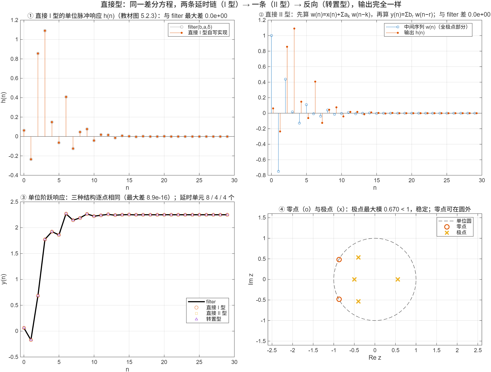

::: {.page-meta}
[教材书内 153—159 页 · PDF 161—167 页]{} [5.2.1 直接型（I 型、II 型、转置型）]{} [1 课时]{}
:::

::: {.keypoints}
[本页要点]{.kp-title}

- 差分方程 y(n)=Σ_{r=0}^{M} b_r x(n−r)+Σ_{k=1}^{N} a_k y(n−k) 按字面画出来就是**直接 I 型**：x 的延时链（M 个）算零点部分，y 的延时链（N 个）算极点部分，共 M+N 个延时单元。
- 两个线性时不变子系统级联可以交换次序：先算全极点部分 w(n)=x(n)+Σa_k w(n−k)，再算 y(n)=Σb_r w(n−r)。两条延时链里存的都是 w，合成一条：**直接 II 型**，只要 max(M,N) 个延时单元，因此叫**典范型**。
- 把流图所有支路反向、输入输出互换，传递函数不变：**转置型**。
- 三种结构算出的 y(n) 完全相同（浮点下差 0）；区别只在存储量和（后面会讲的）有限字长效应。
:::

## [①]{.col-badge} 问题从哪来：信号流图本来是为反馈放大器发明的 {#sec-1}

1953 年 Mason 在《Proc. IRE》上发表《反馈理论：信号流图的一些性质》，1956 年又发表续篇，给出了著名的 Mason 增益公式。他要解决的是真空管反馈放大器的分析：用节点和带增益的有向支路代替电路图，一眼看出传递函数。数字滤波器出现后，这套图形语言被整个搬了过来，支路增益只剩两种：常数和 z⁻¹。流图的一个基本性质是**转置定理**：把所有支路反向、输入输出互换，传递函数不变。本页的转置型就是这个定理的直接应用。

课堂落点：**流图不是示意图，它是可以直接翻译成程序的“电路”。** 演示里每种结构都用循环逐样本写了一遍，节点对应一行加法，支路对应一次乘法或一次移位。

::: {.classroom-media-grid}



:::

::: {.media-note}
外部素材需要联网；核对日期和未知字段见各卡。
:::

::: {.sources}
- S. J. Mason, "Feedback theory—Some properties of signal flow graphs," *Proc. IRE* 41(9) (1953) 1144–1156. [doi:10.1109/JRPROC.1953.274449](https://doi.org/10.1109/JRPROC.1953.274449)
- S. J. Mason, "Feedback theory—Further properties of signal flow graphs," *Proc. IRE* 44(7) (1956) 920–926. [doi:10.1109/JRPROC.1956.275147](https://doi.org/10.1109/JRPROC.1956.275147)
:::

## [②]{.col-badge} 理论与推导 {#sec-2}

### 直接 I 型 {#sec-2-1}

$$
H(z)=\frac{\sum_{r=0}^{M}b_r z^{-r}}{1-\sum_{k=1}^{N}a_k z^{-k}}
\;\Longleftrightarrow\;
y(n)=\sum_{r=0}^{M}b_r x(n-r)+\sum_{k=1}^{N}a_k y(n-k).
$$

前一个和是 x(n) 经过 M 个延时的加权和（零点部分 H₁），后一个和是 y(n) 经过 N 个延时的反馈（极点部分 H₂）。H=H₁·H₂，按字面画出来（教材图 5.2.2）就是两条延时链，M+N 个延时单元，M+N+1 个乘法器。

### 直接 II 型（典范型） {#sec-2-2}

H₁H₂=H₂H₁，先让 x 过全极点部分：

$$
w(n)=x(n)+\sum_{k=1}^{N}a_k w(n-k),\qquad y(n)=\sum_{r=0}^{M}b_r w(n-r).
$$

现在两条延时链存的都是 w(n)、w(n−1)、…，可以合成一条（教材图 5.2.5），延时单元 max(M,N) 个，是实现这个 H(z) 所需的最少个数，所以叫典范型。演示②画出了中间序列 w(n)：它是全极点系统 1/(1−Σa_k z⁻ᵏ) 的单位脉冲响应。

### 转置型 {#sec-2-3}

把直接 II 型流图的每条支路反向，输入变输出、输出变输入，得到教材图 5.2.7。程序上它对应一组状态更新：

$$
y(n)=b_0x(n)+s_1,\qquad s_i\leftarrow b_i x(n)+a_i y(n)+s_{i+1},\quad i=1,\dots,K,\ s_{K+1}=0.
$$

延时单元同样是 max(M,N) 个。转置型的加法分散在各个延时之间，定点实现时每级加法后就存起来，动态范围行为和直接 II 型不同（第 8 章有限字长效应会用到）。

::: {.callout-note .ask appearance="simple"}
**教师提问：** 例 5.1 中 M=N=4。直接 I 型要几个延时单元？直接 II 型要几个？乘法器各几个？（8 与 4；乘法器都是 9 个，结构不改变乘法次数，只改变存储。）
:::

## [③]{.col-badge} 仿真演示 {#sec-3}

::: {.ide-links data-matlab="demo_iir_direct.m" data-python="python/5.2-iir-direct.py"}
:::

脚本 [demo_iir_direct.m](code/demo_iir_direct.m) [已运行]{.status .ok}：三种结构各写成一个逐样本循环的函数，和内置 `filter` 逐点比。核验记录 [verification-iir-direct.json](code/results/verification-iir-direct.json)。

:::: {.example}
::: {.example-title}
教材例 5.1：H(z)=(1−3z⁻¹+11z⁻²+27z⁻³+18z⁻⁴)/(16+12z⁻¹+2z⁻²−4z⁻³−2z⁻⁴)，三种结构逐样本实现
:::
::: {.example-body}
**运行前问学生：** 分母首项是 16，画流图前先做什么？（除以 16，使 a₀=1，同时教材记法里 a_k 要变号。）h(0) 等于多少？（b₀/16=0.0625。）

{width=100%}

| 能数出来的数 | 值 |
|---|---|
| 归一化后 b / a | [0.0625 −0.1875 0.6875 1.6875 1.125] / [1 0.75 0.125 −0.25 −0.125] |
| h(0)…h(3) | 0.0625, −0.2344, 0.8555, 1.0908 |
| 三种结构与 filter 的最大差（脉冲 / 阶跃） | 0 / 8.9×10⁻¹⁶ |
| 极点模 | 0.557, 0.670, 0.670, 0.500 |
| 延时单元：I 型 / II 型 / 转置型 | 8 / 4 / 4，乘法器均 9 |

::: {.panel-tabset}
#### MATLAB [已运行]{.status .ok}

```matlab
b = [1 -3 11 27 18]/16; a = [16 12 2 -4 -2]/16;   % a(1)=1
br = b; ak = -a(2:end);                            % 教材记法 y(n)=Σb_r x(n−r)+Σa_k y(n−k)
% 直接 II 型：一条延时链 wd，先极点后零点（完整三种实现见 demo_iir_direct.m）
x = [1 zeros(1, 29)]; K = 4; wd = zeros(1, K); y = zeros(1, 30);
for n = 1:30
    wn = x(n) + sum(ak.*wd);                      % w(n)=x(n)+Σa_k w(n−k)
    y(n) = br(1)*wn + sum(br(2:end).*wd);         % y(n)=Σb_r w(n−r)
    wd = [wn wd(1:end-1)];                        % 延时链移位
end
max(abs(y - filter(b, a, x)))                      % 0
```

#### Python [对照]{.status .ref}

```python
import numpy as np
from scipy import signal
b = np.array([1, -3, 11, 27, 18.])/16; a = np.array([16, 12, 2, -4, -2.])/16
br, ak = b, -a[1:]
x = signal.unit_impulse(30); wd = np.zeros(4); y = np.zeros(30)
for n in range(30):
    wn = x[n] + ak @ wd; y[n] = br[0]*wn + br[1:] @ wd; wd = np.r_[wn, wd[:-1]]
print(np.max(np.abs(y - signal.lfilter(b, a, x))))   # 0
```
:::
:::
::::

## [④]{.col-badge} 检查与思考 {#sec-4}

::: {.quiz data-type="number" data-answer="5" data-tol="0"}
::: {.q-text}
1. H(z) 的分子 M=3 阶、分母 N=5 阶，直接 II 型需要多少个延时单元？
:::
::: {.q-explain}
max(M,N)=5；直接 I 型要 M+N=8 个。
:::
:::

::: {.quiz data-type="choice" data-answer="C"}
::: {.q-text}
2. 直接 II 型比直接 I 型省延时单元，靠的是
:::
::: {.q-opts}
[减少了乘法次数]{data-opt="A"}
[把分母近似掉了]{data-opt="B"}
[交换零点部分与极点部分的次序，使两条延时链存同一个序列]{data-opt="C"}
[输出取了近似]{data-opt="D"}
:::
::: {.q-explain}
线性时不变系统级联可交换；先算全极点部分得到 w(n)，两条链合成一条。
:::
:::

::: {.quiz data-type="multi" data-answer="A,B,D"}
::: {.q-text}
3. 关于转置型，正确的有
:::
::: {.q-opts}
[由直接 II 型流图所有支路反向得到]{data-opt="A"}
[传递函数与直接 II 型相同]{data-opt="B"}
[延时单元比直接 II 型少]{data-opt="C"}
[输入输出位置互换]{data-opt="D"}
:::
::: {.q-explain}
转置定理：支路反向、输入输出互换，H(z) 不变；延时单元个数相同。
:::
:::

**短答题**

4. 对 H(z)=(1+2z⁻¹)/(1−0.5z⁻¹+0.25z⁻²)，写出直接 I 型和直接 II 型的差分方程组，并数出各自的延时单元。
5. 证明先算全极点部分再算零点部分，输出与直接 I 型相同。

::: {.callout-tip collapse="true" appearance="simple"}
## 教师参考要点
4. I 型：y(n)=x(n)+2x(n−1)+0.5y(n−1)−0.25y(n−2)，延时 1+2=3；II 型：w(n)=x(n)+0.5w(n−1)−0.25w(n−2)，y(n)=w(n)+2w(n−1)，延时 2。
5. H=H₁H₂，卷积可交换：y=h₁*(h₂*x)=h₂*(h₁*x)。
:::



::: {.see-also}
[另请参阅]{.sa-title}

::: {.sa-row}
[先修]{.sa-label} [5.1 基本概念](5.1-concepts.qmd) · [2.2 差分方程](../ch2/2.2-time-domain.qmd)
:::
::: {.sa-row}
[后继]{.sa-label} [5.3 级联型与并联型](5.3-iir-cascade-parallel.qmd)
:::
:::
