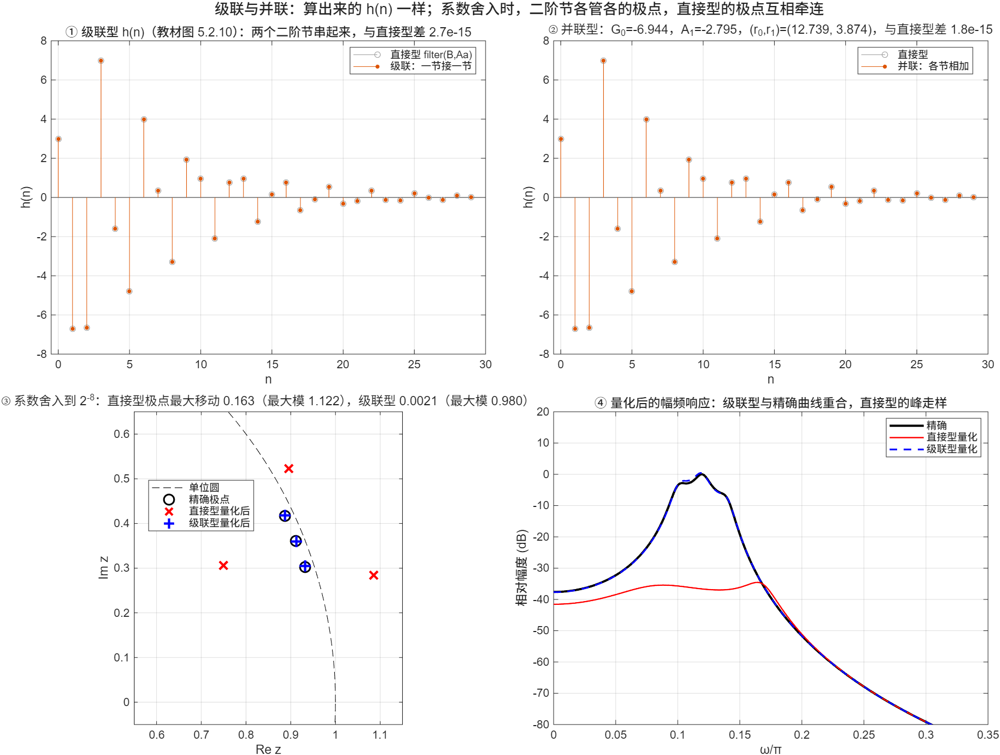

::: {.page-meta}
[教材书内 159—164 页 · PDF 167—172 页]{} [5.2.2 级联型，5.2.3 并联型]{} [1 课时]{}
:::

::: {.keypoints}
[本页要点]{.kp-title}

- 级联型：分子、分母各分解成实系数一阶和二阶因子，H(z)=A∏H_i(z)，每个 H_i 是一个二阶节（式 (5.2.7)）；零、极点可以任意配对，节的次序可以任意排。
- 并联型：H(z) 做部分分式展开，H(z)=G₀+ΣA_k/(1−g_k z⁻¹)+Σ(r₀+r₁z⁻¹)/(1−α₁z⁻¹−α₂z⁻²)（式 (5.2.9)），各节并行、输出相加；误差不积累。
- 算出的 h(n) 与直接型逐点相同。差别在**系数灵敏度**：直接型的每个系数影响全部极点，二阶节的系数只影响自己的一对极点。
- 教材例 5.4 的第一节分母 1−2.95z⁻¹+3.14z⁻² 的极点模为 1.77，系统不稳定；课堂演示改用例 5.3 的并联形式。
:::

## [①]{.col-badge} 问题从哪来：直接型对系数误差太敏感 {#sec-1}

Kaiser 1965 年的论文已经指出，高阶滤波器如果按直接型实现，系数只要有很小的舍入，极点就会大幅偏移，甚至越出单位圆；他建议把高阶系统拆成一阶、二阶节。1970 年 Jackson 在《Bell System Technical Journal》和《IEEE Trans. Audio Electroacoust.》上发表两篇文章，系统分析了级联型、并联型的舍入噪声与动态范围，讨论了零极点怎样配对、各节怎样排序噪声最小。教材 5.2.2 末尾“级联型的零极点配对与次序会影响误差”的说法就来自这一系列工作。

课堂落点：**结构不改变 H(z)，但改变“系数写成有限位数之后”的 H(z)。** 演示③用一个六阶系统把这句话画出来：同样舍入到 2⁻⁸，直接型的极点跑出单位圆，级联型几乎不动。

::: {.classroom-media-grid}





:::

::: {.media-note}
外部素材需要联网；核对日期和未知字段见各卡。
:::

::: {.sources}
- J. F. Kaiser, "Some practical considerations in the realization of linear digital filters," *Proc. 3rd Allerton Conf.* (1965)；重印于 *Papers on Digital Signal Processing*, MIT Press (1969) 54–66. [doi:10.7551/mitpress/5222.003.0006](https://doi.org/10.7551/mitpress/5222.003.0006)
- L. B. Jackson, "On the interaction of roundoff noise and dynamic range in digital filters," *Bell Syst. Tech. J.* 49(2) (1970) 159–184. [doi:10.1002/j.1538-7305.1970.tb01763.x](https://doi.org/10.1002/j.1538-7305.1970.tb01763.x)
- L. B. Jackson, "Roundoff-noise analysis for fixed-point digital filters realized in cascade or parallel form," *IEEE Trans. Audio Electroacoust.* 18(2) (1970) 107–122. [doi:10.1109/TAU.1970.1162084](https://doi.org/10.1109/TAU.1970.1162084)
:::

## [②]{.col-badge} 理论与推导 {#sec-2}

### 5.2.2 级联型 {#sec-2-1}

把分子、分母因式分解。实系数多项式的根要么是实数，要么共轭成对；把共轭对乘回去得到实系数二阶因子：

$$
H(z)=A\prod_{i=1}^{L}\frac{1+\beta_{1i}z^{-1}+\beta_{2i}z^{-2}}{1-\alpha_{1i}z^{-1}-\alpha_{2i}z^{-2}},\qquad L=\left\lceil\tfrac{N+1}{2}\right\rceil.
$$

每个因子用直接 II 型实现（4 个乘法、2 个延时），串起来（教材图 5.2.8）。例 5.3 已经写成了因式形式：A=3，第一节 (1+z⁻¹)/(1−0.6z⁻¹)，第二节 (1−3.14z⁻¹+z⁻²)/(1+0.7z⁻¹+0.72z⁻²)。零点、极点怎么配成节、节的次序怎么排，都是自由的，L 节有 L! 种排法；这些选择在定点实现时影响噪声，浮点课堂演示看不出差别。

### 5.2.3 并联型 {#sec-2-2}

对 H(z) 做部分分式展开（M=N 时多出常数项 G₀）：

$$
H(z)=G_0+\sum_{k}\frac{A_k}{1-g_kz^{-1}}+\sum_{k}\frac{r_{0k}+r_{1k}z^{-1}}{1-\alpha_{1k}z^{-1}-\alpha_{2k}z^{-2}}.
$$

各节并行，输出相加（教材图 5.2.12）。求系数的一个简单办法是比较分子多项式：B(z)=G₀·A(z)+A₁·a₂(z)+(r₀+r₁z⁻¹)·a₁(z)，逐次幂比较系数得线性方程组。例 5.3 解得 G₀=−6.944，A₁=−2.795，(r₀,r₁)=(12.739, 3.874)。并联型的好处：某一节的舍入误差不会传到别的节，而且各节的极点互不影响。

::: {.callout-note .ask appearance="simple"}
**教师提问：** 教材例 5.4 的 H(z) 第一节分母是 1−2.95z⁻¹+3.14z⁻²。它的极点模是多少？这个系统能用吗？（模 √3.14=1.77，极点在单位圆外，h(n) 发散。课本图 5.2.14 画的是发散的序列。讲课时把它当反例：结构无法拯救一个不稳定的 H(z)。）
:::

### 系数量化为什么级联型更稳 {#sec-2-3}

直接型分母 A(z)=∏(1−p_iz⁻¹) 乘开后，每个系数 a_k 是所有极点的对称函数；极点靠得越近，∂p_i/∂a_k 越大（经典结果：与 ∏_{j≠i}(p_i−p_j) 成反比）。二阶节的系数只与自己的一对极点有关，舍入只在这对极点附近动一点。演示③取三对极点 r=0.98、角 0.10π、0.12π、0.14π（相邻很近），系数舍入到 2⁻⁸：直接型极点最大移动 0.163，最大模 1.122，已不稳定；级联型只移动 0.002。

## [③]{.col-badge} 仿真演示 {#sec-3}

::: {.ide-links data-matlab="demo_iir_cascade_parallel.m" data-python="python/5.3-iir-cascade-parallel.py"}
:::

<div class="video-box">
<p class="media-pending">课堂动画正在整理上线；请先查看下方静态图和实验代码。</p>
</div>

::: {.media-note}
由 [make_iir_quantization_video.m](code/make_iir_quantization_video.m) 生成；[动画核验记录](code/results/verification-video-iir-quantization.json)。先让学生预测“系数舍入到多少位，直接型的极点会越出单位圆”，再播；播到越出那一级时暂停一次。Bits 表示小数位数，不是总字长；各级实时计算，位移不保证单调。点击加载后再按播放键。
:::


脚本 [demo_iir_cascade_parallel.m](code/demo_iir_cascade_parallel.m) [已运行]{.status .ok}。核验记录 [verification-iir-cascade-parallel.json](code/results/verification-iir-cascade-parallel.json)。

:::: {.example}
::: {.example-title}
例 5.3 的级联与并联；六阶系统的系数舍入对比
:::
::: {.example-body}
**运行前问学生：** 例 5.3 乘开后直接型的分母是什么？并联型的常数项 G₀ 为什么不为零？三对靠得很近的极点，系数舍入后往哪里跑？

{width=100%}

| 能数出来的数 | 值 |
|---|---|
| 例 5.3 乘开：B / A | [3 −6.42 −6.42 3] / [1 0.1 0.3 −0.432] |
| 级联型与直接型最大差 | 2.7×10⁻¹⁵ |
| 并联型系数 G₀, A₁, r₀, r₁ | −6.944, −2.795, 12.739, 3.874；差 1.8×10⁻¹⁵ |
| 例 5.4 第一节极点模 | 1.772（不稳定） |
| 六阶系统舍入到 2⁻⁸：极点最大位移 直接型 / 级联型 | 0.163（最大模 1.122）/ 0.0021（0.980） |

::: {.panel-tabset}
#### MATLAB [已运行]{.status .ok}

```matlab
A = 3; b1 = [1 1]; a1 = [1 -0.6]; b2 = [1 -3.14 1]; a2 = [1 0.7 0.72];   % 例 5.3
x = [1 zeros(1, 29)];
hCas = A*filter(b2, a2, filter(b1, a1, x));                  % 级联：一节接一节
hDir = filter(A*conv(b1, b2), conv(a1, a2), x); max(abs(hCas - hDir))   % ~1e-15
% 并联系数：B(z)=G0·A(z)+A1·a2(z)+(r0+r1 z^-1)·a1(z)，比较系数
col = @(p) [p(:); zeros(4-numel(p), 1)];
c = [col(conv(a1,a2)), col(a2), col([a1 0]), col([0 a1])] \ col(A*conv(b1, b2));   % [G0 A1 r0 r1]
hPar = c(1)*x + filter(c(2), a1, x) + filter(c(3:4), a2, x); max(abs(hPar - hDir))
% 系数舍入：三对靠近的极点
rp = 0.98; th = [0.10 0.12 0.14]*pi; q = @(v) round(v*256)/256;
Ad = 1; for i = 1:3, Ad = conv(Ad, [1 -2*rp*cos(th(i)) rp^2]); end
max(abs(roots(q(Ad))))                                        % 1.122：直接型量化后不稳定
```

#### Python [对照]{.status .ref}

```python
import numpy as np
from scipy import signal
A = 3; b1, a1 = [1, 1], [1, -0.6]; b2, a2 = [1, -3.14, 1], [1, 0.7, 0.72]
x = signal.unit_impulse(30)
h_cas = A*signal.lfilter(b2, a2, signal.lfilter(b1, a1, x))
h_dir = signal.lfilter(A*np.convolve(b1, b2), np.convolve(a1, a2), x)
print(np.max(np.abs(h_cas - h_dir)))                              # ~1e-15
rp, th = 0.98, np.array([0.10, 0.12, 0.14])*np.pi; Ad = np.array([1.])
for t in th: Ad = np.convolve(Ad, [1, -2*rp*np.cos(t), rp**2])
print(np.max(np.abs(np.roots(np.round(Ad*256)/256))))            # 1.122
```
:::
:::
::::

## [④]{.col-badge} 检查与思考 {#sec-4}

::: {.quiz data-type="number" data-answer="3" data-tol="0"}
::: {.q-text}
1. 六阶 IIR 用二阶节级联实现，需要几节？
:::
::: {.q-explain}
⌈(6+1)/2⌉=3 节。
:::
:::

::: {.quiz data-type="choice" data-answer="B"}
::: {.q-text}
2. 级联型、并联型与直接型相比，最主要的优点是
:::
::: {.q-opts}
[乘法次数更少]{data-opt="A"}
[系数舍入只影响本节的极点，灵敏度低]{data-opt="B"}
[延时单元更少]{data-opt="C"}
[不需要反馈]{data-opt="D"}
:::
::: {.q-explain}
乘法与延时单元个数基本相同；差别在有限字长效应。
:::
:::

::: {.quiz data-type="number" data-answer="1.772" data-tol="0.01"}
::: {.q-text}
3. 分母 1−2.95z⁻¹+3.14z⁻² 的一对共轭极点，模是多少？
:::
::: {.q-explain}
共轭对的模平方等于常数项 3.14，模 √3.14=1.772，在单位圆外。
:::
:::

**短答题**

4. 把 H(z)=(1+z⁻¹)/[(1−0.5z⁻¹)(1+0.8z⁻¹)] 展开成并联型，写出各节。
5. 为什么并联型“误差不积累”而级联型的误差会逐节传递？定点实现时哪种更需要考虑各节的排列次序？

::: {.callout-tip collapse="true" appearance="simple"}
## 教师参考要点
4. 部分分式：A₁/(1−0.5z⁻¹)+A₂/(1+0.8z⁻¹)，A₁=(1+2)/(1+1.6)=1.1538，A₂=(1−1.25)/(1+0.625)=−0.1538。
5. 并联各节输入同为 x(n)，输出相加，某节的舍入噪声只经过该节自身；级联中前一节的噪声要经过后面所有节放大或衰减，所以次序和配对有讲究（Jackson 1970）。
:::



::: {.see-also}
[另请参阅]{.sa-title}

::: {.sa-row}
[先修]{.sa-label} [5.2 直接型](5.2-iir-direct.qmd) · [2.4 零极点与稳定性](../ch2/2.4-system-function.qmd)
:::
::: {.sa-row}
[后继]{.sa-label} [5.4 FIR 结构](5.4-fir-structures.qmd) · 第8章 有限字长效应
:::
:::
