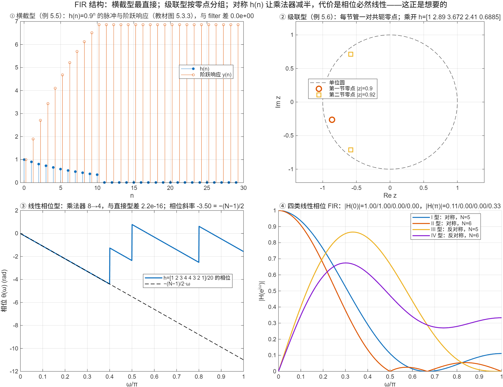

::: {.page-meta}
[教材书内 165—171 页 · PDF 173—179 页]{} [5.3.1 直接型，5.3.2 级联型，5.3.3 线性相位型]{} [1 课时]{}
:::

::: {.keypoints}
[本页要点]{.kp-title}

- FIR：H(z)=Σ_{n=0}^{N−1}h(n)z⁻ⁿ，y(n)=Σh(k)x(n−k)。直接型（横截型、卷积型）就是一条 N−1 级延时链、N 个乘法器、一个累加（式 (5.3.2)、图 5.3.1）。
- 级联型：把 H(z) 分解成实系数一阶、二阶因子的乘积，每个二阶节管一对共轭零点（图 5.3.4）。
- 线性相位型：h(n)=±h(N−1−n) 时 H(z)=Σ_{n=0}^{N/2−1}h(n)[z⁻ⁿ±z^{−(N−1−n)}]（N 奇时多一项 h((N−1)/2)z^{−(N−1)/2}），先把对称的两个输入相加再乘系数，乘法器从 N 减到约 N/2（式 (5.3.4)、(5.3.5)）。
- 四类线性相位 FIR：对称/反对称 × N 奇/偶。反对称在 ω=0 必为零，N 偶对称在 ω=π 必为零（图 5.3.6）。
:::

## [①]{.col-badge} 问题从哪来：1940 年的“横截滤波器”与 1970 年的线性相位设计 {#sec-1}

“横截型”（transversal）这个名字比数字滤波器老得多。1940 年 Kallmann 在《Proc. IRE》发表《横截滤波器》：用一根延迟线在不同位置抽头，各抽头加权后相加，就能做出任意形状的频率响应，当时用于电视和电报的均衡。数字 FIR 的直接型正是这个结构，只是延迟线换成了存储单元。线性相位是 FIR 独有的能力：只要 h(n) 对称，相位就是 ω 的线性函数，群延迟为常数。1970 年 Herrmann 与 Schüßler 在《Electronics Letters》上给出了线性相位非递归滤波器的设计方法，同年 Rabiner、Gold 与 McGonegal 系统整理了这类滤波器的逼近问题。本页只讲结构：对称性带来的乘法器减半，和四类对称的固有零点。

课堂落点：**FIR 不用担心稳定，也可以做到严格线性相位，代价是阶数高；结构上的省法只有一条：利用对称。**

::: {.sources}
- H. E. Kallmann, "Transversal filters," *Proc. IRE* 28(7) (1940) 302–310. [doi:10.1109/JRPROC.1940.229346](https://doi.org/10.1109/JRPROC.1940.229346)
- O. Herrmann, W. Schüßler, "Design of nonrecursive digital filters with linear phase," *Electronics Letters* 6(11) (1970) 328–329. [doi:10.1049/el:19700231](https://doi.org/10.1049/el:19700231)
- L. R. Rabiner, B. Gold, C. A. McGonegal, "An approach to the approximation problem for nonrecursive digital filters," *IEEE Trans. Audio Electroacoust.* 18(2) (1970) 83–106. [doi:10.1109/TAU.1970.1162092](https://doi.org/10.1109/TAU.1970.1162092)
:::

## [②]{.col-badge} 理论与推导 {#sec-2}

### 5.3.1 直接型（横截型） {#sec-2-1}

$$
y(n)=\sum_{k=0}^{N-1}h(k)x(n-k).
$$

就是卷积按字面实现：x(n) 进入 N−1 级延时链，各级输出乘 h(k) 后相加。它是 IIR 直接型在 a_k=0、b_k=h(k) 时的特例。例 5.5 取 h(n)=0.9ⁿ（0≤n≤10），演示①画出脉冲响应和阶跃响应（教材图 5.3.3）。

### 5.3.2 级联型 {#sec-2-2}

H(z) 是 N−1 次多项式，分解成实系数二阶因子（复零点共轭成对）：H(z)=∏(a₀+a₁z⁻¹+a₂z⁻²)。每节零点独立可调。例 5.6：(1+1.72z⁻¹+0.81z⁻²)(1+1.17z⁻¹+0.85z⁻²)，两节的零点都在单位圆内（模 0.9 与 0.92），乘开得 h=[1 2.89 3.6724 2.4097 0.6885]。

### 5.3.3 线性相位型 {#sec-2-3}

设 h(n)=h(N−1−n)（对称）。把求和拆成前后两半，后一半用 n→N−1−n 换元：

$$
H(z)=\sum_{n=0}^{N/2-1}h(n)\big[z^{-n}+z^{-(N-1-n)}\big]\quad(N\text{ 偶}),\qquad
H(z)=\sum_{n=0}^{(N-3)/2}h(n)\big[z^{-n}+z^{-(N-1-n)}\big]+h\!\left(\tfrac{N-1}{2}\right)z^{-\frac{N-1}{2}}\quad(N\text{ 奇}).
$$

反对称 h(n)=−h(N−1−n) 时括号里换成减号，且 N 奇时中点 h((N−1)/2)=0。结构上：先把 x(n−n) 与 x(n−(N−1−n)) 相加（或相减），再乘 h(n)，乘法器 N/2 或 (N+1)/2 个（图 5.3.6）。频率响应 H(e^{jω})=e^{−jω(N−1)/2}·H_r(ω)，H_r 实，相位 −ω(N−1)/2 是线性的，群延迟 (N−1)/2 个样本。演示③用 h=[1 2 3 4 4 3 2 1]/20 拟合相位斜率，得 −3.500。

### 四类的固有零点 {#sec-2-4}

| 类型 | h(n) | N | 固有零点 |
|---|---|---|---|
| I | 对称 | 奇 | 无 |
| II | 对称 | 偶 | z=−1（ω=π） |
| III | 反对称 | 奇 | z=1 与 z=−1 |
| IV | 反对称 | 偶 | z=1（ω=0） |

理由：反对称序列各项相加为零，所以 H(e^{j0})=0；N 偶对称时 Σh(n)(−1)ⁿ 两两相消，所以 H(e^{jπ})=0。演示④对四个例子算出 |H(0)| 与 |H(π)|。低通只能用 I、II 型；高通只能用 I、IV 型；微分器、希尔伯特变换器用 III、IV 型。

::: {.callout-note .ask appearance="simple"}
**教师提问：** N=8 对称 h(n) 的线性相位结构要几个乘法器？群延迟几个样本？（4 个；3.5 个样本，非整数是正常的。）
:::

## [③]{.col-badge} 仿真演示 {#sec-3}

::: {.ide-links data-matlab="demo_fir_structures.m" data-python="python/5.4-fir-structures.py"}
:::

脚本 [demo_fir_structures.m](code/demo_fir_structures.m) [已运行]{.status .ok}。核验记录 [verification-fir-structures.json](code/results/verification-fir-structures.json)。

:::: {.example}
::: {.example-title}
横截型与级联型（例 5.5、5.6）、对称 h(n) 的乘法器减半与线性相位、四类的 |H(0)|、|H(π)|
:::
::: {.example-body}
**运行前问学生：** 例 5.6 两节的零点在单位圆内还是外？对称的 8 点 h(n) 相位斜率是多少？反对称 FIR 能做低通吗？

{width=100%}

| 能数出来的数 | 值 |
|---|---|
| 横截型 / 级联型 / 线性相位型 与 filter 的最大差 | 0 / 0 / 2.2×10⁻¹⁶ |
| 例 5.6 乘开的 h(n) | 1, 2.89, 3.6724, 2.4097, 0.6885；零点模 0.9、0.922 |
| N=8 对称：乘法器 / 相位斜率 | 8→4 / −3.500 |
| 四类 \|H(0)\| | 1, 1, 0, 0 |
| 四类 \|H(π)\| | 0.111, 0, 0, 0.333 |

::: {.panel-tabset}
#### MATLAB [已运行]{.status .ok}

```matlab
h = [1 2 3 4 4 3 2 1]/20; N = 8; x = randn(1, 200);
% 线性相位型：先把对称的两个输入相加再乘 h(k)，N/2 个乘法（完整实现见 demo_fir_structures.m）
xd = zeros(1, N-1); y = zeros(1, 200);
for n = 1:200
    xs = [x(n) xd];                                  % xs(k+1)=x(n−k)
    acc = 0; for k = 0:N/2-1, acc = acc + h(k+1)*(xs(k+1) + xs(N-k)); end
    y(n) = acc; xd = xs(1:end-1);
end
max(abs(y - filter(h, 1, x)))                          % ~1e-16
w = linspace(0, 0.3*pi, 200); H = polyval(fliplr(h), exp(-1i*w));
p = polyfit(w, unwrap(angle(H)), 1); p(1)              % −3.5 = −(N−1)/2
```

#### Python [对照]{.status .ref}

```python
import numpy as np
from scipy import signal
h = np.array([1, 2, 3, 4, 4, 3, 2, 1])/20; N = 8; x = np.random.default_rng(0).normal(size=200)
xd = np.zeros(N-1); y = np.zeros(200)
for n in range(200):
    xs = np.r_[x[n], xd]; y[n] = sum(h[k]*(xs[k] + xs[N-1-k]) for k in range(N//2)); xd = xs[:-1]
print(np.max(np.abs(y - signal.lfilter(h, 1, x))))     # ~1e-16
w = np.linspace(0, 0.3*np.pi, 200); H = np.polyval(h[::-1], np.exp(-1j*w))
print(np.polyfit(w, np.unwrap(np.angle(H)), 1)[0])      # -3.5
```
:::
:::
::::

## [④]{.col-badge} 检查与思考 {#sec-4}

::: {.quiz data-type="number" data-answer="16" data-tol="0"}
::: {.q-text}
1. N=31 的对称 FIR 用线性相位结构实现，需要多少个乘法器？
:::
::: {.q-explain}
(N+1)/2 = 16；直接型要 31 个。
:::
:::

::: {.quiz data-type="choice" data-answer="D"}
::: {.q-text}
2. 下列哪一类线性相位 FIR 不能用来做低通滤波器？
:::
::: {.q-opts}
[I 型（对称，N 奇）]{data-opt="A"}
[II 型（对称，N 偶）]{data-opt="B"}
[以上都能]{data-opt="C"}
[IV 型（反对称，N 偶）]{data-opt="D"}
:::
::: {.q-explain}
反对称序列在 ω=0 处 H=0，低通做不成；III 型同理。
:::
:::

::: {.quiz data-type="number" data-answer="7.5" data-tol="0.01"}
::: {.q-text}
3. N=16 的线性相位 FIR，群延迟是多少个样本？
:::
::: {.q-explain}
(N−1)/2 = 7.5。
:::
:::

**短答题**

4. 从 H(z)=Σh(n)z⁻ⁿ 出发，利用 h(n)=h(N−1−n)（N 偶）推出式 (5.3.4)。
5. 为什么 N 偶、对称的 FIR 在 z=−1 必有零点？举一个 N=4 的例子验证。

::: {.callout-tip collapse="true" appearance="simple"}
## 教师参考要点
4. 拆成 n=0…N/2−1 与 n=N/2…N−1 两段，后段换元 m=N−1−n，用对称性合并。
5. H(−1)=Σh(n)(−1)ⁿ，对称对 (n, N−1−n) 的 (−1)ⁿ 与 (−1)^{N−1−n} 在 N 偶时符号相反，逐对抵消；h=[1 2 2 1]：1−2+2−1=0。
:::



::: {.see-also}
[另请参阅]{.sa-title}

::: {.sa-row}
[先修]{.sa-label} [5.1 基本概念](5.1-concepts.qmd) · [5.3 级联型](5.3-iir-cascade-parallel.qmd)
:::
::: {.sa-row}
[后继]{.sa-label} [5.5 频率采样型](5.5-frequency-sampling.qmd) · 第7章 FIR 设计（线性相位条件的用法）
:::
:::
