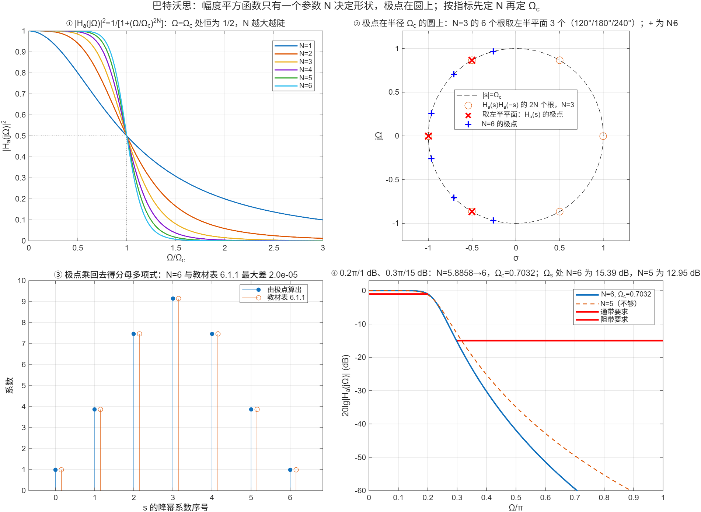

::: {.page-meta}
[教材书内 177—183 页 · PDF 185—191 页]{} [6.1 引言与幅度平方函数，6.1.1 巴特沃思]{} [1 课时]{}
:::

::: {.keypoints}
[本页要点]{.kp-title}

- IIR 设计的间接路线：先设计模拟低通 Ha(s)，再变换成 H(z)。模拟设计从**幅度平方函数** A²(Ω)=|Ha(jΩ)|²=Ha(s)Ha(−s)|_{s=jΩ} 出发（式 (6.1.3)）：它的极点关于虚轴对称成对，取左半平面的一半给 Ha(s)。
- 巴特沃思：A²(Ω)=1/[1+(Ω/Ωc)^{2N}]（式 (6.1.4)）。Ω=0 处为 1，Ω=Ωc 处恒为 1/2（3 dB），单调下降，N 越大越接近理想低通。
- 极点：s_k=Ωc·e^{jπ[1/2+(2k−1)/(2N)]}，k=1…N（式 (6.1.7)），均布在半径 Ωc 的圆上、左半平面，关于实轴对称。Ha(s)=Ωc^N/∏(s−s_k)（式 (6.1.6)）。
- 按指标定参数：由通带、阻带两个不等式相除得 N，再由通带（或阻带）等式定 Ωc（例 6.5 第 (2) 步）。
:::

## [①]{.col-badge} 问题从哪来：1930 年，让放大器的通带“最平坦” {#sec-1}

1930 年，英国物理学家 Butterworth 在《Experimental Wireless and the Wireless Engineer》上发表《论滤波放大器的理论》，为多级电子管放大器设计级间耦合网络，目标是通带内增益尽可能平、通带外尽快下降。他给出的幅度函数 1/√(1+Ω^{2N}) 在 Ω=0 处前 2N−1 阶导数全为零，后来被称为“最大平坦”。这类问题在模拟滤波器理论里被 Darlington 1939 年的插入损耗综合方法系统化：先选一个可实现的幅度平方函数，再分解出网络。数字 IIR 设计（本章）完全继承了这条路线：设计幅度平方函数、取左半平面极点、然后把 Ha(s) 搬到 z 平面。

课堂落点：**本章不发明新的滤波器，只是借用 1930 年代成熟的模拟设计，再解决“怎么搬”的问题。**

::: {.classroom-media-grid}



:::

::: {.media-note}
外部素材需要联网；核对日期、资料性质和未知字段见各卡。
:::

::: {.sources}
- S. Butterworth, "On the theory of filter amplifiers," *Experimental Wireless and the Wireless Engineer* 7 (1930) 536–541.（原刊无 DOI）
- S. Darlington, "Synthesis of reactance 4-poles which produce prescribed insertion loss characteristics," *J. Math. Phys.* 18 (1939) 257–353. [doi:10.1002/sapm1939181257](https://doi.org/10.1002/sapm1939181257)
:::

## [②]{.col-badge} 理论与推导 {#sec-2}

### 幅度平方函数与 Ha(s) {#sec-2-1}

Ha(s) 实系数，则 Ha(jΩ)*=Ha(−jΩ)，于是

$$
A^2(\Omega)=|H_a(j\Omega)|^2=H_a(s)H_a(-s)\big|_{s=j\Omega}.
$$

把 Ω²=−s² 代入 A²(Ω) 得 A²(s)=Ha(s)Ha(−s)：它的零极点关于虚轴（也关于原点）成对出现，s₀ 与 −s₀ 同时是根。稳定、因果的 Ha(s) 取左半平面的极点；零点通常取左半平面（最小相位）。所以设计只需决定 A²(Ω)。

### 6.1.1 巴特沃思幅度平方函数 {#sec-2-2}

$$
A^2(\Omega)=\frac{1}{1+(\Omega/\Omega_c)^{2N}}.
$$

三条性质：Ω=0 时 A²=1；Ω=Ωc 时 A²=1/2，即 |Ha|=0.707，衰减 3.01 dB，所以 Ωc 叫 3 dB 截止频率；Ω>Ωc 后单调下降，N 越大越陡（演示①）。A²(Ω) 在 Ω=0 处前 2N−1 阶导数为零，通带最平坦。

### 极点在圆上 {#sec-2-3}

Ω²=−s²：

$$
H_a(s)H_a(-s)=\frac{1}{1+\left(\frac{s}{j\Omega_c}\right)^{2N}}
\;\Rightarrow\;
s_p=\Omega_c\,e^{j\pi\left(\frac12+\frac{2p-1}{2N}\right)},\quad p=1,\dots,2N.
$$

2N 个根均布在半径 Ωc 的圆上，相邻夹角 π/N，且不落在虚轴上（N=3 时 60° 一个）。取左半平面的 N 个作 Ha(s) 的极点（式 (6.1.7)），Ha(s)=Ωc^N/∏(s−s_k)，常数使 Ha(0)=1。把极点乘回去就得到教材表 6.1.1 的分母多项式（Ωc=1）；演示③逐阶复现，差在 3×10⁻⁵ 以内（表只印 4 位小数）。

### 按指标定 N 与 Ωc {#sec-2-4}

指标：Ωp 处衰减 ≤αp dB，Ωs 处 ≥αs dB。写成

$$
10\lg\big[1+(\Omega_p/\Omega_c)^{2N}\big]\le\alpha_p,\qquad 10\lg\big[1+(\Omega_s/\Omega_c)^{2N}\big]\ge\alpha_s.
$$

取等号，两式相除消去 Ωc：

$$
N\ge\frac{\lg\big[(10^{\alpha_s/10}-1)/(10^{\alpha_p/10}-1)\big]}{2\lg(\Omega_s/\Omega_p)}.
$$

N 取整后，用通带等式定 Ωc=Ωp/(10^{αp/10}−1)^{1/(2N)}，阻带自然留出余量（也可反过来）。例 6.5 的指标 0.2π/1 dB、0.3π/15 dB：N=5.8858→6，Ωc=0.7032；演示④画出 N=6 满足、N=5 不满足。

::: {.callout-note .ask appearance="simple"}
**教师提问：** N=6、Ωc 由通带定，那阻带实际衰减是多少？（15.39 dB，比 15 多出的就是取整带来的余量。若用阻带定 Ωc，则通带衰减小于 1 dB。）
:::

## [③]{.col-badge} 仿真演示 {#sec-3}

::: {.ide-links data-matlab="demo_butterworth.m" data-python="python/6.1-butterworth.py"}
:::

脚本 [demo_butterworth.m](code/demo_butterworth.m) [已运行]{.status .ok}，原型由 [dsp_butter_analog.m](code/dsp_butter_analog.m) 按式 (6.1.7) 生成。核验记录 [verification-butterworth.json](code/results/verification-butterworth.json)。

:::: {.example}
::: {.example-title}
幅度平方函数、极点分布、表 6.1.1 复现、例 6.5 的定阶
:::
::: {.example-body}
**运行前问学生：** N=3 的 6 个根在圆上的角度各是多少？哪三个给 Ha(s)？0.2π/1 dB、0.3π/15 dB 需要几阶？

{width=100%}

| 能数出来的数 | 值 |
|---|---|
| N=3 极点角度 | 120°、180°、240° |
| N=6 分母系数（Ωc=1） | 1, 3.8637, 7.4641, 9.1416, 7.4641, 3.8637, 1；与表 6.1.1 差 ≤3×10⁻⁵ |
| 例 6.5 定阶 | N=5.8858→6，Ωc=0.7032（由通带定） |
| N=6 在 Ωp / Ωs 处衰减 | 1.000 / 15.39 dB；N=5 在 Ωs 处只有 12.95 dB |
| 与 `butter(6,1,'s')` 的差 | 10⁻¹⁵ 量级 |

::: {.panel-tabset}
#### MATLAB [已运行]{.status .ok}

```matlab
N = 3; Wc = 1; k = 1:N;
p = Wc*exp(1i*pi*(0.5 + (2*k - 1)/(2*N)));         % 式 (6.1.7)：左半平面 N 个极点
a = real(poly(p))                                     % [1 2 2 1]，与表 6.1.1 一致
% 例 6.5 定阶
Wp = 0.2*pi; Ws = 0.3*pi; ap = 1; as = 15;
N = log10((10^(as/10) - 1)/(10^(ap/10) - 1))/(2*log10(Ws/Wp))   % 5.8858 → 6
Wc = Wp/(10^(ap/10) - 1)^(1/12)                                  % 0.7032
```

#### Python [对照]{.status .ref}

```python
import numpy as np
N, Wc = 3, 1; k = np.arange(1, N+1)
p = Wc*np.exp(1j*np.pi*(0.5 + (2*k-1)/(2*N))); print(np.real(np.poly(p)))   # [1 2 2 1]
Wp, Ws, ap, as_ = 0.2*np.pi, 0.3*np.pi, 1, 15
print(np.log10((10**(as_/10)-1)/(10**(ap/10)-1))/(2*np.log10(Ws/Wp)), Wp/(10**(ap/10)-1)**(1/12))   # 5.8858, 0.7032
```
:::
:::
::::

## [④]{.col-badge} 检查与思考 {#sec-4}

::: {.quiz data-type="number" data-answer="3.01" data-tol="0.05"}
::: {.q-text}
1. 巴特沃思滤波器在 Ω=Ωc 处的衰减是多少 dB（与 N 无关）？
:::
::: {.q-explain}
A²(Ωc)=1/2，−10lg(1/2)=3.01 dB。
:::
:::

::: {.quiz data-type="choice" data-answer="C"}
::: {.q-text}
2. N=4 的巴特沃思，Ha(s)Ha(−s) 的 8 个根中相邻两根的夹角是
:::
::: {.q-opts}
[90°]{data-opt="A"}
[60°]{data-opt="B"}
[45°]{data-opt="C"}
[22.5°]{data-opt="D"}
:::
::: {.q-explain}
2N=8 个根均布在圆上，夹角 360°/8=45°。
:::
:::

::: {.quiz data-type="number" data-answer="6" data-tol="0"}
::: {.q-text}
3. 指标 Ωp=0.2π 处 ≤1 dB、Ωs=0.3π 处 ≥15 dB，巴特沃思至少几阶？
:::
::: {.q-explain}
N≥5.8858，取 6。
:::
:::

**短答题**

4. 说明为什么 Ha(s)Ha(−s) 的极点必然关于虚轴对称，以及为什么 Ha(s) 取左半平面的一半。
5. 用通带定 Ωc 和用阻带定 Ωc 有什么不同？各在哪一端留余量？

::: {.callout-tip collapse="true" appearance="simple"}
## 教师参考要点
4. A²(s) 只含 s²，s₀ 是根则 −s₀ 也是；稳定要求极点在左半平面，故各取一半。
5. 通带定：通带恰好 αp，阻带衰减 > αs；阻带定：阻带恰好 αs，通带衰减 < αp。
:::



::: {.see-also}
[另请参阅]{.sa-title}

::: {.sa-row}
[先修]{.sa-label} [5.1 技术指标与 dB](../ch5/5.1-concepts.qmd)
:::
::: {.sa-row}
[后继]{.sa-label} [6.2 切比雪夫](6.2-chebyshev.qmd) · [6.3 脉冲响应不变法](6.3-impulse-invariance.qmd)
:::
:::
