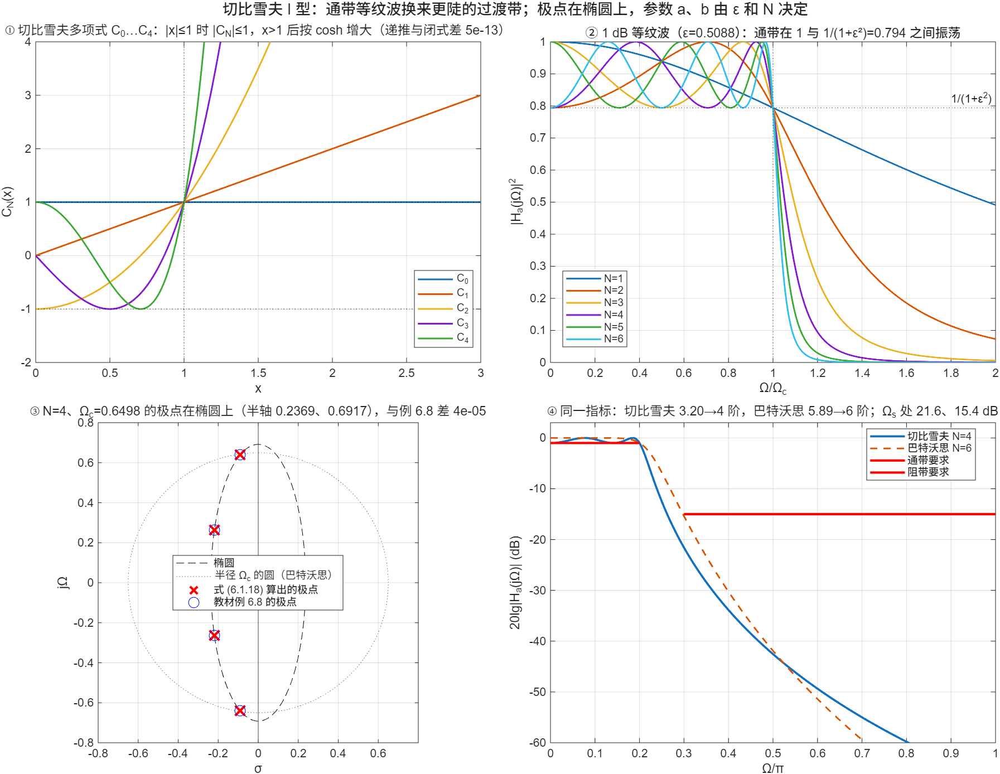

::: {.page-meta}
[教材书内 183—192 页 · PDF 191—200 页]{} [6.1.2 切比雪夫（I 型为主），6.1.3 模拟→数字的基本要求]{} [1 课时]{}
:::

::: {.keypoints}
[本页要点]{.kp-title}

- 切比雪夫多项式 C_N(x)=cos(N·arccos x)（|x|≤1）、cosh(N·arcosh x)（x>1）；递推 C_{N+1}=2xC_N−C_{N−1}。|x|≤1 时在 ±1 间等幅振荡，x>1 后迅速增大（式 (6.1.10)(6.1.11)）。
- I 型幅度平方函数 A²(Ω)=1/[1+ε²C_N²(Ω/Ωc)]（式 (6.1.9)）：通带在 1 与 1/(1+ε²) 之间等纹波，Ω=Ωc 处恒为 1/(1+ε²)，Ω=0 处 N 奇为 1、N 偶为 1/(1+ε²)。纹波 αp dB ↔ ε²=10^{αp/10}−1（式 (6.1.13)）。
- 阶数 N≥arcosh[√(1/A²(Ωs)−1)/ε]/arcosh(Ωs/Ωc)（式 (6.1.15)）。极点在椭圆上：σ_i=−aΩc sin θ_i，Ω_i=bΩc cos θ_i，θ_i=(2i−1)π/(2N)，a、b 由 β=[√(1+1/ε²)+1/ε]^{1/N} 给出（式 (6.1.18)—(6.1.22)）。
- 模拟→数字的两条要求：jΩ 轴映到单位圆（保频率响应），左半平面映到单位圆内（保稳定）。
:::

## [①]{.col-badge} 问题从哪来：1854 年的最小偏差多项式 {#sec-1}

切比雪夫 1854 年在研究蒸汽机连杆机构（瓦特平行四边形）时提出：在区间上与零偏差最小的首一多项式是什么？答案就是 C_N(x)/2^{N−1}——它在 [−1,1] 上的最大偏差最小，且以“等纹波”的方式达到。八十年后模拟滤波器理论意识到，通带内允许等幅起伏正是换取过渡带陡度的最省办法；Darlington 1939 年的综合方法把切比雪夫逼近纳入了插入损耗设计。巴特沃思把全部“预算”花在 Ω=0 附近的平坦上，切比雪夫把它均匀撒在整个通带里，所以同样指标可以省两阶（演示④：4 阶对 6 阶）。更进一步让阻带也等纹波就是椭圆（Cauer）滤波器，教材只提及。

课堂落点：**等纹波不是缺点，是最优逼近的标志。** 通带纹波 1 dB 能不能接受，由应用决定；能接受就少两阶。

::: {.classroom-media-grid}





:::

::: {.media-note}
外部素材需要联网；核对日期、资料性质和未知字段见各卡。
:::

::: {.sources}
- P. L. Tchebychef, "Théorie des mécanismes connus sous le nom de parallélogrammes," *Mémoires présentés à l'Académie impériale des sciences de St.-Pétersbourg* 7 (1854) 539–568.（原刊无 DOI）
- S. Darlington, "Synthesis of reactance 4-poles which produce prescribed insertion loss characteristics," *J. Math. Phys.* 18 (1939) 257–353. [doi:10.1002/sapm1939181257](https://doi.org/10.1002/sapm1939181257)
:::

## [②]{.col-badge} 理论与推导 {#sec-2}

### 切比雪夫多项式 {#sec-2-1}

$$
C_N(x)=\begin{cases}\cos(N\arccos x), & 0\le x\le1\\ \cosh(N\,\mathrm{arcosh}\,x), & x>1\end{cases},\qquad
C_0=1,\ C_1=x,\ C_{N+1}=2xC_N-C_{N-1}.
$$

三条性质（演示①）：|x|≤1 时 |C_N|≤1，在 ±1 之间振荡 N 次；C_N(1)=1；x>1 后按 cosh 迅速增大。于是 1+ε²C_N²(x) 在通带内在 1 与 1+ε² 之间振荡，通带外单调增大。

### 6.1.2 I 型幅度平方函数 {#sec-2-2}

$$
A^2(\Omega)=\frac{1}{1+\varepsilon^2C_N^2(\Omega/\Omega_c)}.
$$

Ωc 是通带边界（纹波区的终点），不是 3 dB 点。Ω=Ωc 处 A²=1/(1+ε²)；Ω=0 处，N 奇 C_N(0)=0 → A²=1，N 偶 C_N(0)=±1 → A²=1/(1+ε²)（演示②）。通带最大衰减 αp=10lg(1+ε²)，所以

$$
\varepsilon=\sqrt{10^{\alpha_p/10}-1};\qquad \alpha_p=1\ \text{dB}\Rightarrow\varepsilon=0.50885.
$$

阻带 Ωs 处要求 A²(Ωs)≤1/10^{αs/10}，用 cosh 分支解出

$$
N\ge\frac{\mathrm{arcosh}\big[\sqrt{10^{\alpha_s/10}-1}/\varepsilon\big]}{\mathrm{arcosh}(\Omega_s/\Omega_c)}.
$$

3 dB 点 Ω_{3dB}=Ωc cosh[(1/N)arcosh(1/ε)]，在 Ωc 之外（式 (6.1.17)）。

### 极点在椭圆上 {#sec-2-3}

解 1+ε²C_N²(s/jΩc)=0 得

$$
s_i=\sigma_i+j\Omega_i,\quad \sigma_i=-a\Omega_c\sin\theta_i,\ \Omega_i=b\Omega_c\cos\theta_i,\ \theta_i=\frac{(2i-1)\pi}{2N},
$$
$$
\beta=\Big[\sqrt{1+1/\varepsilon^2}+1/\varepsilon\Big]^{1/N},\qquad a=\frac{\beta-\beta^{-1}}2,\qquad b=\frac{\beta+\beta^{-1}}2.
$$

(σ/aΩc)²+(Ω/bΩc)²=1：极点在短轴 aΩc（实轴方向）、长轴 bΩc（虚轴方向）的椭圆上；ε→0 时 a→b→∞·ε… 归一后趋向巴特沃思的圆。Ha(s)=K/∏(s−s_i)，K 使 Ha(0)=1（N 奇）或 1/√(1+ε²)（N 偶）。演示③用例 6.8 的数值：N=4，Ωc=0.6498，β=4.1702^{1/4}，a=0.3646，b=1.0644，四个极点与教材一致。

::: {.callout-note .ask appearance="simple"}
**教师提问：** N 偶的切比雪夫在 Ω=0 处 |Ha|<1，做低通时直流增益不是 1，可以接受吗？（可以，整体差一个常数 1/√(1+ε²)，落在容限之内；或把增益归一到 Ω=0，纹波区就变成 1 到 √(1+ε²)。）
:::

### 6.1.3 模拟到数字的两条要求 {#sec-2-4}

把 Ha(s) 变成 H(z) 的映射必须：(1) s 平面的 jΩ 轴映到 z 平面的单位圆，频率响应才能继承；(2) 左半平面映到单位圆内，稳定性才能继承。常用四种方法：脉冲响应不变、阶跃响应不变、双线性变换、z 变换匹配；教材讲前者和双线性（6.3、6.4）。

## [③]{.col-badge} 仿真演示 {#sec-3}

::: {.ide-links data-matlab="demo_chebyshev.m" data-python="python/6.2-chebyshev.py"}
:::

脚本 [demo_chebyshev.m](code/demo_chebyshev.m) [已运行]{.status .ok}，原型由 [dsp_cheby1_analog.m](code/dsp_cheby1_analog.m) 按式 (6.1.18)—(6.1.22) 生成。核验记录 [verification-chebyshev.json](code/results/verification-chebyshev.json)。

:::: {.example}
::: {.example-title}
切比雪夫多项式、1 dB 等纹波、例 6.8 的极点与椭圆、同一指标切比雪夫 4 阶对巴特沃思 6 阶
:::
::: {.example-body}
**运行前问学生：** 1 dB 纹波对应 ε 是多少？N=4 在 Ω=0 处的 |Ha|² 是 1 吗？同样指标切比雪夫能省几阶？

{width=100%}

| 能数出来的数 | 值 |
|---|---|
| ε（αp=1 dB） | 0.50885 |
| Ω=0 处 \|Ha\|²，N=1…6 | 1, 0.794, 1, 0.794, 1, 0.794 |
| 例 6.8：β / a / b | 1.4290（=4.1702^{1/4}）/ 0.3646 / 1.0644 |
| 例 6.8 极点（Ωc=0.6498） | −0.0907±j0.6390，−0.2189±j0.2647；与教材差 4×10⁻⁵ |
| 例 6.8 Ha(s) | 0.0438/[(s²+0.1814s+0.4166)(s²+0.4378s+0.1180)] |
| 同一指标（0.2π/1 dB，0.3π/15 dB）的阶数 | 切比雪夫 3.198→4，巴特沃思 5.886→6；Ωs 处 21.58 与 15.39 dB |

::: {.panel-tabset}
#### MATLAB [已运行]{.status .ok}

```matlab
ap = 1; eps = sqrt(10^(ap/10) - 1);                    % 0.50885
N = 4; Wc = 2*tan(0.1*pi);                             % 例 6.8（预畸变后的 Ωc，见 6.4）
beta = (sqrt(1 + 1/eps^2) + 1/eps)^(1/N);              % 式 (6.1.22)
a = (beta - 1/beta)/2; b = (beta + 1/beta)/2;          % 0.3646, 1.0644
th = (2*(1:N) - 1)*pi/(2*N);
p = -a*Wc*sin(th) + 1i*b*Wc*cos(th)                    % 式 (6.1.18)：四个极点
den = real(poly(p)); K = den(end)/sqrt(1 + eps^2)      % N 偶：Ha(0)=1/√(1+ε²) → K=0.0438
Wp = 0.2*pi; Ws = 0.3*pi; as = 15;
Nc = acosh(sqrt(10^(as/10) - 1)/eps)/acosh(Ws/Wp)      % 3.198 → 4
```

#### Python [对照]{.status .ref}

```python
import numpy as np
eps = np.sqrt(10**0.1 - 1); N = 4; Wc = 2*np.tan(0.1*np.pi)
beta = (np.sqrt(1 + 1/eps**2) + 1/eps)**(1/N); a, b = (beta - 1/beta)/2, (beta + 1/beta)/2
th = (2*np.arange(1, N+1) - 1)*np.pi/(2*N); p = -a*Wc*np.sin(th) + 1j*b*Wc*np.cos(th)
print(np.round(p, 4)); print(np.real(np.poly(p))[-1]/np.sqrt(1 + eps**2))     # 极点；K=0.0438
print(np.arccosh(np.sqrt(10**1.5 - 1)/eps)/np.arccosh(1.5))                    # 3.198
```
:::
:::
::::

## [④]{.col-badge} 检查与思考 {#sec-4}

::: {.quiz data-type="number" data-answer="0.5088" data-tol="0.001"}
::: {.q-text}
1. 通带纹波 1 dB 的切比雪夫 I 型滤波器，ε 等于多少？
:::
::: {.q-explain}
ε=√(10^{0.1}−1)=0.5088。
:::
:::

::: {.quiz data-type="choice" data-answer="B"}
::: {.q-text}
2. 切比雪夫 I 型滤波器的 Ωc 是
:::
::: {.q-opts}
[3 dB 截止频率]{data-opt="A"}
[通带等纹波区的边界，此处衰减恰为 αp]{data-opt="B"}
[阻带起点]{data-opt="C"}
[第一个纹波极大点]{data-opt="D"}
:::
::: {.q-explain}
A²(Ωc)=1/(1+ε²)，衰减 αp；3 dB 点在 Ωc 之外。
:::
:::

::: {.quiz data-type="number" data-answer="4" data-tol="0"}
::: {.q-text}
3. 指标 Ωp=0.2π 处 ≤1 dB、Ωs=0.3π 处 ≥15 dB，切比雪夫 I 型至少几阶？
:::
::: {.q-explain}
N≥3.198，取 4；巴特沃思要 6。
:::
:::

**短答题**

4. 由 C_N(x)=cos(N arccos x) 推出递推式 C_{N+1}=2xC_N−C_{N−1}。
5. 说明为什么切比雪夫极点在椭圆上，并写出椭圆的两个半轴。

::: {.callout-tip collapse="true" appearance="simple"}
## 教师参考要点
4. 令 x=cos φ，cos((N+1)φ)+cos((N−1)φ)=2cos φ cos(Nφ)。
5. σ_i=−aΩc sin θ_i，Ω_i=bΩc cos θ_i，消去 θ_i 得 (σ/aΩc)²+(Ω/bΩc)²=1；半轴 aΩc（实轴）、bΩc（虚轴）。
:::



::: {.see-also}
[另请参阅]{.sa-title}

::: {.sa-row}
[先修]{.sa-label} [6.1 巴特沃思](6.1-butterworth.qmd)
:::
::: {.sa-row}
[后继]{.sa-label} [6.4 双线性变换（例 6.8 全程）](6.4-bilinear.qmd) · [6.5 设计对比](6.5-design-compare.qmd)
:::
:::
