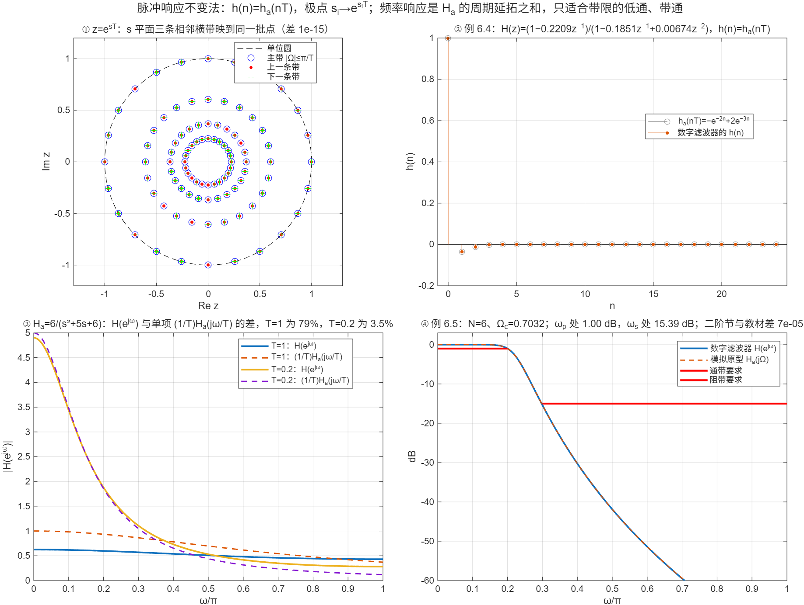

::: {.page-meta}
[教材书内 192—201 页 · PDF 200—209 页]{} [6.2.1 原理，6.2.2 变换公式，6.2.3 稳定性，6.2.4 混叠，6.2.5 设计步骤]{} [1.5 课时]{}
:::

::: {.keypoints}
[本页要点]{.kp-title}

- 思路：让数字滤波器的单位脉冲响应等于模拟滤波器脉冲响应的采样，h(n)=ha(nT)。z=e^{sT}：左半平面→单位圆内（稳定保持），jΩ 轴→单位圆，但 s 平面每条宽 2π/T 的横带都映到整个 z 平面（多对一）。
- 频率响应：H(e^{jω})=(1/T)Σ_m Ha(j(ω+2πm)/T)（式 (6.2.1)）——周期延拓之和。Ha 不带限就有混叠，所以只适合低通、带通；不能做高通、带阻。常把 h(n) 乘 T 抵消 1/T（式 (6.2.8)）。
- 变换公式：Ha(s)=ΣA_i/(s−s_i) → H(z)=ΣA_i/(1−e^{s_iT}z⁻¹)（式 (6.2.6)），残数不变、极点按 e^{s_iT} 映射，零点不按此映射。
- 例 6.4：(s+1)/(s²+5s+6)，T=1 → (1−0.2209z⁻¹)/(1−0.1851z⁻¹+0.00674z⁻²)。例 6.5：0.2π/1 dB、0.3π/15 dB → 巴特沃思 N=6、Ωc=0.7032 → 三个二阶节。
:::

## [①]{.col-badge} 问题从哪来：Rader 与 Gold 1967 的两条路线，Jackson 2000 的补丁 {#sec-1}

1967 年 Rader 与 Gold 的综述把“从模拟滤波器得到数字滤波器”的方法系统摆出来：一条是让脉冲响应对应（本节），一条是用代数映射把 s 平面变到 z 平面（下节的双线性变换）。他们明确指出脉冲响应不变法的频率响应是模拟响应的周期延拓，并讨论了 1/T 因子的处理。三十多年后 Jackson 在《IEEE Signal Processing Letters》上指出一个长期被忽略的细节：当 ha(t) 在 t=0 有跳变（分子阶数恰比分母低一阶）时，按周期延拓公式应取 h(0)=ha(0⁺)/2，而通常的部分分式做法取 h(0)=ha(0⁺)，两者的频率响应差一个常数 ha(0⁺)/2。教材例 6.4 正是这种情形，演示②③把这个差 0.5 量了出来；例 6.5 的巴特沃思分子是常数，不受影响。

课堂落点：**脉冲响应不变法是“时域采样”思想在系统上的应用，第 2 章采样定理的混叠在这里以同样的面目出现。**

::: {.classroom-media-grid}



:::

::: {.media-note}
外部素材需要联网；核对日期、资料性质和未知字段见各卡。
:::

::: {.sources}
- C. M. Rader, B. Gold, "Digital filter design techniques in the frequency domain," *Proc. IEEE* 55(2) (1967) 149–171. [doi:10.1109/PROC.1967.5434](https://doi.org/10.1109/PROC.1967.5434)
- L. B. Jackson, "A correction to impulse invariance," *IEEE Signal Processing Letters* 7(10) (2000) 273–275. [doi:10.1109/97.870677](https://doi.org/10.1109/97.870677)
:::

## [②]{.col-badge} 理论与推导 {#sec-2}

### 6.2.1 映射 z=e^{sT} {#sec-2-1}

h(n)=ha(nT)。采样序列的 z 变换与拉普拉斯变换的关系（第 2 章）：

$$
H(z)\big|_{z=e^{sT}}=\frac1T\sum_{m=-\infty}^{\infty}H_a\!\left(s+j\frac{2\pi m}{T}\right).
$$

s=σ+jΩ → z=e^{σT}e^{jΩT}：σ<0 ↔ |z|<1（稳定保持），σ=0 ↔ 单位圆。但 Ω 每增加 2π/T，z 转回原处：s 平面每条宽 2π/T 的横带都映到整个 z 平面（演示①：三条带的网格点在 z 平面完全重合）。取 s=jΩ、ω=ΩT：

$$
H(e^{j\omega})=\frac1T\sum_m H_a\!\left(j\frac{\omega+2\pi m}{T}\right).
$$

Ha(jΩ) 在 |Ω|≥π/T 之外为零时，H(e^{jω})=(1/T)Ha(jω/T)，形状完全继承；否则各周期重叠——混叠。1/T 因子使增益随 T 变化，工程上取 h(n)=T·ha(nT)（式 (6.2.8)）。

### 6.2.2 变换公式 {#sec-2-2}

设 Ha(s) 只有单极点且分子阶数低于分母，部分分式 Ha(s)=Σ_{i}A_i/(s−s_i)，ha(t)=ΣA_i e^{s_it}u(t)，采样后

$$
h(n)=\sum_iA_ie^{s_inT}u(n)\;\Rightarrow\;H(z)=\sum_i\frac{A_i}{1-e^{s_iT}z^{-1}}.
$$

即：残数 A_i 不变；极点 s_i→e^{s_iT}；零点没有简单对应，要通分后才知道。例 6.4：(s+1)/(s²+5s+6)=−1/(s+2)+2/(s+3)，T=1：

$$
H(z)=\frac{-1}{1-e^{-2}z^{-1}}+\frac{2}{1-e^{-3}z^{-1}}=\frac{1-0.2209z^{-1}}{1-0.1851z^{-1}+0.00674z^{-2}}.
$$

演示②验证它的 h(n) 与 −e^{−2n}+2e^{−3n} 逐点相同。

### 6.2.3—6.2.4 稳定性与混叠 {#sec-2-3}

Re s_i<0 ⇒ |e^{s_iT}|<1，稳定必保持。混叠大小取决于 Ha 在 |Ω|>π/T 处的余量：演示③用 Ha=6/(s²+5s+6)，T=1 时 H(e^{jω}) 与单项 (1/T)Ha(jω/T) 差 80%，T=0.2 时降到 3.5%。设计时 T 只是名义量，通常取 T=1、Ω=ω。

### 6.2.5 设计步骤（例 6.5） {#sec-2-4}

1. 数字指标 → 模拟指标：Ω=ω/T（T=1）：Ωp=0.2π 处 ≤1 dB，Ωs=0.3π 处 ≥15 dB。
2. 定 N、Ωc：N=5.8858→6，Ωc=0.7032（[6.1](6.1-butterworth.qmd)）。
3. 极点：0.7032·e^{j(105°,135°,165°)} 及共轭。
4. Ha(s)=0.12093/[(s²+0.3640s+0.4945)(s²+0.9945s+0.4945)(s²+1.3585s+0.4945)]。
5. 部分分式 → 每对共轭极点合并成一个二阶节：

$$
\frac{A}{1-pz^{-1}}+\frac{A^*}{1-p^*z^{-1}}=\frac{2\,\mathrm{Re}A-2\,\mathrm{Re}(Ap^*)z^{-1}}{1-2\,\mathrm{Re}p\,z^{-1}+|p|^2z^{-2}}.
$$

得教材的三个二阶节：(0.2871−0.4466z⁻¹)/(1−1.2971z⁻¹+0.6949z⁻²)+(−2.1428+1.1455z⁻¹)/(1−1.0691z⁻¹+0.3699z⁻²)+(1.8558−0.6304z⁻¹)/(1−0.9972z⁻¹+0.2570z⁻²)。演示④复现并核对：ωp 处 1.00 dB，ωs 处 15.39 dB。

::: {.callout-note .ask appearance="simple"}
**教师提问：** 三个二阶节分母的常数项都是 0.4945 的“数字版”吗？（|e^{s_iT}|²=e^{2Re s_i}；三对极点实部不同，所以 0.6949、0.3699、0.2570 各不相同，而模拟分母的常数项 |s_i|²=Ωc²=0.4945 相同。圆映成了不同半径。）
:::

## [③]{.col-badge} 仿真演示 {#sec-3}

::: {.ide-links data-matlab="demo_impulse_invariance.m" data-python="python/6.3-impulse-invariance.py"}
:::

脚本 [demo_impulse_invariance.m](code/demo_impulse_invariance.m) [已运行]{.status .ok}，变换由 [dsp_impinvar.m](code/dsp_impinvar.m)（`residue` + 极点映射 + 通分）完成，与工具箱 `impinvar` 逐系数一致。核验记录 [verification-impulse-invariance.json](code/results/verification-impulse-invariance.json)。

:::: {.example}
::: {.example-title}
多对一映射、例 6.4、混叠随 T 的变化、例 6.5 全程
:::
::: {.example-body}
**运行前问学生：** s=−1+j(Ω+2π/T) 和 s=−1+jΩ 映到 z 平面的同一点吗？例 6.4 的 h(0) 应该是多少？例 6.5 的三个二阶节分母常数项为什么不一样？

{width=100%}

| 能数出来的数 | 值 |
|---|---|
| 例 6.4 残数 / 极点 | A=(−1, 2)，s=(−2, −3) → z 极点 e⁻²=0.1353、e⁻³=0.0498 |
| 例 6.4 H(z) | (1−0.2208835z⁻¹)/(1−0.18512235z⁻¹+0.00673795z⁻²)；h(n)=ha(nT) 差 <10⁻¹² |
| 例 6.4 的跳变项 | H(e^{jω})−ΣHa(j(ω+2πm))=0.5=ha(0⁺)/2 |
| 混叠（Ha=6/(s²+5s+6)） | T=1：80%；T=0.2：3.5% |
| 例 6.5 二阶节 | 与教材三节的 12 个系数差 <2×10⁻⁴ |
| 例 6.5 指标 | ωp 处 1.00 dB，ωs 处 15.39 dB |

::: {.panel-tabset}
#### MATLAB [已运行]{.status .ok}

```matlab
b = [1 1]; a = [1 5 6]; T = 1;
[r, p] = residue(b, a)                                   % r=[2;−1]，p=[−3;−2]
% H(z) = Σ r_i/(1 − e^{p_i T} z^-1)，通分（完整实现见 dsp_impinvar.m）
az = conv([1 -exp(p(1)*T)], [1 -exp(p(2)*T)]);
bz = r(1)*[1 -exp(p(2)*T)] + r(2)*[1 -exp(p(1)*T)]       % [1 −0.2209]，az=[1 −0.1851 0.00674]
n = 0:20; max(abs(filter(bz, az, [1 zeros(1,20)]) - (-exp(-2*n) + 2*exp(-3*n))))   % ~1e-16
% 例 6.5：巴特沃思 N=6、Ωc=0.7032 → 脉冲响应不变
[bA, aA] = dsp_butter_analog(6, 0.7032); [bz5, az5] = dsp_impinvar(bA, aA, 1);
w = [0.2 0.3]*pi; -20*log10(abs(dsp_freqz(bz5, az5, w))/abs(dsp_freqz(bz5, az5, 0)))   % 1.00, 15.39 dB
```

#### Python [对照]{.status .ref}

```python
import numpy as np
from scipy import signal
b, a = [1, 1], [1, 5, 6]; T = 1
r, p, _ = signal.residue(b, a)                              # r=[-1, 2], p=[-2, -3]
az = np.convolve([1, -np.exp(p[0]*T)], [1, -np.exp(p[1]*T)])
bz = r[0]*np.array([1, -np.exp(p[1]*T)]) + r[1]*np.array([1, -np.exp(p[0]*T)])
print(bz.real, az.real)                                      # [1 -0.2209], [1 -0.1851 0.00674]
```
:::
:::
::::

## [④]{.col-badge} 检查与思考 {#sec-4}

::: {.quiz data-type="number" data-answer="0.1353" data-tol="0.001"}
::: {.q-text}
1. 模拟极点 s=−2，T=1，脉冲响应不变法得到的数字极点是多少？
:::
::: {.q-explain}
e^{sT}=e^{−2}=0.1353。
:::
:::

::: {.quiz data-type="choice" data-answer="C"}
::: {.q-text}
2. 脉冲响应不变法不适合设计高通滤波器，因为
:::
::: {.q-opts}
[高通不稳定]{data-opt="A"}
[高通没有部分分式]{data-opt="B"}
[高通的 Ha(jΩ) 在高频不为零，周期延拓必然混叠]{data-opt="C"}
[T 无法选取]{data-opt="D"}
:::
::: {.q-explain}
式 (6.2.1) 是周期延拓之和；Ha 不带限就重叠。
:::
:::

::: {.quiz data-type="multi" data-answer="A,C"}
::: {.q-text}
3. 关于变换 Ha(s)=ΣA_i/(s−s_i) → H(z)=ΣA_i/(1−e^{s_iT}z⁻¹)，正确的有
:::
::: {.q-opts}
[残数 A_i 不变]{data-opt="A"}
[零点也按 e^{s_iT} 映射]{data-opt="B"}
[极点按 e^{s_iT} 映射，稳定性保持]{data-opt="C"}
[适用于分子阶数高于分母的 Ha(s)]{data-opt="D"}
:::
::: {.q-explain}
零点由通分决定；分子阶数必须低于分母，否则 ha(t) 含冲激。
:::
:::

**短答题**

4. 从 h(n)=ha(nT)=ΣA_ie^{s_inT}u(n) 出发推出 H(z)=ΣA_i/(1−e^{s_iT}z⁻¹)。
5. 例 6.4 的 Ha(s) 分子比分母低一阶，ha(0⁺)=1。说明为什么按式 (6.2.1) 的周期延拓之和与按部分分式得到的 H(e^{jω}) 差 0.5。

::: {.callout-tip collapse="true" appearance="simple"}
## 教师参考要点
4. Σ_n A_i(e^{s_iT}z⁻¹)ⁿ 是等比级数，|e^{s_iT}z⁻¹|<1 时收敛为 A_i/(1−e^{s_iT}z⁻¹)。
5. 泊松求和公式要求采样点取函数的左右平均值；t=0 处 ha 从 0 跳到 1，公式对应 h(0)=1/2，而 ha(nT) 直接取 1，相差 0.5 只影响 h(0)，即频率响应差常数 0.5（Jackson 2000）。
:::



::: {.see-also}
[另请参阅]{.sa-title}

::: {.sa-row}
[先修]{.sa-label} [2.1 采样与混叠](../ch2/2.1-sampling.qmd) · [6.1 巴特沃思](6.1-butterworth.qmd)
:::
::: {.sa-row}
[后继]{.sa-label} [6.4 双线性变换](6.4-bilinear.qmd) · [6.5 设计对比](6.5-design-compare.qmd)
:::
:::
