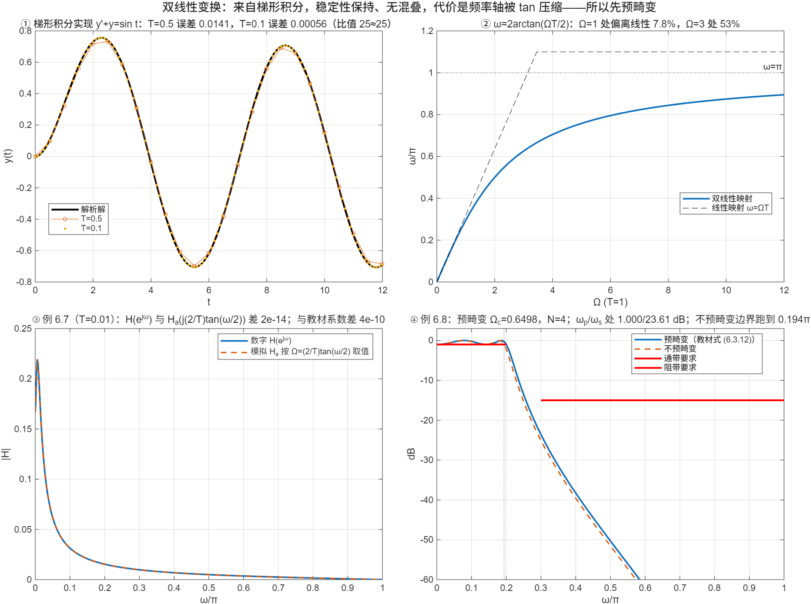

::: {.page-meta}
[教材书内 201—213 页 · PDF 209—221 页]{} [6.3.1 原理，6.3.2 变换公式，6.3.3 稳定性与频率映射，6.3.4 预畸变，6.3.5 设计步骤]{} [1.5 课时]{}
:::

::: {.keypoints}
[本页要点]{.kp-title}

- 来历：把微分方程 C₁y'+C₀y=d₀x 用梯形法数值积分，得到差分方程，其 H(z) 正是 Ha(s) 在 s=(2/T)(1−z⁻¹)/(1+z⁻¹) 处的值（式 (6.3.2)）；反过来 z=(2/T+s)/(2/T−s)（式 (6.3.3)）。
- 性质：整个 jΩ 轴一对一映到单位圆一周（无混叠），左半平面映到单位圆内（保稳定），N 阶变 N 阶。
- 代价：ω=2·arctan(ΩT/2)（式 (6.3.7)），非线性；Ω→∞ 压到 ω=π。指标只在边界频率上给出时，先把数字边界 ω 预畸变成模拟边界 Ω=(2/T)tan(ω/2)，再设计 Ha(s)，变换回来后边界正好落在原处。
- 例 6.8：0.2π/1 dB、0.3π/15 dB → 预畸变 Ωp=0.6498、Ωs=1.0191 → 切比雪夫 N=4 → H(z)=0.001836(1+z⁻¹)⁴/[(1−1.4996z⁻¹+0.8482z⁻²)(1−1.5548z⁻¹+0.6493z⁻²)]。
:::

## [①]{.col-badge} 问题从哪来：Tustin 1947 的时间序列法，Golden 与 Kaiser 1964 的数字滤波器 {#sec-1}

1947 年 Tustin 在英国电气工程师学会会刊上发表《用时间序列分析线性系统行为的一种方法》，为伺服系统的计算提出：把连续系统的积分用梯形法近似，整个系统就变成了可以逐步计算的差分方程。控制界至今把 s=(2/T)(z−1)/(z+1) 叫 Tustin 变换。1964 年 Golden 与 Kaiser 在《Bell System Technical Journal》的《宽带采样数据滤波器设计》中把它用于滤波器：先按频率轴的 tan 畸变反向修正指标（预畸变），再做变换，宽带滤波器也能保持指标。教材 6.3.1 开头提到的“凯塞（Kaiser）和戈尔登（Golden）”就是这项工作；“双线性”指分子分母都是 z 的一次式。

课堂落点：**双线性变换本质上是一条数值积分公式；它保住了稳定性和无混叠，代价是把频率轴弯了。** 弯的规律是已知的（tan），所以可以预先补偿。

::: {.classroom-media-grid}





:::

::: {.media-note}
外部素材需要联网；核对日期、资料性质和未知字段见各卡。
:::

::: {.sources}
- A. Tustin, "A method of analysing the behaviour of linear systems in terms of time series," *J. IEE Part IIA* 94(1) (1947) 130–142. [doi:10.1049/ji-2a.1947.0020](https://doi.org/10.1049/ji-2a.1947.0020)
- R. M. Golden, J. F. Kaiser, "Design of wideband sampled-data filters," *Bell Syst. Tech. J.* 43(4) (1964) 1533–1546. [doi:10.1002/j.1538-7305.1964.tb04095.x](https://doi.org/10.1002/j.1538-7305.1964.tb04095.x)
:::

## [②]{.col-badge} 理论与推导 {#sec-2}

### 6.3.1 从梯形积分来 {#sec-2-1}

一阶系统 C₁y'(t)+C₀y(t)=d₀x(t)，Ha(s)=d₀/(C₁s+C₀)。y(nT)=∫_{(n−1)T}^{nT}y'dτ+y((n−1)T)，梯形法：

$$
y(n)-y(n-1)=\frac T2\big[y'(n)+y'(n-1)\big],\qquad y'=\frac{d_0x-C_0y}{C_1}.
$$

代入并取 z 变换：H(z)=d₀/[C₁·(2/T)(1−z⁻¹)/(1+z⁻¹)+C₀]，即 Ha(s) 在

$$
s=\frac2T\cdot\frac{1-z^{-1}}{1+z^{-1}}
$$

处的值。任何 Ha(s) 都可以这样代换（式 (6.3.4)）；N 阶变 N 阶。演示①：y'+y=sin t 用 T=0.5 和 0.1 的梯形法算，最大误差 0.0141 与 0.00056，比值 25——二阶精度。

### 6.3.3 稳定性与频率映射 {#sec-2-2}

z=(2/T+s)/(2/T−s)，s=σ+jΩ：

$$
|z|=\sqrt{\frac{(2/T+\sigma)^2+\Omega^2}{(2/T-\sigma)^2+\Omega^2}}
\;\Rightarrow\;\sigma<0\Leftrightarrow|z|<1,\quad\sigma=0\Leftrightarrow|z|=1.
$$

左半平面整体映到单位圆内，jΩ 轴一对一映到单位圆——没有混叠。s=jΩ、z=e^{jω}：

$$
\omega=2\arctan\frac{\Omega T}{2},\qquad \Omega=\frac2T\tan\frac\omega2.
$$

Ω 从 0 到 ∞，ω 从 0 到 π（演示②）：低频近似线性 ω≈ΩT，高频压缩得厉害（T=1 时 Ω=1 处偏 7.8%，Ω=3 处偏 53%）。后果：Ha 的幅频曲线形状在 ω 轴上被压扁，边界频率移位；相频响应也被弯曲，线性相位保不住。

### 6.3.4 预畸变 {#sec-2-3}

指标只给几个边界频率 ω_k 时，先算 Ω_k=(2/T)tan(ω_k/2)，用 Ω_k 设计 Ha(s)，变换后 H(e^{jω}) 在 ω_k 处恰好取到 Ha(jΩ_k) 的值。教材图 6.3.4 的带通四个边界就是这样处理。T 在设计中互相抵消，取 T=1 即可。演示④对比：不预畸变时通带边界跑到 0.194π，ωp 处衰减 2.2 dB，不达标。

### 6.3.5 设计步骤（例 6.8） {#sec-2-4}

1. 预畸变（T=1）：Ωp=2tan(0.1π)=0.6498，Ωs=2tan(0.15π)=1.0191。
2. 切比雪夫 I 型，ε=√(10^{0.1}−1)=0.50885，Ωc=Ωp。
3. N=arcosh(√(10^{1.5}−1)/ε)/arcosh(Ωs/Ωc)=3.014→4。
4. β=4.1702^{1/4}，a=0.3646，b=1.0644；极点 −0.0907±j0.6390、−0.2189±j0.2647。
5. Ha(s)=0.04381/[(s²+0.1814s+0.4166)(s²+0.4378s+0.1180)]。
6. 代入 s=2(1−z⁻¹)/(1+z⁻¹)：H(z)=0.001836(1+z⁻¹)⁴/[(1−1.4996z⁻¹+0.8482z⁻²)(1−1.5548z⁻¹+0.6493z⁻²)]（式 (6.3.12)）。

(1+z⁻¹)⁴ 说明 Ha 在 s=∞ 的 4 个零点全映到 z=−1（ω=π）。演示④核对：ωp 处 1.000 dB，ωs 处 23.6 dB。

::: {.callout-note .ask appearance="simple"}
**教师提问：** 教材例 6.7 说 T=0.001，印出的系数是 [0.0049017 0.0000488 −0.0048529]/[1 −1.95064 0.95123]。用 T=0.001 算，分母是 [1 −1.99501 0.99501]，对不上；用 T=0.01（fs=100）算才对上（差 4×10⁻¹⁰）。课堂上可以让学生自己算一遍找出来。
:::

## [③]{.col-badge} 仿真演示 {#sec-3}

::: {.ide-links data-matlab="demo_bilinear.m" data-python="python/6.4-bilinear.py"}
:::

<div class="video-box">
<p class="media-pending">课堂动画正在整理上线；请先查看下方静态图和实验代码。</p>
</div>

::: {.media-note}
由 [make_bilinear_video.m](code/make_bilinear_video.m) 生成；[动画核验记录](code/results/verification-video-bilinear.json)。先让学生预测“不预畸变时通带边界会落在哪”，再播；播到第②段 Ω=3 时暂停一次问“为什么到不了 π”。相对偏离沿用原脚本，以双线性映射值为分母。点击加载后再按播放键。
:::


脚本 [demo_bilinear.m](code/demo_bilinear.m) [已运行]{.status .ok}，变换由 [dsp_bilinear.m](code/dsp_bilinear.m)（多项式代换后按 z⁻¹ 整理）完成，与工具箱 `bilinear` 逐系数一致。核验记录 [verification-bilinear.json](code/results/verification-bilinear.json)。

:::: {.example}
::: {.example-title}
梯形积分的精度、频率映射、例 6.7 的两个 T、例 6.8 预畸变与不预畸变
:::
::: {.example-body}
**运行前问学生：** 双线性变换会不会把稳定的 Ha(s) 变成不稳定的 H(z)？ω=0.5π 对应的模拟频率 Ω 是多少（T=1）？不预畸变会怎样？

{width=100%}

| 能数出来的数 | 值 |
|---|---|
| 梯形积分误差（T=0.5 / 0.1） | 0.0141 / 0.00056，比值 25.4 |
| 映射偏离（T=1）Ω=1 / Ω=3 | 7.8% / 52.6% |
| 例 6.7 按 T=0.001 | (4.99×10⁻⁴+5×10⁻⁷z⁻¹−4.985×10⁻⁴z⁻²)/(1−1.99501z⁻¹+0.99501z⁻²) |
| 例 6.7 按 T=0.01 | 与教材印出的系数差 4×10⁻¹⁰ |
| 无混叠核验 | H(e^{jω}) 与 Ha(j(2/T)tan(ω/2)) 差 2×10⁻¹⁴ |
| 例 6.8 | Ωc=0.6498，N=4，H(z) 与式 (6.3.12) 差 8×10⁻⁵；ωp/ωs 处 1.000/23.61 dB |
| 不预畸变 | 通带边界落到 0.194π；ωp 处 2.20 dB（不达标） |

::: {.panel-tabset}
#### MATLAB [已运行]{.status .ok}

```matlab
% 例 6.8：预畸变 → 切比雪夫 N=4 → 双线性（T=1）
wp = 0.2*pi; ws = 0.3*pi; ap = 1; as = 15; T = 1;
Wp = (2/T)*tan(wp/2); Ws = (2/T)*tan(ws/2);            % 0.6498, 1.0191
eps = sqrt(10^(ap/10) - 1);
N = ceil(acosh(sqrt(10^(as/10) - 1)/eps)/acosh(Ws/Wp))  % 3.014 → 4
[bA, aA] = dsp_cheby1_analog(N, eps, Wp);              % Ha(s)
[bz, az] = dsp_bilinear(bA, aA, T)                     % bz=0.001836·[1 4 6 4 1]
-20*log10(abs(dsp_freqz(bz, az, [wp ws])))             % 1.000, 23.61 dB
% 例 6.7 用工具箱核对：bilinear(b, a, fs)，fs=1/T
[bS, aS] = bilinear([1 1], [1 5 6], 100)               % 与教材印出的系数一致（T=0.01）
```

#### Python [对照]{.status .ref}

```python
import numpy as np
from scipy import signal
from dsp_iir import cheby1_analog
wp, ws, ap, as_ = 0.2*np.pi, 0.3*np.pi, 1, 15
Wp, Ws = 2*np.tan(wp/2), 2*np.tan(ws/2); eps = np.sqrt(10**(ap/10) - 1)
N = int(np.ceil(np.arccosh(np.sqrt(10**(as_/10) - 1)/eps)/np.arccosh(Ws/Wp)))   # 4
bA, aA, *_ = cheby1_analog(N, eps, Wp); bz, az = signal.bilinear(bA, aA, fs=1)
print(bz, az)                                             # 0.001836·[1 4 6 4 1], [1 -3.0543 3.8290 -2.2925 0.5507]
print(signal.bilinear([1, 1], [1, 5, 6], fs=100))         # 例 6.7 教材系数对应 fs=100
```
:::
:::
::::

## [④]{.col-badge} 检查与思考 {#sec-4}

::: {.quiz data-type="number" data-answer="2" data-tol="0.01"}
::: {.q-text}
1. T=1，数字频率 ω=0.5π 对应的模拟频率 Ω=(2/T)tan(ω/2) 是多少？
:::
::: {.q-explain}
2·tan(π/4)=2。
:::
:::

::: {.quiz data-type="choice" data-answer="B"}
::: {.q-text}
2. 双线性变换的主要缺点是
:::
::: {.q-opts}
[有混叠]{data-opt="A"}
[频率映射非线性，边界频率移位、相位被弯曲]{data-opt="B"}
[不能保持稳定性]{data-opt="C"}
[阶数升高]{data-opt="D"}
:::
::: {.q-explain}
jΩ 轴一对一映到单位圆，无混叠；左半平面映到圆内，稳定保持；N 阶变 N 阶。只有 tan 压缩这一条。
:::
:::

::: {.quiz data-type="number" data-answer="4" data-tol="0"}
::: {.q-text}
3. 例 6.8 的指标经预畸变后，切比雪夫 I 型需要几阶？
:::
::: {.q-explain}
N≥3.014，取 4。
:::
:::

**短答题**

4. 从梯形法 y(n)−y(n−1)=(T/2)[y'(n)+y'(n−1)] 推出 s=(2/T)(1−z⁻¹)/(1+z⁻¹)。
5. 证明 σ<0 时 |z|<1。为什么这保证了稳定性保持？

::: {.callout-tip collapse="true" appearance="simple"}
## 教师参考要点
4. 两边取 z 变换：Y(1−z⁻¹)=(T/2)Y'(1+z⁻¹)，Y'/Y=(2/T)(1−z⁻¹)/(1+z⁻¹)，而连续域 Y'/Y=s。
5. |z|²=[(2/T+σ)²+Ω²]/[(2/T−σ)²+Ω²]，σ<0 时分子小于分母；Ha 的极点在左半平面 ⇒ H 的极点在单位圆内。
:::



::: {.see-also}
[另请参阅]{.sa-title}

::: {.sa-row}
[先修]{.sa-label} [6.2 切比雪夫](6.2-chebyshev.qmd) · [6.3 脉冲响应不变法](6.3-impulse-invariance.qmd)
:::
::: {.sa-row}
[后继]{.sa-label} [6.5 设计对比](6.5-design-compare.qmd)
:::
:::
