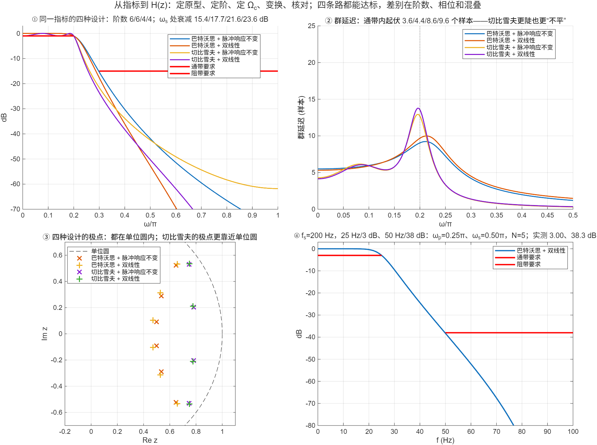

::: {.page-meta}
[教材书内 197—215 页 · PDF 205—223 页]{} [例 6.5、6.6、6.8—6.11，6.4 习题]{} [1 课时]{}
:::

::: {.keypoints}
[本页要点]{.kp-title}

- 全流程五步：数字指标 → 模拟指标（脉冲响应不变：Ω=ω/T；双线性：Ω=(2/T)tan(ω/2)）→ 选原型定 N、Ωc → Ha(s) → 变换 → 核对 H(e^{jω})。
- 指标 0.2π/1 dB、0.3π/15 dB：巴特沃思 6 阶、切比雪夫 4 阶，与变换方法无关（双线性预畸变后阶数恰好没变）；四种设计全部达标，阻带余量 15.4/17.7/21.6/23.6 dB。
- 切比雪夫更陡，代价是通带群延迟起伏更大（8.6—9.6 个样本对 3.6—4.4）、极点更靠近单位圆（0.92 对 0.84）。
- 给 Hz 的指标先化成 ω=2πf/fs：fs=200 Hz、25 Hz/3 dB、50 Hz/38 dB → ωp=0.25π、ωs=0.5π → 巴特沃思 + 双线性 N=5。
:::

## [①]{.col-badge} 问题从哪来：低通原型之后——Constantinides 的频率变换 {#sec-1}

本章只设计低通。1967—1970 年 Constantinides 给出了在 z 平面内直接做的频率变换：把一个数字低通原型变成任意截止频率的低通、高通、带通、带阻，变换是全通函数的代换 z⁻¹→G(z⁻¹)，稳定性和等纹波性质都保持。加上本章的两种模拟→数字变换和第 5 章的结构，IIR 设计的工具箱就齐了：`butter`、`cheby1` 这类函数在内部做的正是“模拟低通原型 → 频率变换 → 双线性”。教材没有讲频率变换，本页只作展望；四种设计的对比是本页重点。Gold 与 Rader 1969 年的《Digital Processing of Signals》是第一本把这些内容写成教材的书。

::: {.sources}
- A. G. Constantinides, "Spectral transformations for digital filters," *Proc. IEE* 117(8) (1970) 1585–1590. [doi:10.1049/piee.1970.0281](https://doi.org/10.1049/piee.1970.0281)
- A. G. Constantinides, "Frequency transformations for digital filters," *Electronics Letters* 3(11) (1967) 487–489. [doi:10.1049/el:19670385](https://doi.org/10.1049/el:19670385)
- B. Gold, C. M. Rader, *Digital Processing of Signals*, McGraw-Hill (1969).（专著，无 DOI）
:::

## [②]{.col-badge} 理论与推导 {#sec-2}

### 四条路的差别在哪 {#sec-2-1}

| | 巴特沃思 | 切比雪夫 I 型 |
|---|---|---|
| 通带 | 单调、最平坦 | 等纹波 αp |
| 同一指标的阶数 | 6 | 4 |
| 群延迟（通带内起伏） | 小 | 大 |
| 极点 | 圆上，离单位圆较远 | 椭圆上，更靠近单位圆，对系数量化更敏感（第 5 章） |

| | 脉冲响应不变 | 双线性 |
|---|---|---|
| 指标换算 | Ω=ω/T | Ω=(2/T)tan(ω/2)（预畸变） |
| 混叠 | 有，阻带余量被吃掉一些 | 无 |
| 频率轴 | 线性（低于 π/T 部分） | tan 压缩，高频形状变形 |
| 适用 | 低通、带通 | 各种类型 |
| 相位 | 继承模拟相位 | 被弯曲 |

演示①：四种设计的幅频曲线都穿过指标线；脉冲响应不变的阻带余量小于双线性（15.4 对 17.7，21.6 对 23.6），差在混叠和 tan 压缩两个方向的效应上。

### 阶数为什么不变 {#sec-2-2}

双线性预畸变后 Ωs/Ωp 从 1.5 变成 tan(0.15π)/tan(0.1π)=1.568，比值变大，所需的 N 略降（巴特沃思 5.886→5.30，切比雪夫 3.198→3.014），取整后仍是 6 和 4。这不是普遍规律，指标靠近取整边界时可能少一阶。

### Hz 指标怎么化 {#sec-2-3}

fs=200 Hz，通带 0—25 Hz 衰减 <3 dB，阻带 ≥50 Hz 衰减 ≥38 dB：ωp=2π·25/200=0.25π，ωs=0.5π。双线性预畸变（T=1/200）：Ωp=400·tan(0.125π)=165.7 rad/s，Ωs=400。巴特沃思 N=lg[(10^{3.8}−1)/(10^{0.3}−1)]/(2lg(400/165.7))=4.5→5，Ωc=165.8。演示④核对：25 Hz 处 3.00 dB，50 Hz 处 38.3 dB。

::: {.callout-note .ask appearance="simple"}
**教师提问：** 同一题若改用脉冲响应不变法，ωs=0.5π 已经是 π/T 的一半，阻带混叠会不会影响 38 dB？（巴特沃思 5 阶在 Ω>π/T 处衰减已很深，影响不到 0.1 dB；但若阻带要求在 0.8π 以上，就该换双线性。）
:::

## [③]{.col-badge} 仿真演示 {#sec-3}

::: {.ide-links data-matlab="demo_iir_design_compare.m" data-python="python/6.5-iir-design-compare.py"}
:::

脚本 [demo_iir_design_compare.m](code/demo_iir_design_compare.m) [已运行]{.status .ok}，只调用本章的 `dsp_*` 函数；阶数与工具箱 `buttord`、`cheb1ord` 一致。核验记录 [verification-iir-design-compare.json](code/results/verification-iir-design-compare.json)。

:::: {.example}
::: {.example-title}
四种设计的幅频、群延迟、极点；Hz 指标的题
:::
::: {.example-body}
**运行前问学生：** 四种设计哪种阻带余量最大？哪种群延迟最平？25 Hz/50 Hz 的题化成 ω 是多少？

{width=100%}

| 设计 | 阶数 | ωp 处 (dB) | ωs 处 (dB) | 通带群延迟起伏（样本） | 极点最大模 |
|---|---|---|---|---|---|
| 巴特沃思 + 脉冲响应不变 | 6 | 1.000 | 15.39 | 3.6 | 0.834 |
| 巴特沃思 + 双线性 | 6 | 1.000 | 17.65 | 4.4 | 0.846 |
| 切比雪夫 + 脉冲响应不变 | 4 | 1.001 | 21.58 | 8.6 | 0.916 |
| 切比雪夫 + 双线性 | 4 | 1.000 | 23.61 | 9.6 | 0.921 |

| Hz 指标的题 | 值 |
|---|---|
| ωp / ωs | 0.25π / 0.5π |
| 预畸变 Ωp / Ωs（rad/s） | 165.7 / 400 |
| N / Ωc | 5 / 165.8 |
| 25 Hz / 50 Hz 处衰减 | 3.00 / 38.3 dB |

::: {.panel-tabset}
#### MATLAB [已运行]{.status .ok}

```matlab
fs = 200; fp = 25; fst = 50; ap = 3; as = 38; T = 1/fs;
wp = 2*pi*fp/fs; ws = 2*pi*fst/fs;                          % 0.25π, 0.5π
Wp = (2/T)*tan(wp/2); Ws = (2/T)*tan(ws/2);                 % 预畸变
N = ceil(log10((10^(as/10) - 1)/(10^(ap/10) - 1))/(2*log10(Ws/Wp)))   % 5
Wc = Wp/(10^(ap/10) - 1)^(1/(2*N));
[bA, aA] = dsp_butter_analog(N, Wc); [bz, az] = dsp_bilinear(bA, aA, T);
-20*log10(abs(dsp_freqz(bz, az, [wp ws])))                  % 3.00, 38.3 dB
% 工具箱一行版：[N, Wn] = buttord(wp/pi, ws/pi, ap, as); [bz, az] = butter(N, Wn);
```

#### Python [已运行]{.status .ok}

```python
import numpy as np
from scipy import signal
fs, fp, fst, ap, as_ = 200, 25, 50, 3, 38
N, Wn = signal.buttord(fp/(fs/2), fst/(fs/2), ap, as_)      # 5
bz, az = signal.butter(N, Wn)
w, H = signal.freqz(bz, az, worN=[2*np.pi*fp/fs, 2*np.pi*fst/fs])
print(N, -20*np.log10(np.abs(H)))                           # 5, [3.0 38.3]
```
:::
:::
::::

## [④]{.col-badge} 检查与思考 {#sec-4}

::: {.quiz data-type="number" data-answer="0.25" data-tol="0.001"}
::: {.q-text}
1. fs=200 Hz，通带边界 25 Hz 对应的数字频率是 ωp=？π
:::
::: {.q-explain}
ω=2πf/fs=2π·25/200=0.25π。
:::
:::

::: {.quiz data-type="choice" data-answer="A"}
::: {.q-text}
2. 同一指标下，切比雪夫比巴特沃思阶数低，但
:::
::: {.q-opts}
[通带群延迟起伏更大，极点更靠近单位圆]{data-opt="A"}
[阻带衰减更小]{data-opt="B"}
[不能用双线性变换]{data-opt="C"}
[通带不能达标]{data-opt="D"}
:::
::: {.q-explain}
演示②③：群延迟起伏 8.6—9.6 对 3.6—4.4 个样本，极点模 0.92 对 0.84。
:::
:::

::: {.quiz data-type="number" data-answer="5" data-tol="0"}
::: {.q-text}
3. fs=200 Hz、25 Hz/3 dB、50 Hz/38 dB，巴特沃思 + 双线性需要几阶？
:::
::: {.q-explain}
预畸变后 N≥4.5，取 5。
:::
:::

**短答题**

4. 写出用双线性变换设计数字低通的完整步骤，说明每一步用到本章哪一个公式。
5. 教材习题 11：fs=200 Hz，0—25 Hz 衰减 <3 dB，≥50 Hz 衰减 ≥38 dB。用脉冲响应不变法重做一遍，与双线性的结果比较阻带衰减。

::: {.callout-tip collapse="true" appearance="simple"}
## 教师参考要点
4. 预畸变 (6.3.7) → 定 N (6.1.15 或巴特沃思定阶式) → 定 Ωc → 极点 (6.1.7)/(6.1.18) → Ha(s) (6.1.6)/(6.1.23) → 代换 (6.3.4) → 核对。
5. 脉冲响应不变：Ω=ω/T，Ωp=50π、Ωs=100π rad/s，N 同为 5，Ωc 略不同；阻带衰减略低于双线性（混叠），仍高于 38 dB。
:::



::: {.see-also}
[另请参阅]{.sa-title}

::: {.sa-row}
[先修]{.sa-label} [6.3 脉冲响应不变法](6.3-impulse-invariance.qmd) · [6.4 双线性变换](6.4-bilinear.qmd) · [5.3 级联结构与系数灵敏度](../ch5/5.3-iir-cascade-parallel.qmd)
:::
::: {.sa-row}
[后继]{.sa-label} 第7章 FIR 滤波器设计
:::
:::
