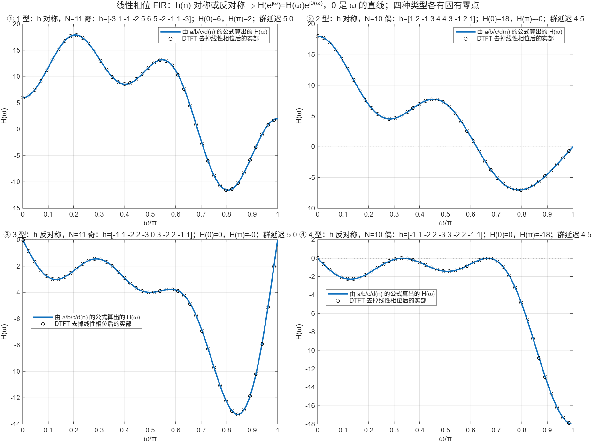

::: {.page-meta}
[教材书内 216—229 页 · PDF 224—237 页]{} [7.1.1 线性相位条件与四类，例 7.1—7.4]{} [1 课时]{}
:::

::: {.keypoints}
[本页要点]{.kp-title}

- FIR：H(z)=Σ_{n=0}^{N−1}h(n)z⁻ⁿ，N−1 个零点、N−1 个在原点的极点，必然稳定。线性相位条件：h(n)=h(N−1−n)（对称）或 h(n)=−h(N−1−n)（反对称）（式 (7.1.3)(7.1.4)）。
- 写成 H(e^{jω})=H(ω)e^{jθ(ω)}，H(ω) 实（可正可负），θ(ω)=−(N−1)ω/2（对称）或 −(N−1)ω/2+π/2（反对称）。群延迟 (N−1)/2 个样本，常数。
- 四类：1 型（对称、N 奇）H(ω)=Σa(n)cos nω；2 型（对称、N 偶）Σb(n)cos(n−½)ω，H(π)=0；3 型（反对称、N 奇）Σc(n)sin nω，H(0)=H(π)=0；4 型（反对称、N 偶）Σd(n)sin(n−½)ω，H(0)=0（表 7.1.1）。
- 后果：低通、带阻只能用 1 型或 2 型；高通不能用 2、3 型；微分器、希尔伯特变换器用 3、4 型。
:::

## [①]{.col-badge} 问题从哪来：1970 年前后，FIR 设计成为独立课题 {#sec-1}

IIR 借用模拟设计（第 6 章）；FIR 没有模拟原型可借，要从头建立设计方法。1970 年 Herrmann 与 Schüßler 在《Electronics Letters》给出线性相位非递归滤波器的设计；1971 年 Rabiner 在《IEEE Trans. Communications》发表综述《有限冲激响应数字滤波器的设计技术》，把窗函数法、频率采样法、最优设计三条路线并列，并系统整理了线性相位的四种情况和它们的零点约束。教材 7.1 的表 7.1.1 就是这个分类。线性相位为什么重要：图像、数据传输、语音的相位失真肉眼可见、耳朵可闻，而 IIR 做不到严格线性相位。

课堂落点：**FIR 的全部设计理论建立在一件事上：h(n) 对称，相位就是直线。** 四类的区别只在 N 奇偶和对称还是反对称，但决定了能做哪种滤波器。

::: {.classroom-media-grid}



:::

::: {.media-note}
外部素材需要联网；核对日期、资料性质和未知字段见各卡。
:::

::: {.sources}
- O. Herrmann, W. Schüßler, "Design of nonrecursive digital filters with linear phase," *Electronics Letters* 6(11) (1970) 328–329. [doi:10.1049/el:19700231](https://doi.org/10.1049/el:19700231)
- L. R. Rabiner, "Techniques for designing finite-duration impulse-response digital filters," *IEEE Trans. Communication Technology* 19(2) (1971) 188–195. [doi:10.1109/TCOM.1971.1090625](https://doi.org/10.1109/TCOM.1971.1090625)
:::

## [②]{.col-badge} 理论与推导 {#sec-2}

### 线性相位条件 {#sec-2-1}

要求 θ(ω)=−τω（或 −τω+β），即 H(e^{jω})=H(ω)e^{−jτω}。把 Σh(n)e^{−jωn} 与之比较，可证 τ=(N−1)/2 且 h(n)=h(N−1−n)（β=0）或 h(n)=−h(N−1−n)（β=π/2）。反过来，对称性给出线性相位，下面逐类推导。

### 1 型：对称，N 奇 {#sec-2-2}

把求和拆成 n<(N−1)/2、n=(N−1)/2、n>(N−1)/2 三段，第三段换元 m=N−1−n，用 h(n)=h(N−1−n)，提出公因子 e^{−j(N−1)ω/2}：

$$
H(e^{j\omega})=e^{-j\frac{N-1}2\omega}\Big[h\big(\tfrac{N-1}2\big)+\sum_{n=0}^{\frac{N-3}2}2h(n)\cos\big(\tfrac{N-1}2-n\big)\omega\Big]
=e^{-j\frac{N-1}2\omega}\sum_{n=0}^{\frac{N-1}2}a(n)\cos n\omega,
$$

a(0)=h((N−1)/2)，a(n)=2h((N−1)/2−n)（式 (7.1.10)—(7.1.12)）。cos nω 在 ω=0、π 都不必为零，1 型没有固有零点，四种滤波器都能做。例 7.1：h=[−3 1 −1 −2 5 6 5 −2 −1 1 −3]，a=[6 10 −4 −2 2 −6]，H(0)=6，H(π)=2。

### 2 型：对称，N 偶 {#sec-2-3}

没有中间项，H(ω)=Σ_{n=1}^{N/2}b(n)cos(n−½)ω，b(n)=2h(N/2−n)（式 (7.1.14)(7.1.15)）。ω=π 时 cos(n−½)π=0 ⇒ H(π)=0：z=−1 必是零点，不能做高通、带阻。例 7.2：h=[1 2 −1 3 4 4 3 −1 2 1]，b=[8 6 −2 4 2]。

### 3 型：反对称，N 奇 {#sec-2-4}

反对称迫使 h((N−1)/2)=0。合并后出现 e^{jω}−e^{−jω}=2j sin，多出 j=e^{jπ/2}：

$$
H(e^{j\omega})=e^{-j\frac{N-1}2\omega}e^{j\frac\pi2}\sum_{n=1}^{\frac{N-1}2}c(n)\sin n\omega,\qquad c(n)=2h\big(\tfrac{N-1}2-n\big).
$$

sin nω 在 ω=0、π 都为零 ⇒ z=±1 都是零点，只能做带通、微分器、希尔伯特变换器。例 7.3：c=[−6 4 −4 2 −2]。

### 4 型：反对称，N 偶 {#sec-2-5}

H(ω)=Σ_{n=1}^{N/2}d(n)sin(n−½)ω，d(n)=2h(N/2−n)（式 (7.1.20)）。ω=0 处为零，ω=π 处不必为零：能做高通，不能做低通。例 7.4：d=[−6 4 −4 2 −2]（与例 7.3 的 c 相同，h 少了中间的 0）。

::: {.callout-note .ask appearance="simple"}
**教师提问：** 3 型和 4 型的相位比 1、2 型多 π/2，这个 90° 是什么？（H(ω) 里的 sin 项带来的 j；反对称序列的频率响应在 ω=0 附近像 jω，是微分器的特征。）
:::

### 统一写法 {#sec-2-6}

四类都可以写成 H(e^{jω})=H(ω)e^{j(Lπ/2−(N−1)ω/2)}，L=0（对称）或 1（反对称）（式 (7.1.21)）。群延迟 τ=−dθ/dω=(N−1)/2，N 偶时是半个样本的奇数倍。

## [③]{.col-badge} 仿真演示 {#sec-3}

::: {.ide-links data-matlab="demo_linear_phase_types.m" data-python="python/7.1-linear-phase-types.py"}
:::

脚本 [demo_linear_phase_types.m](code/demo_linear_phase_types.m) [已运行]{.status .ok}：对例 7.1—7.4 分别按表 7.1.1 的公式算 H(ω)，再把 DTFT 除以 e^{jθ(ω)} 看剩下的是不是同一个实函数。核验记录 [verification-linear-phase-types.json](code/results/verification-linear-phase-types.json)。

:::: {.example}
::: {.example-title}
例 7.1—7.4：四类的 H(ω) 与 DTFT 逐点对照，固有零点
:::
::: {.example-body}
**运行前问学生：** 例 7.2 的 h 在 ω=π 处响应是多少？例 7.3 的 h 中间那个 0 是巧合吗？四个例子的群延迟各是几个样本？

{width=100%}

| 例 | 类型 | 系数 a/b/c/d(n) | H(0) | H(π) | 群延迟 |
|---|---|---|---|---|---|
| 7.1 | 1 型 | a=[6 10 −4 −2 2 −6] | 6 | 2 | 5 |
| 7.2 | 2 型 | b=[8 6 −2 4 2] | 18 | 0 | 4.5 |
| 7.3 | 3 型 | c=[−6 4 −4 2 −2] | 0 | 0 | 5 |
| 7.4 | 4 型 | d=[−6 4 −4 2 −2] | 0 | −18 | 4.5 |

四例 H(ω)e^{jθ} 与 DTFT 的最大差均在 10⁻¹⁴ 量级。

::: {.panel-tabset}
#### MATLAB [已运行]{.status .ok}

```matlab
h = [-3 1 -1 -2 5 6 5 -2 -1 1 -3]; N = numel(h); L = (N-1)/2;     % 例 7.1，1 型
a = [h(L+1), 2*h(L:-1:1)]                                            % a(0)=h(L)，a(n)=2h(L−n)
w = linspace(0, pi, 1024); Hw = a*cos((0:L).'*w);                     % H(ω)=Σ a(n) cos nω
H = polyval(fliplr(h), exp(-1i*w));                                   % DTFT
max(abs(H - Hw.*exp(-1i*(N-1)*w/2)))                                  % ~1e-14：H(e^{jω})=H(ω)e^{−j(N−1)ω/2}
h3 = [-1 1 -2 2 -3 0 3 -2 2 -1 1]; c = 2*h3(5:-1:1);                  % 例 7.3，3 型：多 e^{jπ/2}
max(abs(polyval(fliplr(h3), exp(-1i*w)) - (c*sin((1:5).'*w)).*exp(1i*(pi/2 - (11-1)*w/2))))
```

#### Python [已运行]{.status .ok}

```python
import numpy as np
h = np.array([-3, 1, -1, -2, 5, 6, 5, -2, -1, 1, -3.]); N = h.size; L = (N-1)//2
a = np.r_[h[L], 2*h[L-1::-1]]; w = np.linspace(0, np.pi, 1024)
Hw = a @ np.cos(np.outer(np.arange(L+1), w)); H = np.polyval(h[::-1], np.exp(-1j*w))
print(a, np.max(np.abs(H - Hw*np.exp(-1j*(N-1)*w/2))))                # [6 10 -4 -2 2 -6], ~1e-14
```
:::
:::
::::

## [④]{.col-badge} 检查与思考 {#sec-4}

::: {.quiz data-type="number" data-answer="15.5" data-tol="0.01"}
::: {.q-text}
1. N=32 的线性相位 FIR，群延迟是多少个样本？
:::
::: {.q-explain}
(N−1)/2=15.5。
:::
:::

::: {.quiz data-type="choice" data-answer="B"}
::: {.q-text}
2. 要设计一个线性相位高通滤波器，不能选
:::
::: {.q-opts}
[1 型（对称，N 奇）]{data-opt="A"}
[2 型（对称，N 偶）]{data-opt="B"}
[4 型（反对称，N 偶）]{data-opt="C"}
[以上都可以]{data-opt="D"}
:::
::: {.q-explain}
2 型在 ω=π 必为零，高通做不成；3 型也不行（ω=π 为零）。
:::
:::

::: {.quiz data-type="multi" data-answer="B,C"}
::: {.q-text}
3. 反对称 h(n) 的 FIR，H(ω) 在哪些频率必为零？（N 奇）
:::
::: {.q-opts}
[ω=π/2]{data-opt="A"}
[ω=0]{data-opt="B"}
[ω=π]{data-opt="C"}
[没有固有零点]{data-opt="D"}
:::
::: {.q-explain}
3 型 H(ω)=Σc(n)sin nω，在 0 和 π 都为零。
:::
:::

**短答题**

4. 从 h(n)=h(N−1−n)、N 奇出发推导式 (7.1.12)，说明 a(n) 与 h(n) 的关系。
5. 为什么 2 型 FIR 在 z=−1 必有零点？用 h=[1 2 2 1] 验证。

::: {.callout-tip collapse="true" appearance="simple"}
## 教师参考要点
4. 拆三段、换元、合并 e^{±j(...)} 为 2cos；a(0)=h((N−1)/2)，a(n)=2h((N−1)/2−n)。
5. H(π)=Σh(n)(−1)ⁿ，对称对 (n, N−1−n) 在 N 偶时 (−1)ⁿ 与 (−1)^{N−1−n} 反号，逐对抵消；1−2+2−1=0。
:::



::: {.see-also}
[另请参阅]{.sa-title}

::: {.sa-row}
[先修]{.sa-label} [5.4 线性相位结构](../ch5/5.4-fir-structures.qmd) · [2.3 频率响应](../ch2/2.3-frequency-domain.qmd)
:::
::: {.sa-row}
[后继]{.sa-label} [7.2 零点特性与滑动平均](7.2-zeros-moving-average.qmd) · [7.3 窗函数法](7.3-window-method.qmd)
:::
:::
