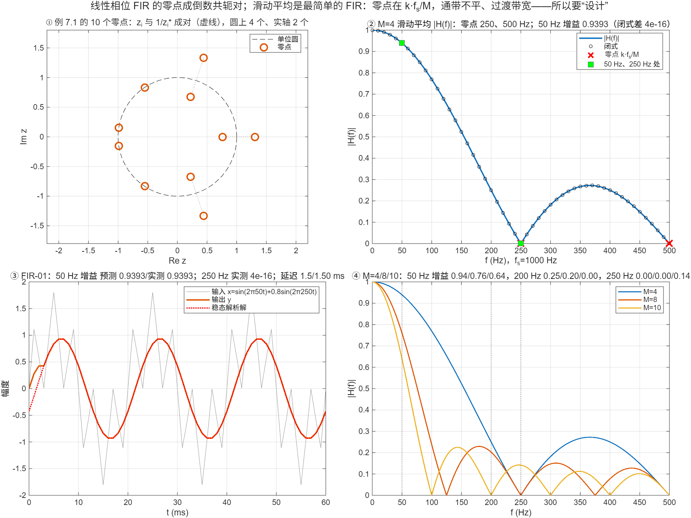

::: {.page-meta}
[教材书内 229—230 页 · PDF 237—238 页 + FIR-01 实验]{} [7.1.2 零点特性；实验：M=4 滑动平均，fs=1 kHz]{} [1 课时]{}
:::

::: {.keypoints}
[本页要点]{.kp-title}

- h 对称 ⇒ H(z)=z^{−(N−1)}H(z⁻¹)；反对称 ⇒ H(z)=−z^{−(N−1)}H(z⁻¹)（式 (7.1.22)—(7.1.24)）。z_i 是零点则 1/z_i 也是；系数实又要求 z_i* 是零点。于是零点四个一组：z_i、1/z_i、z_i*、1/z_i*；圆上的共轭成对，实轴上的倒数成对，±1 单独。
- M 点滑动平均 h(n)=1/M（0≤n≤M−1）是最简单的线性相位 FIR：H(e^{jω})=(1/M)·sin(Mω/2)/sin(ω/2)·e^{−j(M−1)ω/2}，零点在 ω=2πk/M（f=k·fs/M），群延迟 (M−1)/2 个样本。
- FIR-01：fs=1000 Hz，x=sin(2π·50t)+0.8sin(2π·250t)，M=4：预测 50 Hz 增益 0.9393、250 Hz 增益 0、延迟 1.5 ms；仿真逐一吻合。
- 滑动平均通带不平（50 Hz 已掉 6%）、过渡带宽、阻带不稳，只能靠零点“碰巧”压掉干扰——这是要学 7.3—7.5 的理由。
:::

## [①]{.col-badge} 问题从哪来：滑动平均比“数字滤波器”老得多 {#sec-1}

统计学家早就在用滑动平均平滑数据。1937 年 Slutzky 在《Econometrica》发表《随机原因的累加作为周期过程的来源》：对纯随机序列反复做滑动平均，会生成看起来很像商业周期的振荡——换句话说，滑动平均是一个带通结构的滤波器，它的零点与旁瓣决定了“制造”出什么周期。1940 年 Kallmann 的横截滤波器把抽头延迟线加权求和用于模拟信号，滑动平均是所有权重相等的特例。教材 7.1.2 讲的零点四个一组，在滑动平均上一眼看清：M 个零点均布在单位圆上（除去 z=1），全部满足倒数共轭对称。

课堂落点：**滑动平均是学生最容易“看见”的 FIR：零点在 fs/M 的整数倍，这正是 FIR-01 实验里 250 Hz 干扰被完全消掉的原因。** 但它没有可调的通带、过渡带、阻带——所以要设计。

::: {.classroom-media-grid}



:::

::: {.media-note}
外部素材需要联网；核对日期、资料性质和未知字段见各卡。
:::

::: {.sources}
- E. Slutzky, "The summation of random causes as the source of cyclic processes," *Econometrica* 5(2) (1937) 105–146. [doi:10.2307/1907241](https://doi.org/10.2307/1907241)
- H. E. Kallmann, "Transversal filters," *Proc. IRE* 28(7) (1940) 302–310. [doi:10.1109/JRPROC.1940.229346](https://doi.org/10.1109/JRPROC.1940.229346)
:::

## [②]{.col-badge} 理论与推导 {#sec-2}

### 7.1.2 零点四个一组 {#sec-2-1}

h(n)=h(N−1−n) 代入 H(z)=Σh(n)z⁻ⁿ，换元 m=N−1−n：

$$
H(z)=\sum_m h(m)z^{-(N-1-m)}=z^{-(N-1)}\sum_m h(m)(z^{-1})^{-m}=z^{-(N-1)}H(z^{-1}).
$$

所以 H(z_i)=0 ⇒ H(1/z_i)=0。h 实 ⇒ H(z_i*)=0。四种情形（教材图 7.1.7）：(1) 既不在圆上也不在实轴：z_i、1/z_i、z_i*、1/z_i* 四个一组；(2) 在圆上：z_i 与 z_i*（1/z_i=z_i*）；(3) 在实轴：z_i 与 1/z_i；(4) z=±1 单独。例 7.1 的 10 个零点：4 个在圆上（两对共轭）、2 个在实轴（1.3102 与 0.7632 互为倒数）、4 个成一组（模 1.4071 与 0.7107）。演示①核验每个零点的 1/z* 都在零点集合里。

### 滑动平均 {#sec-2-2}

$$
H(e^{j\omega})=\frac1M\sum_{n=0}^{M-1}e^{-j\omega n}=\frac1M\cdot\frac{1-e^{-j\omega M}}{1-e^{-j\omega}}=\frac1M\cdot\frac{\sin(M\omega/2)}{\sin(\omega/2)}e^{-j\frac{M-1}2\omega}.
$$

零点：sin(Mω/2)=0 且 ω≠0 ⇒ ω=2πk/M，即 f=k·fs/M，k=1,…,⌊M/2⌋；z 平面上是 e^{j2πk/M}（M=4：j、−1、−j）。相位线性，群延迟 (M−1)/2 个样本 = (M−1)/(2fs) 秒。ω=0 处增益 1，第一旁瓣峰约 −13 dB（与矩形窗谱同形，见 7.3）。

### FIR-01 的预测表 {#sec-2-3}

fs=1000 Hz，M=4，输入 sin(2π·50t)+0.8sin(2π·250t)：

| 量 | 公式 | 预测 |
|---|---|---|
| 50 Hz 增益 | \|sin(4·0.05π)/(4 sin 0.05π)\| | 0.9393 |
| 250 Hz 增益 | 250=fs/4 是零点 | 0 |
| 延迟 | (M−1)/2/fs | 1.5 ms |
| 稳态输出 | 0.9393 sin(2π·50(t−1.5 ms)) | 干扰消失 |

改 M=8：零点 125、250、375、500 Hz，250 Hz 仍消，但 50 Hz 掉到 0.760；改 M=10：零点 100、200、…、500 Hz，200 Hz 干扰能消而 250 Hz 不能（剩 0.141）。演示④把三条曲线画在一起。

::: {.callout-note .ask appearance="simple"}
**教师提问：** 干扰改成 200 Hz、仍用 M=4 会怎样？（200 Hz 不是零点，增益 0.25，只压到四分之一。要消 200 Hz 得让 fs/M 整除 200：M=5 或 10。）
:::

## [③]{.col-badge} 仿真演示 {#sec-3}

::: {.ide-links data-matlab="demo_fir_zeros_moving_average.m" data-python="python/7.2-fir-zeros-moving-average.py"}
:::

脚本 [demo_fir_zeros_moving_average.m](code/demo_fir_zeros_moving_average.m) [已运行]{.status .ok}。核验记录 [verification-fir-zeros-moving-average.json](code/results/verification-fir-zeros-moving-average.json)。FIR-01 的完整实验包（学生任务单、预测表、随堂测验、Python/MATLAB/Syslab/Sysplorer 四平台脚本）在 [lab-fir01/](lab-fir01/index.md)：学生先填预测再运行 `python run_lab.py`，`--taps 8`、`--f2 200` 做探索，`--compare` 做跨平台核对。

:::: {.example}
::: {.example-title}
例 7.1 的零点、M=4 滑动平均的 |H(f)|、FIR-01 预测与仿真、M=4/8/10 探索
:::
::: {.example-body}
**运行前问学生：** 先填预测表（50 Hz 增益、250 Hz 增益、延迟），再运行。零点 250 Hz 是怎么来的？M 改成 8 后 50 Hz 会怎样？

{width=100%}

| 能数出来的数 | 值 |
|---|---|
| 例 7.1 零点模 | 1.4071×2、1.3102、1×4、0.7632、0.7107×2；倒数配对差 3×10⁻¹⁵ |
| M=4 闭式与 DTFT 差 | 3.5×10⁻¹⁶；零点 z=−1、±j |
| FIR-01 50 Hz 增益：预测 / 实测 | 0.9393 / 0.9393 |
| FIR-01 250 Hz 增益：预测 / 实测 | 0 / 4×10⁻¹⁶ |
| FIR-01 延迟：预测 / 实测 | 1.5 / 1.50 ms；稳态波形差 10⁻¹³ |
| M=4/8/10 在 50、200、250 Hz 的增益 | 0.939/0.760/0.639；0.250/0.202/0；0/0/0.141 |

::: {.panel-tabset}
#### MATLAB [已运行]{.status .ok}

```matlab
h = [-3 1 -1 -2 5 6 5 -2 -1 1 -3]; z = roots(h);
max(arrayfun(@(q) min(abs(z - 1/conj(q))), z))          % ~1e-15：每个零点的 1/z* 也是零点
fs = 1000; M = 4; hM = ones(1, M)/M;
t = (0:2000)/fs; x = sin(2*pi*50*t) + 0.8*sin(2*pi*250*t);
y = filter(hM, 1, x);
H50 = polyval(fliplr(hM), exp(-1i*2*pi*50/fs)); abs(H50)  % 0.9393 预测
ts = t(200:end); A = [cos(2*pi*50*ts); sin(2*pi*50*ts)].'; c = A\y(200:end).';
hypot(c(1), c(2))                                        % 0.9393 实测
-atan2(c(1), c(2))/(2*pi*50)*1e3                         % 1.5 ms
```

#### Python [已运行]{.status .ok}

```python
import numpy as np
from scipy import signal
fs, M = 1000, 4; hM = np.ones(M)/M; t = np.arange(2001)/fs
x = np.sin(2*np.pi*50*t) + 0.8*np.sin(2*np.pi*250*t); y = signal.lfilter(hM, [1], x)
print(abs(np.polyval(hM[::-1], np.exp(-2j*np.pi*50/fs))))          # 0.9393
ts = t[199:]; A = np.column_stack([np.cos(2*np.pi*50*ts), np.sin(2*np.pi*50*ts)])
c = np.linalg.lstsq(A, y[199:], rcond=None)[0]; print(np.hypot(*c), -np.arctan2(c[0], c[1])/(2*np.pi*50)*1e3)   # 0.9393, 1.5 ms
```
:::
:::
::::

## [④]{.col-badge} 检查与思考 {#sec-4}

::: {.quiz data-type="number" data-answer="0.9393" data-tol="0.001"}
::: {.q-text}
1. fs=1000 Hz 的 4 点滑动平均，对 50 Hz 正弦的增益是多少？
:::
::: {.q-explain}
|sin(4·0.05π)/(4 sin 0.05π)|=0.5878/0.6257=0.9393。
:::
:::

::: {.quiz data-type="choice" data-answer="C"}
::: {.q-text}
2. 线性相位 FIR 有一个零点 z=0.5e^{jπ/3}，则下列哪个也必是零点？
:::
::: {.q-opts}
[−0.5e^{jπ/3}]{data-opt="A"}
[0.5e^{−jπ/3} 但 2e^{jπ/3} 不是]{data-opt="B"}
[2e^{−jπ/3}]{data-opt="C"}
[0.5]{data-opt="D"}
:::
::: {.q-explain}
1/z*=2e^{jπ/3} 与 z*=0.5e^{−jπ/3} 都是零点，1/z=2e^{−jπ/3} 也是。
:::
:::

::: {.quiz data-type="number" data-answer="5" data-tol="0"}
::: {.q-text}
3. fs=1000 Hz，要用最短的滑动平均完全消除 200 Hz 干扰，M 取多少？
:::
::: {.q-explain}
零点在 k·fs/M：M=5 时零点 200、400 Hz。
:::
:::

**短答题**

4. 证明 h(n)=h(N−1−n) ⇒ H(z)=z^{−(N−1)}H(z⁻¹)，并说明为什么零点必成倒数对。
5. FIR-01 里 M=4 的滑动平均对 50 Hz 已经衰减 6%，若要求通带 0—60 Hz 起伏 <0.1 dB、250 Hz 附近衰减 >40 dB，滑动平均能做到吗？为什么？

::: {.callout-tip collapse="true" appearance="simple"}
## 教师参考要点
4. 换元 m=N−1−n；H(z_i)=0 ⇒ H(1/z_i)=z_i^{N−1}H(z_i)=0。
5. 不能：滑动平均没有独立可调的通带宽度与阻带深度，只有 M 一个参数；通带平坦度和阻带衰减互相牵制。要用 7.3—7.5 的设计方法。
:::



::: {.see-also}
[另请参阅]{.sa-title}

::: {.sa-row}
[先修]{.sa-label} [7.1 线性相位四型](7.1-linear-phase.qmd) · [1.3 数字滤波的优点](../ch1/1.3-advantages.qmd)
:::
::: {.sa-row}
[后继]{.sa-label} [7.3 窗函数法](7.3-window-method.qmd)
:::
:::
