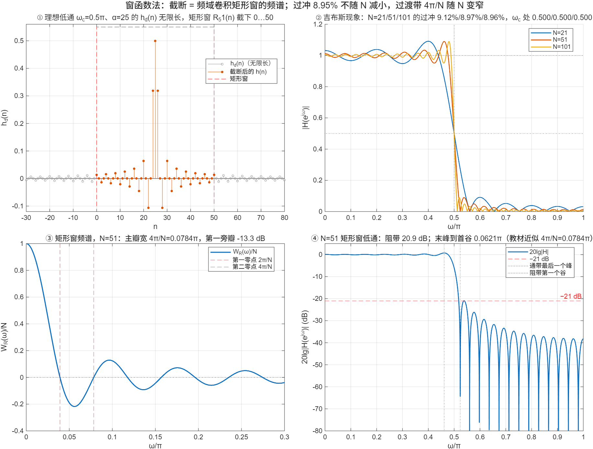

::: {.page-meta}
[教材书内 230—236 页 · PDF 238—244 页]{} [7.2.1 设计思想，7.2.2 加窗对幅度特性的影响，例 7.5—7.7]{} [1 课时]{}
:::

::: {.keypoints}
[本页要点]{.kp-title}

- 目标响应 Hd(e^{jω}) 反变换得 hd(n)，一般无限长、非因果。做法：截成 N 点并延迟 α=(N−1)/2 使之因果——h(n)=hd(n)R_N(n)（式 (7.2.5)）。带线性相位的理想低通：hd(n)=sin[ωc(n−α)]/[π(n−α)]（式 (7.2.4)），关于 α 对称，是 1 型或 2 型线性相位。
- 时域相乘 = 频域卷积：H(ω)=(1/2π)∫Hd(θ)W_R(ω−θ)dθ（式 (7.2.9)），W_R(ω)=sin(Nω/2)/sin(ω/2)，主瓣宽 4π/N，第一旁瓣 −13 dB。
- 三个后果：过渡带宽约等于主瓣宽 4π/N；通带、阻带各有一串起伏，最大峰在 ωc±2π/N 附近；过冲 8.95% 不随 N 减小（吉布斯效应），阻带最小衰减只有 −21 dB。
- N 加大只让过渡带变窄、起伏变密，压不下旁瓣；要压旁瓣得换窗（7.4）。
:::

## [①]{.col-badge} 问题从哪来：1899 年 Gibbs 的一封信 {#sec-1}

把方波展成傅里叶级数只取有限项，跳变处总有约 9% 的过冲，项数再多也不消失。1899 年 Gibbs 在《Nature》上的一封短信澄清了这个现象（Wilbraham 1848 年已发现，但被遗忘），后来叫吉布斯现象。窗函数法设计 FIR 恰好落在同一件事上：理想低通的 hd(n) 是 sin x/x，截断就是把它的傅里叶级数截断，通带边缘的 8.95% 过冲和 −21 dB 阻带就是吉布斯现象的另一副面孔。教材 7.2.2 用卷积把它解释清楚：矩形窗的频谱有旁瓣，卷积时旁瓣在 ωc 两侧各留下一串起伏。

课堂落点：**截断不是“近似”那么简单，它把一个固定形状的旁瓣结构烙在响应上；这个形状由窗决定，不由 N 决定。**

::: {.classroom-media-grid}





:::

::: {.media-note}
外部素材需要联网；核对日期、资料性质和未知字段见各卡。
:::

::: {.sources}
- J. W. Gibbs, "Fourier's series," *Nature* 59 (1899) 606. [doi:10.1038/059606a0](https://doi.org/10.1038/059606a0)
- C. M. Rader, B. Gold, "Digital filter design techniques in the frequency domain," *Proc. IEEE* 55(2) (1967) 149–171. [doi:10.1109/PROC.1967.5434](https://doi.org/10.1109/PROC.1967.5434)
:::

## [②]{.col-badge} 理论与推导 {#sec-2}

### 7.2.1 理想低通的 hd(n) 与截断 {#sec-2-1}

先给理想低通配一个线性相位 e^{−jαω}：

$$
H_d(e^{j\omega})=\begin{cases}e^{-j\alpha\omega},&|\omega|\le\omega_c\\0,&\omega_c<|\omega|\le\pi\end{cases}
\;\Rightarrow\;
h_d(n)=\frac1{2\pi}\int_{-\omega_c}^{\omega_c}e^{j\omega(n-\alpha)}d\omega=\frac{\sin[\omega_c(n-\alpha)]}{\pi(n-\alpha)}.
$$

它关于 n=α 对称，两头无限延伸。取 α=(N−1)/2，保留 0≤n≤N−1：h(n)=hd(n)R_N(n)，对称性保持，得到线性相位 FIR。例 7.5/7.6：N=51、ωc=0.5π、α=25，h(25)=0.5，h(24)=h(26)=1/π=0.3183。演示①画出无限长的 hd 和被截下的 51 点。

### 7.2.2 加窗的影响：频域卷积 {#sec-2-2}

h(n)=hd(n)w(n) ⇒ H(e^{jω})=(1/2π)Hd(e^{jω})⊛W(e^{jω})。矩形窗：

$$
W_R(e^{j\omega})=\sum_{n=0}^{N-1}e^{-j\omega n}=\frac{\sin(N\omega/2)}{\sin(\omega/2)}e^{-j\alpha\omega}=W_R(\omega)e^{-j\alpha\omega}.
$$

线性相位因子提出来后，剩下实函数的卷积 H(ω)=(1/2π)∫_{−ωc}^{ωc}W_R(ω−θ)dθ（式 (7.2.9)）：H(ω) 等于 W_R 在长为 2ωc 的窗口里的积分。W_R(ω) 主瓣宽 4π/N（零点在 ±2π/N），第一旁瓣 −13 dB（演示③）。沿 ω 移动这个积分窗口（教材图 7.2.2）：

- ω=0：主瓣和许多旁瓣都在窗口内，H(0)≈1；
- ω=ωc：主瓣正好一半在窗口内，H(ωc)=0.5H(0)；
- ω=ωc−2π/N：主瓣全在内、最大的负旁瓣刚出去，H 取最大值（通带过冲）；
- ω=ωc+2π/N：主瓣全出去、最大的负旁瓣在内，H 取最小值（阻带负峰）；
- 继续移动，旁瓣一个个进出，形成通带和阻带的起伏。

### 三条结论 {#sec-2-3}

1. 过渡带宽度约等于主瓣宽 4π/N（演示④量得峰谷间距 0.062π，教材取 4π/N=0.078π 作近似），N 越大越窄。
2. 起伏的大小由旁瓣面积决定，与 N 无关：N 加大只是把 W_R(ω) 横向压缩，sin x/x 的形状不变，积分 ∫sin x/x 的过冲比例不变——8.95%。这就是吉布斯效应。演示②：N=21、51、101 的过冲 9.1%、9.0%、9.0%。
3. 阻带最小衰减 20lg(0.0895)≈−21 dB，对多数应用不够。

::: {.callout-note .ask appearance="simple"}
**教师提问：** 既然 N 压不下旁瓣，还有什么办法？（换一个旁瓣更低的窗——代价是主瓣更宽，过渡带更宽；7.4 列表比较。）
:::

## [③]{.col-badge} 仿真演示 {#sec-3}

::: {.ide-links data-matlab="demo_window_method.m" data-python="python/7.3-window-method.py"}
:::

脚本 [demo_window_method.m](code/demo_window_method.m) [已运行]{.status .ok}。核验记录 [verification-window-method.json](code/results/verification-window-method.json)。

:::: {.example}
::: {.example-title}
截断、吉布斯过冲随 N 不变、矩形窗频谱、−21 dB 与过渡带
:::
::: {.example-body}
**运行前问学生：** N 从 21 加到 101，过冲会从 9% 降到多少？ωc 处的 |H| 是多少？阻带最小衰减多少 dB？

{width=100%}

| 能数出来的数 | 值 |
|---|---|
| h(24)、h(25)、h(26)（N=51，ωc=0.5π） | 0.3183、0.5、0.3183 |
| 过冲，N=21 / 51 / 101 | 9.12% / 8.97% / 8.96% |
| ωc 处 \|H\| | 0.500（三个 N 都是） |
| 矩形窗：第一旁瓣 / 主瓣宽 | −13.3 dB / 4π/N=0.0784π |
| N=51 低通：阻带最小衰减 / 通带末峰到阻带首谷 | 20.9 dB / 0.0621π（≈3.2π/N） |

::: {.panel-tabset}
#### MATLAB [已运行]{.status .ok}

```matlab
wc = 0.5*pi; N = 51; a = (N-1)/2; n = 0:N-1;
hd = sin(wc*(n - a))./(pi*(n - a)); hd(n == a) = wc/pi;          % 理想低通截 N 点（式 (7.2.4)(7.2.5)）
w = linspace(0, pi, 8192); H = abs(polyval(fliplr(hd), exp(-1i*w)));
[max(H(w < wc)) - 1, interp1(w, H, wc)]                          % 过冲 0.0897，ωc 处 0.500
WR = sin(N*w/2)./sin(w/2); WR(1) = N;                              % 矩形窗频谱
20*log10(max(abs(WR(w > 2*pi/N)))/N)                               % 第一旁瓣 −13.3 dB
```

#### Python [已运行]{.status .ok}

```python
import numpy as np
wc, N = 0.5*np.pi, 51; a = (N-1)/2; n = np.arange(N)
hd = np.where(n == a, wc/np.pi, np.sin(wc*(n - a))/(np.pi*(n - a) + (n == a)))
w = np.linspace(0, np.pi, 8192); H = np.abs(np.polyval(hd[::-1], np.exp(-1j*w)))
print(H[w < wc].max() - 1, np.interp(wc, w, H))                     # 0.0897, 0.500
```
:::
:::
::::

## [④]{.col-badge} 检查与思考 {#sec-4}

::: {.quiz data-type="number" data-answer="0.5" data-tol="0.01"}
::: {.q-text}
1. 矩形窗截断的理想低通，在 ω=ωc 处 \|H(e^{jω})\|/H(0) 等于多少？
:::
::: {.q-explain}
主瓣一半在积分窗口内，0.5。
:::
:::

::: {.quiz data-type="choice" data-answer="C"}
::: {.q-text}
2. 把矩形窗的 N 从 51 增加到 501，通带的最大过冲
:::
::: {.q-opts}
[减小到原来的 1/10]{data-opt="A"}
[减小到原来的 1/√10]{data-opt="B"}
[基本不变，仍约 8.95%]{data-opt="C"}
[增大]{data-opt="D"}
:::
::: {.q-explain}
吉布斯效应：过冲由 sin x/x 的积分决定，与 N 无关；N 只影响过渡带宽度。
:::
:::

::: {.quiz data-type="number" data-answer="0.08" data-tol="0.005"}
::: {.q-text}
3. N=50 的矩形窗，主瓣宽度 4π/N 是多少 π？
:::
::: {.q-explain}
4/50=0.08π。
:::
:::

**短答题**

4. 从 Hd(e^{jω})=e^{−jαω}（|ω|≤ωc）推出 hd(n)=sin[ωc(n−α)]/[π(n−α)]，并求 hd(α)。
5. 用卷积 H(ω)=(1/2π)∫_{−ωc}^{ωc}W_R(ω−θ)dθ 解释：为什么通带最大峰出现在 ωc−2π/N 附近，阻带最大负峰出现在 ωc+2π/N 附近？

::: {.callout-tip collapse="true" appearance="simple"}
## 教师参考要点
4. 反变换积分 e^{jω(n−α)} 从 −ωc 到 ωc；n=α 时被积函数为 1，hd(α)=ωc/π。
5. 积分窗口右边缘在 ω−(−ωc)…：当主瓣完全进入且第一负旁瓣刚离开窗口时积分最大，对应主瓣边缘 2π/N 对齐窗口边缘。
:::



::: {.see-also}
[另请参阅]{.sa-title}

::: {.sa-row}
[先修]{.sa-label} [3.7 窗函数与频谱泄漏](../ch3/3.7-windows.qmd) · [7.1 线性相位](7.1-linear-phase.qmd)
:::
::: {.sa-row}
[后继]{.sa-label} [7.4 典型窗与设计步骤](7.4-windows-design.qmd)
:::
:::
