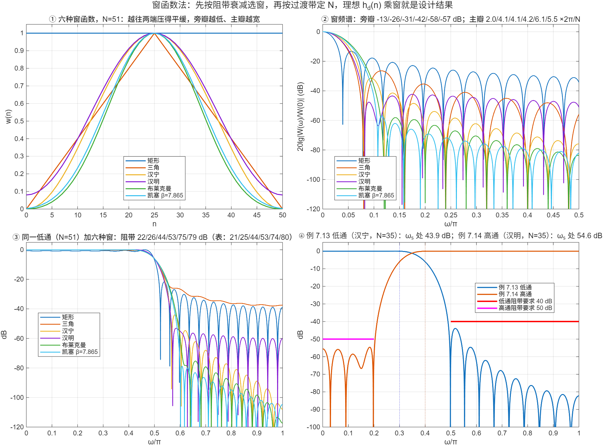

::: {.page-meta}
[教材书内 236—255 页 · PDF 244—263 页]{} [7.2.3 典型窗函数（表 7.2.1、7.2.2），7.2.4 设计步骤，例 7.8—7.16]{} [2 课时]{}
:::

::: {.keypoints}
[本页要点]{.kp-title}

- 窗的两个指标互相牵制：旁瓣峰值（决定阻带衰减）和主瓣宽度（决定过渡带）。矩形 −13 dB/4π/N，三角 −25/8π/N，汉宁 −31/8π/N，汉明 −41/8π/N，布莱克曼 −57/12π/N；凯塞窗用 β 连续调节（表 7.2.1）。
- 加窗后低通的阻带最小衰减（表 7.2.2）：矩形 21、三角 25、汉宁 44、汉明 53、布莱克曼 74、凯塞（β=7.865）80 dB。
- 设计步骤：① 给 Hd(e^{jω})（含线性相位）；② 求 hd(n)；③ 按阻带衰减选窗、按过渡带 Δω 定 N（汉宁/汉明 N≈6.6π/Δω，布莱克曼 11π/Δω），取奇数；④ h(n)=hd(n)w(n)。
- 高通、带通、带阻的 hd(n) 由低通组合：高通 = δ(n−α) − 低通；带通 = 两个低通相减；带阻 = 全通 − 带通。
:::

## [①]{.col-badge} 问题从哪来：从谱估计借来的窗 {#sec-1}

1958 年 Blackman 与 Tukey 在《Bell System Technical Journal》上系统讨论了功率谱测量中的“窗”，汉宁、汉明、布莱克曼这些名字从那里进入工程词汇（第 3 章 3.7 讲过）。1966 年 Kaiser 用零阶修正贝塞尔函数造出一族可调的窗，后来叫凯塞窗，一个参数 β 在“旁瓣低”与“主瓣窄”之间连续折中，1980 年 Kaiser 与 Schafer 在《IEEE Trans. ASSP》上总结了它的性质和经验公式。1978 年 Harris 的综述把几十种窗的旁瓣、主瓣、泄漏一并列表。FIR 设计里的窗和谱估计里的窗是同一批函数，选窗的逻辑也一样：先问能容忍多大的泄漏（阻带），再问分辨率（过渡带）要多细。

::: {.classroom-media-grid}





:::

::: {.media-note}
外部素材需要联网；核对日期、资料性质和未知字段见各卡。
:::

::: {.sources}
- R. B. Blackman, J. W. Tukey, "The measurement of power spectra from the point of view of communications engineering," *Bell Syst. Tech. J.* 37(1) (1958) 185–282. [doi:10.1002/j.1538-7305.1958.tb03874.x](https://doi.org/10.1002/j.1538-7305.1958.tb03874.x)
- J. F. Kaiser, R. W. Schafer, "On the use of the I₀-sinh window for spectrum analysis," *IEEE Trans. ASSP* 28(1) (1980) 105–107. [doi:10.1109/TASSP.1980.1163349](https://doi.org/10.1109/TASSP.1980.1163349)
- F. J. Harris, "On the use of windows for harmonic analysis with the discrete Fourier transform," *Proc. IEEE* 66(1) (1978) 51–83. [doi:10.1109/PROC.1978.10837](https://doi.org/10.1109/PROC.1978.10837)
:::

## [②]{.col-badge} 理论与推导 {#sec-2}

### 7.2.3 六种窗 {#sec-2-1}

n=0…N−1，M=N−1：

| 窗 | w(n) | 旁瓣峰值 | 主瓣宽 | 加窗低通阻带衰减 |
|---|---|---|---|---|
| 矩形 | 1 | −13 dB | 4π/N | 21 dB |
| 三角（巴特利特） | 1−\|2n−M\|/M | −25 dB | 8π/N | 25 dB |
| 汉宁 | 0.5−0.5cos(2πn/M) | −31 dB | 8π/N | 44 dB |
| 汉明 | 0.54−0.46cos(2πn/M) | −41 dB | 8π/N | 53 dB |
| 布莱克曼 | 0.42−0.5cos(2πn/M)+0.08cos(4πn/M) | −57 dB | 12π/N | 74 dB |
| 凯塞 | I₀(β√(1−(2n/M−1)²))/I₀(β) | 随 β | 随 β | β=7.865 时 80 dB |

“旁瓣峰值”是窗本身频谱的最高旁瓣，“阻带衰减”是用它截断理想低通后的结果，两者不同（卷积把旁瓣积分了）。汉宁、汉明只差两个系数：0.54/0.46 是让第一旁瓣与主瓣边缘相消的最优值，旁瓣从 −31 降到 −41 dB，但远处旁瓣下降变慢。演示①②画出六种窗和它们的频谱，实测旁瓣 −13/−26/−31/−42/−58 dB。

凯塞窗（式 (7.2.10)）：β 由所需阻带衰减 As 决定，教材表 7.2.1 列了 β 与过渡带、衰减的对应；β=0 退化为矩形窗，β 越大越像高斯。

### 7.2.4 设计步骤 {#sec-2-2}

1. 写出理想响应 Hd(e^{jω})，带线性相位 e^{−jαω}，α=(N−1)/2。
2. 反变换得 hd(n)。低通 sin[ωc(n−α)]/[π(n−α)]；高通 δ(n−α)−低通；带通 低通(ω₂)−低通(ω₁)；带阻 δ(n−α)−带通。截止频率取通带、阻带边界的中点 ωc=(ωp+ωs)/2。
3. 选窗、定 N：阻带衰减 As 查表选最省的窗；过渡带 Δω=|ωs−ωp| 定 N：汉宁、汉明 N=⌈6.6π/Δω⌉+1，布莱克曼 ⌈11π/Δω⌉+1（教材代码的取法），取奇数保证 1 型可做任何类型。
4. h(n)=hd(n)w(n)，画 20lg|H(e^{jω})| 核对。

### 四个例子 {#sec-2-3}

| 例 | 类型 | 指标 | 窗 / N | 实测 |
|---|---|---|---|---|
| 7.13 | 低通 | ωp=0.3π，ωs=0.5π，As=40 dB | 汉宁 / 35 | 阻带 43.9 dB，通带起伏 0.07 dB |
| 7.14 | 高通 | ωp=0.4π，ωs=0.2π，As=50 dB | 汉明 / 35 | 54.6 dB，0.03 dB |
| 7.15 | 带通 | fs=20 kHz，通 3—5 kHz，阻 ≤2、≥6 kHz，55 dB | 布莱克曼 / 111 | 73.6 dB，0.003 dB |
| 7.16 | 带阻 | fs=250 Hz，通 ≤15、≥80 Hz，阻 40—60 Hz，50 dB | 汉明 / 43 | **47.5 dB，不达标** |

例 7.16 的阻带只有 20 Hz 宽（0.16π），汉明窗主瓣 8π/43=0.186π 比阻带还宽，两侧过渡带在阻带中间叠加，深度不够。把 N 加到 45 得 52.5 dB。教训：带阻、带通的窄带一侧要用最窄的过渡带定 N，并留余量核对。

::: {.callout-note .ask appearance="simple"}
**教师提问：** 例 7.13 要求 40 dB，汉宁给 44 dB；用汉明（53 dB）行不行？（行，但同样过渡带下 N 相同，多出的衰减是白送的；反过来阻带要求 50 dB 时汉宁就不够。）
:::

## [③]{.col-badge} 仿真演示 {#sec-3}

::: {.ide-links data-matlab="demo_windows_design.m" data-python="python/7.4-windows-design.py"}
:::

<div class="video-box">
<p class="media-pending">课堂动画正在整理上线；请先查看下方静态图和实验代码。</p>
</div>

::: {.media-note}
由 [make_windows_design_video.m](code/make_windows_design_video.m) 生成；[动画核验记录](code/results/verification-video-windows-design.json)。先让学生预测“换成布莱克曼窗，过渡带会变宽还是变窄”，再播；播到第③段“47.5 dB”变红时暂停一次问“公式为什么会估不准”。变形中的窗是插值过渡，指标实时计算；过渡带宽不保证逐窗单调。点击加载后再按播放键。
:::


脚本 [demo_windows_design.m](code/demo_windows_design.m) [已运行]{.status .ok}，六种窗与四种滤波器的 hd(n) 全部自写。核验记录 [verification-windows-design.json](code/results/verification-windows-design.json)。

:::: {.example}
::: {.example-title}
六种窗、表 7.2.2 复现、例 7.13—7.16
:::
::: {.example-body}
**运行前问学生：** 汉明与汉宁只差两个系数，谁的旁瓣低？同一个 N=51 低通换六种窗，阻带各多少 dB？例 7.16 按教材参数能达到 50 dB 吗？

{width=100%}

| 能数出来的数 | 矩形 / 三角 / 汉宁 / 汉明 / 布莱克曼 / 凯塞 |
|---|---|
| 窗频谱最高旁瓣 | −13.3 / −26.4 / −31.5 / −42.3 / −58.1 / −57.1 dB |
| 主瓣宽（×2π/N） | 2.0 / 4.1 / 4.1 / 4.2 / 6.1 / 5.5 |
| 加窗低通阻带衰减（表 7.2.2） | 21.7 (21) / 26.1 (25) / 44.0 (44) / 53.1 (53) / 75.4 (74) / 78.8 (80) dB |
| 过渡带 1−δ→δ（×π） | 0.036 / 0.139 / 0.125 / 0.135 / 0.224 / 0.200 |

::: {.panel-tabset}
#### MATLAB [已运行]{.status .ok}

```matlab
% 例 7.13：ωp=0.3π，ωs=0.5π，As=40 dB → 汉宁窗
wp = 0.3*pi; ws = 0.5*pi; N = ceil(6.6*pi/(ws - wp)) + 1; if mod(N, 2) == 0, N = N + 1; end   % 35
a = (N-1)/2; n = 0:N-1; wc = (wp + ws)/2;
hd = sin(wc*(n - a))./(pi*(n - a)); hd(n == a) = wc/pi;
wn = 0.5 - 0.5*cos(2*pi*n/(N-1)); h = hd.*wn;                          % h(n)=hd(n)w(n)
w = linspace(0, pi, 8192); H = abs(polyval(fliplr(h), exp(-1i*w)));
-20*log10(max(H(w >= ws)))                                             % 43.9 dB ≥ 40
% 工具箱一行版：h = fir1(N-1, wc/pi, hann(N));
```

#### Python [已运行]{.status .ok}

```python
import numpy as np
from scipy import signal
wp, ws = 0.3*np.pi, 0.5*np.pi; N = int(np.ceil(6.6*np.pi/(ws - wp))) + 1; N += N % 2 == 0    # 35
a = (N-1)/2; n = np.arange(N); wc = (wp + ws)/2
hd = np.where(n == a, wc/np.pi, np.sin(wc*(n - a))/(np.pi*(n - a) + (n == a)))
h = hd*signal.windows.hann(N); w, H = signal.freqz(h, worN=8192)
print(N, -20*np.log10(np.abs(H[w >= ws]).max()))                       # 35, 43.9
```
:::
:::
::::

## [④]{.col-badge} 检查与思考 {#sec-4}

::: {.quiz data-type="choice" data-answer="C"}
::: {.q-text}
1. 阻带衰减要求 45 dB，过渡带要尽量窄，应选
:::
::: {.q-opts}
[矩形窗]{data-opt="A"}
[汉宁窗（44 dB）]{data-opt="B"}
[汉明窗（53 dB）]{data-opt="C"}
[布莱克曼窗（74 dB）]{data-opt="D"}
:::
::: {.q-explain}
汉宁差 1 dB 不够；布莱克曼主瓣 12π/N 比汉明 8π/N 宽，同样过渡带要更大的 N。
:::
:::

::: {.quiz data-type="number" data-answer="67" data-tol="0"}
::: {.q-text}
2. 用汉明窗设计低通，Δω=0.1π，按 N=⌈6.6π/Δω⌉+1 取奇数，N=？
:::
::: {.q-explain}
⌈66⌉+1=67，已是奇数。
:::
:::

::: {.quiz data-type="choice" data-answer="B"}
::: {.q-text}
3. 高通滤波器的理想单位脉冲响应可以写成
:::
::: {.q-opts}
[低通的 hd(n) 取负]{data-opt="A"}
[δ(n−α) 减去截止频率相同的低通 hd(n)]{data-opt="B"}
[低通 hd(n) 乘 (−1)ⁿ 再加 1]{data-opt="C"}
[两个低通相加]{data-opt="D"}
:::
::: {.q-explain}
全通 − 低通 = 高通；(−1)ⁿ 调制也可以但要求 α 整数且截止频率变为 π−ωc。
:::
:::

**短答题**

4. 写出带阻滤波器（阻带 ω₁—ω₂）带线性相位的 hd(n)，并说明 n=α 处的值。
5. 例 7.16 按教材参数只有 47.5 dB。分析原因，并给出两种改进办法。

::: {.callout-tip collapse="true" appearance="simple"}
## 教师参考要点
4. hd(n)=δ(n−α)−[sin ω₂(n−α)−sin ω₁(n−α)]/[π(n−α)]，hd(α)=1−(ω₂−ω₁)/π。
5. 阻带宽 0.16π 小于汉明主瓣宽 8π/43=0.186π，两侧过渡区在阻带内重叠，谷底不够深。办法：N 加到 45（52.5 dB）；或改布莱克曼/凯塞并相应加大 N。
:::



::: {.see-also}
[另请参阅]{.sa-title}

::: {.sa-row}
[先修]{.sa-label} [7.3 窗函数法思想](7.3-window-method.qmd) · [3.7 窗函数](../ch3/3.7-windows.qmd)
:::
::: {.sa-row}
[后继]{.sa-label} [7.5 频率采样法](7.5-frequency-sampling-design.qmd)
:::
:::
