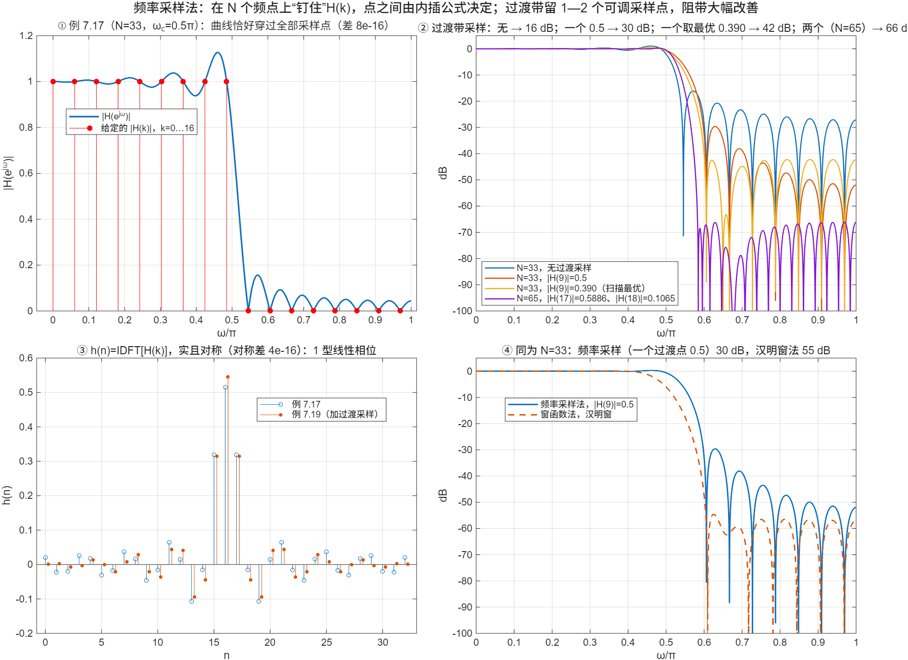

::: {.page-meta}
[教材书内 255—271 页 · PDF 263—279 页]{} [7.3.1 设计思想，7.3.2 线性相位约束，7.3.3 逼近误差与过渡带采样，7.3.4 设计步骤，例 7.17—7.20]{} [1 课时]{}
:::

::: {.keypoints}
[本页要点]{.kp-title}

- 思想：令 H(k)=Hd(e^{j2πk/N})，k=0…N−1，h(n)=IDFT[H(k)]；采样点上 H(e^{jω}) 与 Hd 完全相同，点之间由内插公式（式 (7.3.3)(7.3.4)，即第 3 章式 (3.5.9)）决定，有起伏。
- 线性相位约束（1 型，N 奇）：|H(k)|=|H(N−k)|，θ(k)=−πk(N−1)/N（k≤(N−1)/2），θ(k)=π(N−k)(N−1)/N（其余）（式 (7.3.9)(7.3.20)）。N 偶（2 型）还要 H(N/2)=0。
- 逼近误差集中在过渡带附近：通带、阻带的采样值从 1 直接跳到 0 时，阻带只有约 16—20 dB；在过渡带留 1 个可调采样值可到 40 dB 以上，2 个可到 60 dB 以上（教材 7.3.3 的表）。
- 例 7.17（N=33，ωc=0.5π）：16 dB；例 7.19（|H(9)|=0.5）：30 dB，扫描最优 0.390 时 42 dB；例 7.20（N=65，0.5886、0.1065）：66 dB。
:::

## [①]{.col-badge} 问题从哪来：1969 年的“直接搜索”，1972 年的最优解 {#sec-1}

频率采样设计的想法来自第 5 章的频率采样结构（Rader–Gold 1967）：既然 H(k) 就是结构里的系数，直接按目标响应给 H(k) 就是设计。问题在过渡带：采样值从 1 跳到 0，内插曲线在两侧剧烈起伏。1969 年 Gold 与 Jordan 在《IEEE Trans. Audio Electroacoust.》提出用直接搜索在过渡带找 1—2 个最优采样值，把阻带从 20 dB 压到 60 dB 以上；1970 年 Rabiner、Gold 与 McGonegal 给出了大量优化表格，教材例 7.20 的 0.5886、0.1065 就是这一类结果。再往前一步：与其只优化过渡带的一两个点，不如让整条曲线等纹波逼近——1972 年 Parks 与 McClellan 用切比雪夫逼近和 Remez 交换算法解决了这个问题，成为今天 FIR 设计的默认方法（`firpm`/`remez`），教材未讲，作展望。

::: {.classroom-media-grid}



:::

::: {.media-note}
外部素材需要联网；核对日期、资料性质和未知字段见各卡。
:::

::: {.sources}
- B. Gold, K. L. Jordan, "A direct search procedure for designing finite duration impulse response filters," *IEEE Trans. Audio Electroacoust.* 17(1) (1969) 33–36. [doi:10.1109/TAU.1969.1162027](https://doi.org/10.1109/TAU.1969.1162027)
- L. R. Rabiner, B. Gold, C. A. McGonegal, "An approach to the approximation problem for nonrecursive digital filters," *IEEE Trans. Audio Electroacoust.* 18(2) (1970) 83–106. [doi:10.1109/TAU.1970.1162092](https://doi.org/10.1109/TAU.1970.1162092)
- T. W. Parks, J. H. McClellan, "Chebyshev approximation for nonrecursive digital filters with linear phase," *IEEE Trans. Circuit Theory* 19(2) (1972) 189–194. [doi:10.1109/TCT.1972.1083419](https://doi.org/10.1109/TCT.1972.1083419)
:::

## [②]{.col-badge} 理论与推导 {#sec-2}

### 7.3.1 设计思想与内插公式 {#sec-2-1}

N 点 h(n) 与其 N 点 DFT H(k) 一一对应。取 H(k)=Hd(e^{jω})|_{ω=2πk/N}，h(n)=IDFT[H(k)]，则

$$
H(z)=\frac{1-z^{-N}}N\sum_{k=0}^{N-1}\frac{H(k)}{1-W_N^{-k}z^{-1}},\qquad
H(e^{j\omega})=\sum_{k=0}^{N-1}H(k)\,\Phi\!\left(\omega-\tfrac{2\pi k}N\right),\quad
\Phi(\omega)=\frac1N\frac{\sin(N\omega/2)}{\sin(\omega/2)}e^{-j\frac{N-1}2\omega}.
$$

每个采样值贡献一个以它为中心的 sin(Nω/2)/sin(ω/2) 内插函数；在采样点上其他内插函数都为零，所以曲线恰好穿过全部 H(k)（演示①）；采样点之间是各内插函数旁瓣的叠加，跳变处（通带到阻带）叠加最剧烈。

### 7.3.2 线性相位约束 {#sec-2-2}

要 h(n) 实、对称（1 型，N 奇），H(k) 必须满足：幅度 |H(k)|=|H(N−k)|；相位 θ(k)=−(N−1)/2·2πk/N=−πk(N−1)/N，k=0…(N−1)/2，另一半取 θ(k)=π(N−k)(N−1)/N（式 (7.3.20)），保证 H(k)=H*(N−k)。N 偶（2 型）时 ω=π 处必为零，H(N/2)=0（式 (7.3.22)）。反对称（3、4 型）相位再加 π/2（式 (7.3.11)）。设计 1 型低通：给 |H(k)|=1（通带内的 k）、0（其余），按上式配相位，IDFT，h(n) 自动实且对称（演示③对称差 10⁻¹⁶）。

### 7.3.3 逼近误差与过渡带采样 {#sec-2-3}

误差来源就是内插函数的旁瓣：|H(k)| 从 1 突然降到 0，旁瓣无处抵消，阻带只有约 20 dB（教材说“约 −20 dB”，例 7.17 实测 16 dB）。让过渡带的采样值“慢慢降”——在通带最后一个 1 和阻带第一个 0 之间放 1 个值 T₁（或 2 个 T₁、T₂）——相邻内插函数的旁瓣互相抵消，阻带大幅改善。T 的取值要优化：教材 7.3.3 说 1 个过渡点约 44—54 dB、2 个约 65—75 dB、3 个约 85—95 dB，对应表可查（Rabiner 等 1970）。代价是过渡带变宽：每加一个采样点，过渡带宽增加 2π/N。

### 7.3.4 设计步骤（1 型） {#sec-2-4}

1. 定 N（奇）和 ωc；通带内的 k：2πk/N≤ωc，即 k≤⌊Nωc/2π⌋。
2. |H(k)|：通带 1，过渡带 T₁（T₂），阻带 0；|H(N−k)|=|H(k)|。
3. θ(k) 按式 (7.3.20)。
4. h(n)=IDFT[H(k)]，取实部；核对 20lg|H(e^{jω})|。

例 7.17：N=33，ωc=0.5π，k≤8 为 1（k=0…8 与 25…32）。例 7.19：加 |H(9)|=|H(24)|=0.5。例 7.20：N=65，k≤16 为 1，|H(17)|=0.5886，|H(18)|=0.1065。

::: {.callout-note .ask appearance="simple"}
**教师提问：** 例 7.19 里 0.5 是怎么来的？是最优的吗？（是“中间值”的直觉。演示②在 0.20—0.60 扫描，0.390 时阻带最深 42 dB，0.5 只有 30 dB。真正的最优值要按 Rabiner 等人的表或直接搜索。）
:::

## [③]{.col-badge} 仿真演示 {#sec-3}

::: {.ide-links data-matlab="demo_frequency_sampling_design.m" data-python="python/7.5-frequency-sampling-design.py"}
:::

脚本 [demo_frequency_sampling_design.m](code/demo_frequency_sampling_design.m) [已运行]{.status .ok}，设计函数按式 (7.3.20) 自写，并核验内插公式。核验记录 [verification-frequency-sampling-design.json](code/results/verification-frequency-sampling-design.json)。

:::: {.example}
::: {.example-title}
例 7.17 穿过采样点、例 7.19/7.20 过渡采样、T₁ 扫描、与汉明窗法同 N 对比
:::
::: {.example-body}
**运行前问学生：** 曲线会不会恰好穿过给定的 H(k)？两个采样点之间的起伏从哪来？过渡带放一个 0.5 能改善多少？

{width=100%}

| 能数出来的数 | 值 |
|---|---|
| 例 7.17 穿过采样点的差 / h 对称差 | 10⁻¹⁵ / 10⁻¹⁶ |
| 内插公式与 DTFT 的差 | 10⁻¹¹ |
| 阻带最小衰减：无过渡采样（例 7.17） | 16.1 dB |
| 一个过渡采样 0.5（例 7.19） / 扫描最优 T₁=0.390 | 29.6 dB / 42.2 dB |
| 两个过渡采样 0.5886、0.1065（例 7.20，N=65） | 66.1 dB |
| 同为 N=33 的汉明窗低通（对照） | 54.6 dB |

::: {.panel-tabset}
#### MATLAB [已运行]{.status .ok}

```matlab
N = 33; wc = 0.5*pi; k = 0:N-1; kc = floor(N*wc/(2*pi));          % 8：最后一个通带样本
mag = double(k <= kc); mag(kc + 2) = 0.5;                            % 例 7.19：过渡采样 |H(9)|=0.5
mag = max(mag, [mag(1) fliplr(mag(2:end))]);                         % |H(N−k)|=|H(k)|
L = (N-1)/2; theta = zeros(1, N);                                    % 式 (7.3.20)
theta(k <= L) = -pi*k(k <= L)*(N-1)/N; theta(k > L) = pi*(N - k(k > L))*(N-1)/N;
h = real(ifft(mag.*exp(1i*theta)));                                  % 实、对称
w = linspace(0, pi, 8192); H = abs(polyval(fliplr(h), exp(-1i*w)));
-20*log10(max(H(w >= 2*pi*10/N)))                                    % 阻带 29.6 dB；改 mag(kc+2)=0.39 得 42 dB
% 工具箱一行版：h = fir2(N-1, [0 wc/pi wc/pi 1], [1 1 0 0]);
```

#### Python [已运行]{.status .ok}

```python
import numpy as np
N, wc = 33, 0.5*np.pi; k = np.arange(N); kc = int(N*wc/(2*np.pi))
mag = (k <= kc).astype(float); mag[kc+1] = 0.5; mag = np.maximum(mag, np.r_[0, mag[1:][::-1]])
L = (N-1)//2; theta = np.where(k <= L, -np.pi*k*(N-1)/N, np.pi*(N-k)*(N-1)/N)
h = np.fft.ifft(mag*np.exp(1j*theta)).real
w = np.linspace(0, np.pi, 8192); H = np.abs(np.polyval(h[::-1], np.exp(-1j*w)))
print(-20*np.log10(H[w >= 2*np.pi*10/N].max()))                       # 29.6 dB
```
:::
:::
::::

## [④]{.col-badge} 检查与思考 {#sec-4}

::: {.quiz data-type="number" data-answer="8" data-tol="0"}
::: {.q-text}
1. N=33、ωc=0.5π 的频率采样低通，通带内最大的 k 是多少？
:::
::: {.q-explain}
2πk/33≤0.5π ⇒ k≤8.25，取 8。
:::
:::

::: {.quiz data-type="choice" data-answer="B"}
::: {.q-text}
2. 频率采样法设计的滤波器，在采样点 ω=2πk/N 处
:::
::: {.q-opts}
[与理想响应有约 9% 的误差]{data-opt="A"}
[与给定的 H(k) 完全相等，误差只出现在采样点之间]{data-opt="B"}
[误差最大]{data-opt="C"}
[取决于窗函数]{data-opt="D"}
:::
::: {.q-explain}
内插函数在其他采样点上为零，曲线恰好穿过全部 H(k)。
:::
:::

::: {.quiz data-type="choice" data-answer="C"}
::: {.q-text}
3. 在过渡带增加一个可调采样值的主要代价是
:::
::: {.q-opts}
[h(n) 不再对称]{data-opt="A"}
[通带增益下降]{data-opt="B"}
[过渡带加宽 2π/N]{data-opt="C"}
[N 必须取偶数]{data-opt="D"}
:::
::: {.q-explain}
通带最后一个 1 到阻带第一个 0 之间多了一个采样间隔。
:::
:::

**短答题**

4. 写出 1 型（N 奇）频率采样设计的相位约束 θ(k)，并说明它为什么保证 h(n) 实且对称。
5. 例 7.19 用 |H(9)|=0.5 得 30 dB，改成 0.39 得 42 dB。解释为什么过渡采样值能压低阻带，为什么它有最优值而不是越小越好。

::: {.callout-tip collapse="true" appearance="simple"}
## 教师参考要点
4. θ(k)=−πk(N−1)/N（k≤(N−1)/2），θ(N−k)=−θ(k)；配合 |H(k)|=|H(N−k)| 得 H(k)=H*(N−k) ⇒ h 实；相位是 e^{−j(N−1)ω/2} 的采样 ⇒ 对称。
5. 过渡采样的内插函数旁瓣与相邻两个采样的旁瓣反相抵消；T 太小抵消不够，太大又把自己的旁瓣带进阻带，存在最优。
:::



::: {.see-also}
[另请参阅]{.sa-title}

::: {.sa-row}
[先修]{.sa-label} [5.5 频率采样结构](../ch5/5.5-frequency-sampling.qmd) · [3.5 频域采样与内插](../ch3/3.5-frequency-sampling.qmd) · [7.4 窗函数法](7.4-windows-design.qmd)
:::
::: {.sa-row}
[后继]{.sa-label} 第8章 有限字长效应；Parks–McClellan 等纹波设计（展望）
:::
:::
